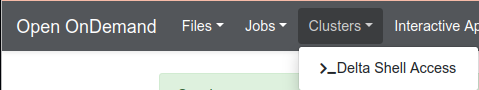

Accessing The System
=========================

Direct Access Login Nodes
-----------------------------

Direct access to the Delta login nodes is via ssh using your NCSA username, password and NCS Duo MFA. Please see the `NCSA Allocation and Account Management <https://wiki.ncsa.illinois.edu/display/USSPPRT/NCSA+Allocation+and+Account+Management>`_ page for links to NCSA Identity and NCSA Duo services. The login nodes provide access to the CPU and GPU resources on Delta.

+------------------------------------+--------------------------------------------------------+
| **Login Node Hostname**            | **Example Usage with SSH**                             |
+------------------------------------+--------------------------------------------------------+
|                                    | ::                                                     |
| dt-login01.delta.ncsa.illinois.edu |                                                        |
|                                    |     ssh -Y username@dt-login01.delta.ncsa.illinois.edu |
|                                    |     ( -Y allows X11 forwarding from linux hosts )      |
+------------------------------------+--------------------------------------------------------+
| dt-login02.delta.ncsa.illinois.edu | ::                                                     |
|                                    |                                                        |
|                                    |     ssh -l username dt-login02.delta.ncsa.illinois.edu |
|                                    |     ( -l username alt. syntax for user@host )          |
+------------------------------------+--------------------------------------------------------+
| | **login.delta.ncsa.illinois.edu**| ::                                                     |
|                                    |                                                        |    
| (round robin DNS name for the set  |     ssh username@login.delta.ncsa.illinois.edu         |   
| of login nodes)                    |                                                        |    
+------------------------------------+--------------------------------------------------------+

Please see `NCSA Allocation and Account Management <https://wiki.ncsa.illinois.edu/display/USSPPRT/NCSA+Allocation+and+Account+Management>`_ for the steps to change your NCSA password for direct access and set up NCSA DUO. For ACCESS awarded projects, to find your local
NCSA username please go your `ACCESS Profile page <https://allocations.access-ci.org/profile>`_ and scroll to the bottom for the **Resource Provider Site Usernames** table. Please contact help@ncsa.illinois.edu for assistance if you do not know your NCSA username.

Use of ssh-key pairs is disabled for general use. Please contact NCSA Help at help@ncsa.illinois.edu for key-pair use by Gateway allocations.

maintaining persistent sessions: tmux

tmux is available on the login nodes to maintain persistent sessions.
See the tmux man page for more information. Use the targeted login
hostnames (dt-login01 or dt-login02) to attach to the login node where
you started tmux after making note of the hostname. Avoid the
round-robin hostname when using tmux.

| 

ssh keyboard-interactive

``For command line ssh clients, make sure to use the following settings if you have trouble logging in to delta:``

``ssh -o PreferredAuthentications=keyboard-interactive,password``

An OpenOnDemand shell interface is available at:
https://openondemand.delta.ncsa.illinois.edu/pun/sys/shell/ssh/dt-login02

    
Logging In 
--------------------

Compute Node External Connectivity
---------------------------------------

