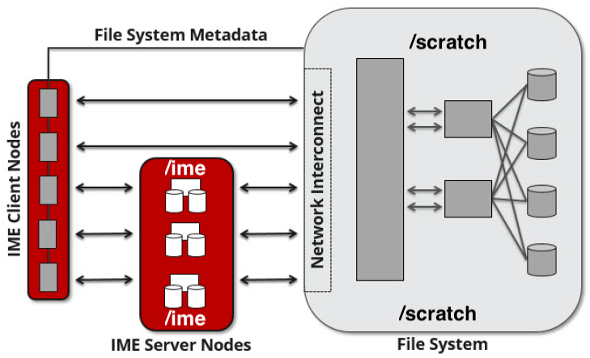

What is DDN IME?
----------------

Infinite Memory Engine (IME®) is a DDN solution for fast data tiering
between the compute nodes and a file system in a high performance
computing environment.

Conceptually the storage subsystem looks like the following

© DDN 2020

How to use IME
--------------

The preferred way to use the Delta IME is as a **read-cache** for
frequently read data and as a **write/read cache** for small file io.

It is possible to use exiting utilities and applications with files
residing or created on /ime. Performance will be equal to or better than
using /scratch directly for i/o to files.

IME and metadata

IME performance for directory/metadata operations is slower than
/scratch (it is not the place to extract or copy millions of files). Do
those operations (rsync, tar, etc) in /scratch.

To get additional performance from the IME software features without
changing IO routines, use the posix2ime library (LD_PRELOAD'd), to
intercept standard Posix IO calls with IME API calls. We have included a
module *posix2ime* that does this for you (read more about posix2ime
below).

shared namespace: /ime , /scratch

The /scratch and /ime file systems share the same name space. The **rm**
command will delete files on both file systems.

You can purge the contents of files from the cache , but not the
presence of the file. Please see below.

There are some important caveats when using the /ime file system for
something other than a **read-cache**. See section 2.2 Data Consistency
Model in the developer guide document .

   Users must maintain close-to-open consistency when multiple clients
   access the same files. This requirement guarantees that any other
   client will see the latest changes made by one client as soon as the
   client opens the file. A client must synchronize all file data and
   metadata changes when it closes a file and unconditionally retrieve a
   file’s attributes when it opens a file, ignoring any information it
   may have cached about the file. IME implements an enhanced
   close-to-open consistency model, allowing IME to be lock free.

IME commands
------------

Please see the man page for ime-ctl or the attached developer guide
document for details.

Stage in and out single files
~~~~~~~~~~~~~~~~~~~~~~~~~~~~~

The ime-ctl command is used to stage and purge files from the caching
/ime file system.

::

   ime-ctl --prestage 
   /ime/abcd/${USER}/file01

To sync the contents of a file created or changed that resides on /ime

::

   ime-ctl --sync /ime/abcd/${USER}/file01]]>
   To sync the contents of a file created or changed that resides on /ime

   ime-ctl --sync /ime/abcd/${USER}/file01

To purge the cached contents of a file on /ime

::

   ime-ctl --purge 
   /ime/abcd/${USER}/file01

Note that purging a file only clears the contents of the file from /ime.
The /scratch and /ime file systems share the same name space which
allows files and directories to be seen from either the caching
front-end /ime or back-end /scratch.

Staging multiple files and directories
~~~~~~~~~~~~~~~~~~~~~~~~~~~~~~~~~~~~~~

To recursively stage the contents of a directory and the files and
directories below, in this case a directory called
/scratch/abcd/${USER}/data_di, use the recursive

::

   ime-ctl --prestage --recursive --block 
   /ime/abcd/${USER}/data_dir

The ``--block option`` makes sure the stage or sync is complete before
returning.

Checking file stage/cache status
~~~~~~~~~~~~~~~~~~~~~~~~~~~~~~~~

To check if a file has been staged to the IME cache in ``/ime`` or has
its contents synced back to the back-end file system use the
``ime-ctl  --frag-stat``\ command.

In this example a file that was created as
``/scratch/abcd/${USER}/file01`` that has not been staged to /ime. The
file will be visible as\ ``/ime/abcd/${USER}/file01.``

Not staged to /ime: all entries are showing "0" for the Dirty, Clean and
Syncing entries.

::

   $ 
   ime-ctl --frag-stat /ime/abcd/${USER}/file01
      File: `/ime/abcd/${USER}/file01'
            Number of bytes:
     Dirty: 0
     Clean: 0
   Syncing: 0
   Data on Slices:

After staging the file to /ime, the number of bytes in the "Clean"
category show that the data on the cache is current.

::

   $ ime-ctl --prestage /ime/abcd/${USER}/file01
   $ ime-ctl --frag-stat /ime/abcd/${USER}/file01
      File: `/ime/abcd/${USER}/file01'
            Number of bytes:
     Dirty: 0
     Clean: 16777216
   Syncing: 0
   Data on Slices:  0

If the file\ ``/ime/abcd/${USER}/file01``\ was modified (appended,
replaced, etc) one would see entries in the Dirty category:

::

   $ ime-ctl --frag-stat /ime/abcd/${USER}/file01
      File: `/ime/abcd/${USER}/file01'
            Number of bytes:
     Dirty: 8388608
     Clean: 16777216
   Syncing: 0
   Data on Slices:  0

After using ``ime-ctl --sync`` to flush the changes to the back-end file
system, the dirty entries will be back to 0.

::

   $ ime-ctl --sync /ime/abcd/${USER}/file01
   $ ime-ctl --frag-stat /ime/abcd/${USER}/file01
      File: `/ime/abcd/${USER}/file01'
            Number of bytes:
     Dirty: 0
     Clean: 25165824
   Syncing: 0
   Data on Slices:  0

IME posix2ime library
---------------------

The posix2ime module is available and loading it will LD_PRELOAD the
library for your shell or batch script and all subsequent commands. The
library is described at: `DDNStorage/posix_2_ime: POSIX to IME Native
API (github.com) <https://github.com/DDNStorage/posix_2_ime>`__ .

posix2ime requires dedicated nodesAt this time, use of the posix2ime
library requires dedicated ( #SBATCH --exclusive ) nodes for your job
script or srun command.

| 

::

   #!/bin/bash 
   #SBATCH --mem=64g
   #SBATCH --nodes=4
   #SBATCH --ntasks-per-node=4
   #SBATCH --exclusive
   #SBATCH --cpus-per-task=16
   #SBATCH --partition=cpu
   #SBATCH --account=bbka-delta-cpu
   #SBATCH --time=00:15:00
   #SBATCH --job-name=posix2ime-ior-dedicated
    
   BFS_DIR=/scratch/bbka/arnoldg/ime_example
   IME_DIR=/ime/bbka/arnoldg/ime_example
   SAMPLE_INPUT_FILE=myinputfile
    
   # do many-files operations in /scratch before 
   # using ime: cd $BFS_DIR; tar xvf inputbundle.tar ...

   # bring the scratch directory into IME
   ime-ctl --recursive --block --prestage $IME_DIR

   # run the job/workflow in IME
   # do serialized commands (avoiding many-files types of operations)
   cd $IME_DIR
   stat $SAMPLE_INPUT_FILE

   # Use posix2ime for large block and/or parallel i/o 
   module load posix2ime
   time srun /u/arnoldg/ior/src/ior -F -b64m
   # turn off posix2ime
   unset LD_PRELOAD  # turns off posix2ime module

   # synchronize IME back out to the Scratch directory ( $BFS_DIR )
   ime-ctl --recursive --block --sync $IME_DIR

   exit

| 

| 

Attachments
-----------
