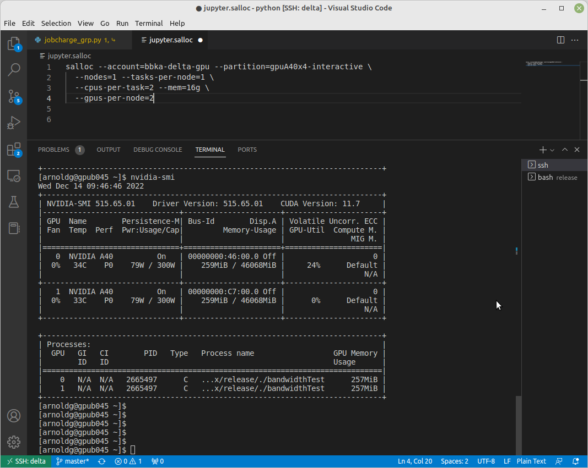
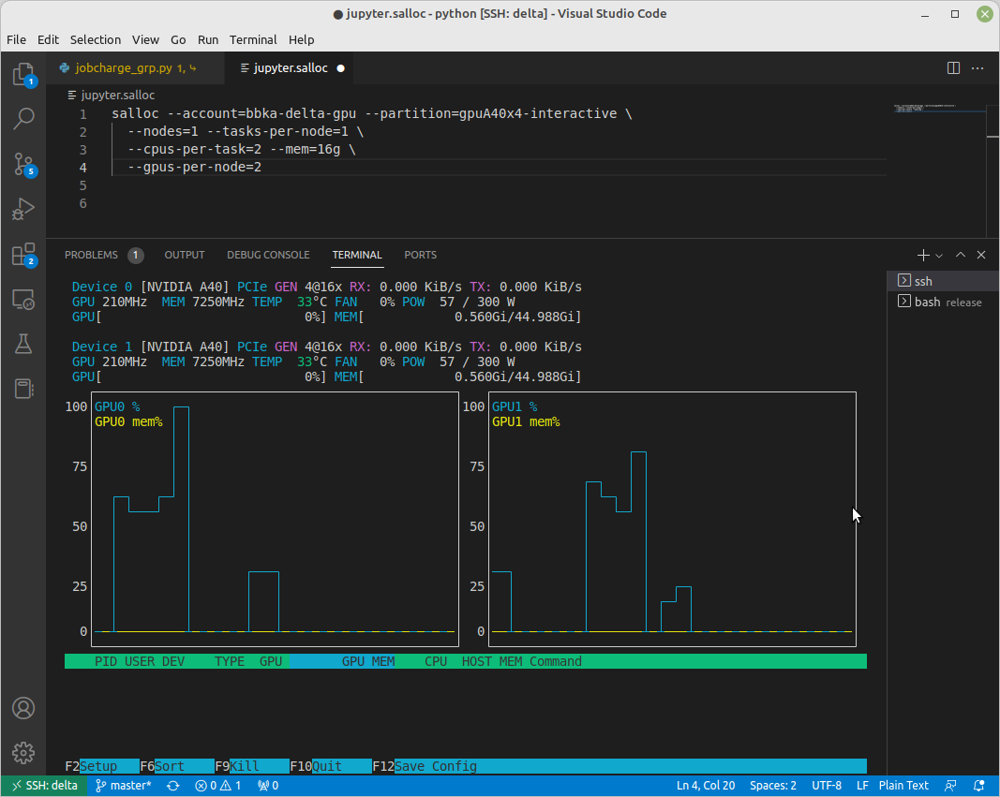
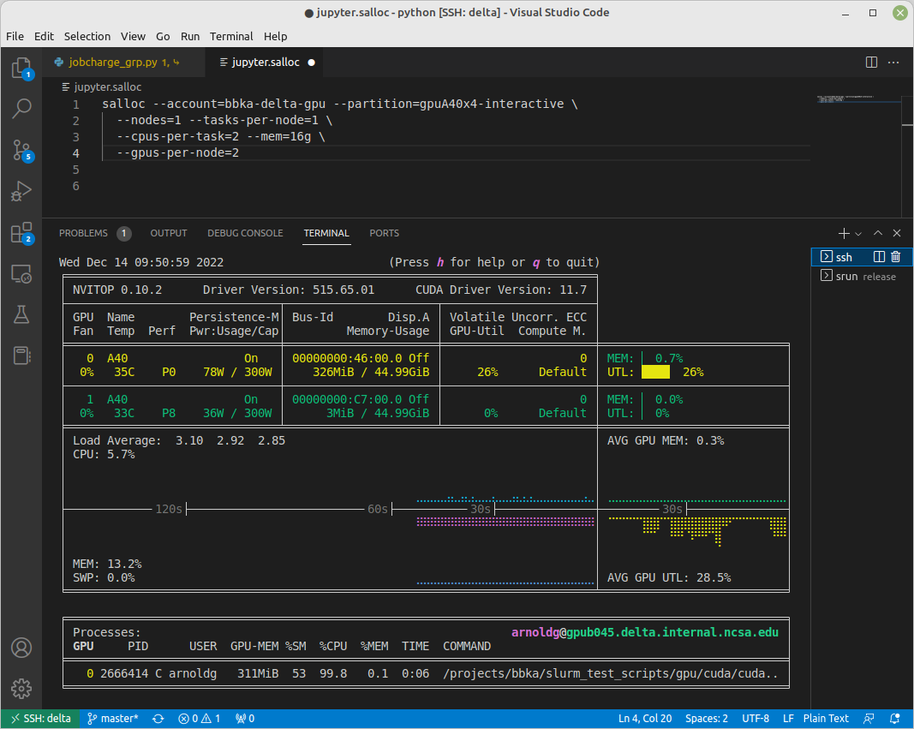
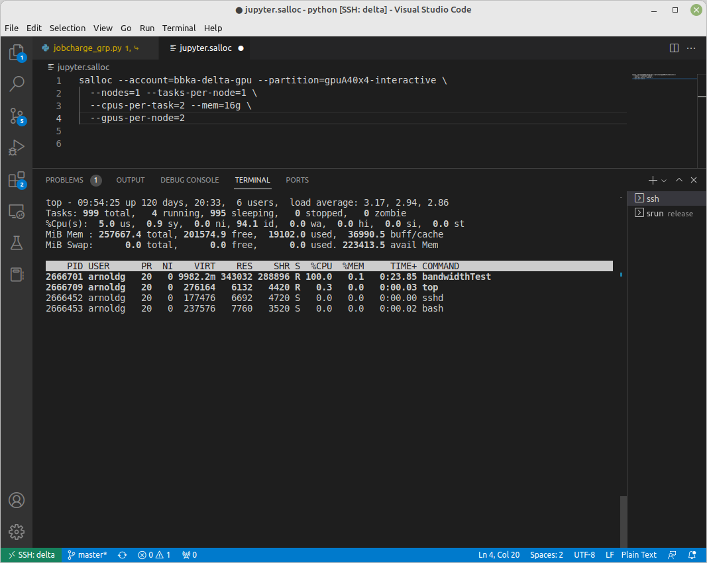
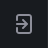
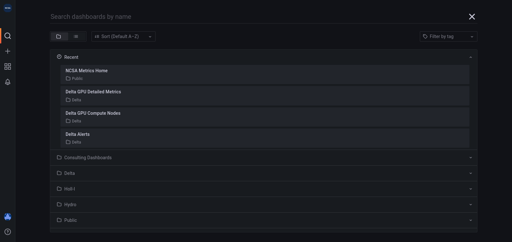
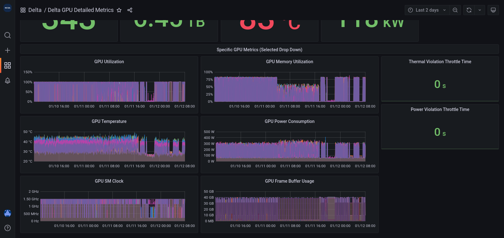

You have ssh access to nodes in your running job(s) . A couple basic
monitoring tools are demonstrated in the example transcript here. Screen
shots are appended so that you can see the output from the tools. Most
common linux utilities are available from the compute nodes (free,
strace, ps ...).

::

   [arnoldg@dt-login03 python]$ squeue -u $USER
                JOBID PARTITION     NAME     USER ST       TIME  NODES NODELIST(REASON)
              1214412 gpuA40x4- interact  arnoldg  R       8:14      1 gpub045
   [arnoldg@dt-login03 python]$ ssh gpub045
   gpub045.delta.internal.ncsa.edu (141.142.145.145)
     OS: RedHat 8.4   HW: HPE   CPU: 64x    RAM: 252 GB
   Last login: Wed Dec 14 09:45:26 2022 from 141.142.144.42
   [arnoldg@gpub045 ~]$ nvidia-smi

   [arnoldg@gpub045 ~]$ module load nvtop
   ---------------------------------------------------------------------------------------------------------------------
   The following dependent module(s) are not currently loaded: cuda/11.6.1 (required by: ucx/1.11.2, openmpi/4.1.2)
   ---------------------------------------------------------------------------------------------------------------------

   The following have been reloaded with a version change:
   1) cuda/11.6.1 => cuda/11.7.0

   [arnoldg@gpub045 ~]$ nvtop

   [arnoldg@gpub045 ~]$ module load anaconda3_gpu
   [arnoldg@gpub045 ~]$ nvitop

   [arnoldg@gpub045 ~]$ top -u $USER

nvidia-smi :

nvtop :

nvitop :

top -u $USER :

>>>>>>>>>>>>>>>>>>>>>>>>>>>>>>>>>>>>>>>>
Galen comments to be integrated:

TODO:

Add grafana back end examples when available.  https://metrics.ncsa.illinois.edu

Make sure to sign in at the lower left of the initial page:

Then navigate to the part of Delta metrics of interest.

You may choose a node from the list of nodes and get detail information in real time.

<<<<<<<<<<<<<<<<<<<<<<<<<<<<<<<<<<<<<<<<
