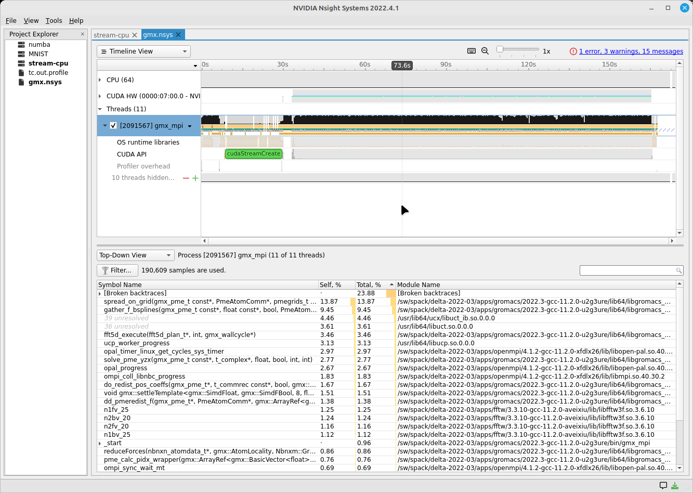
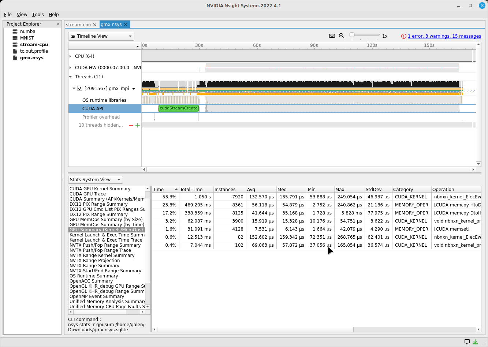
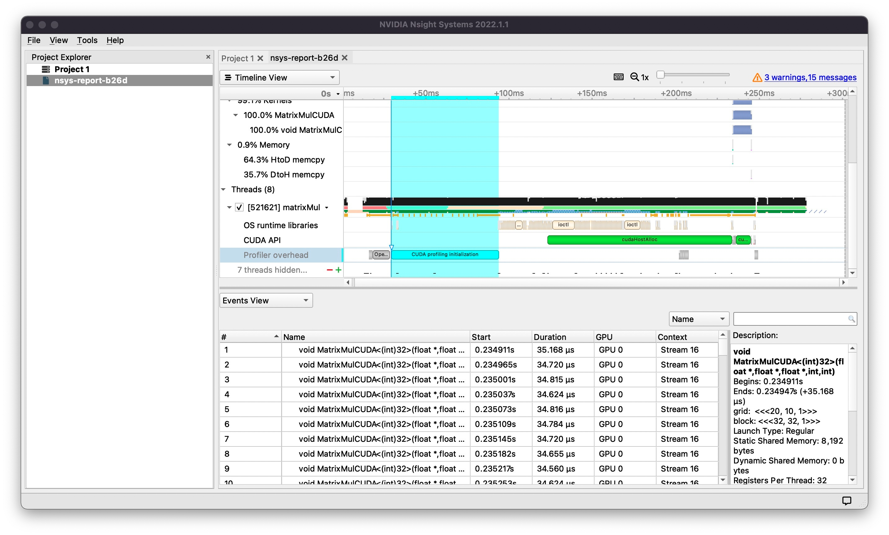
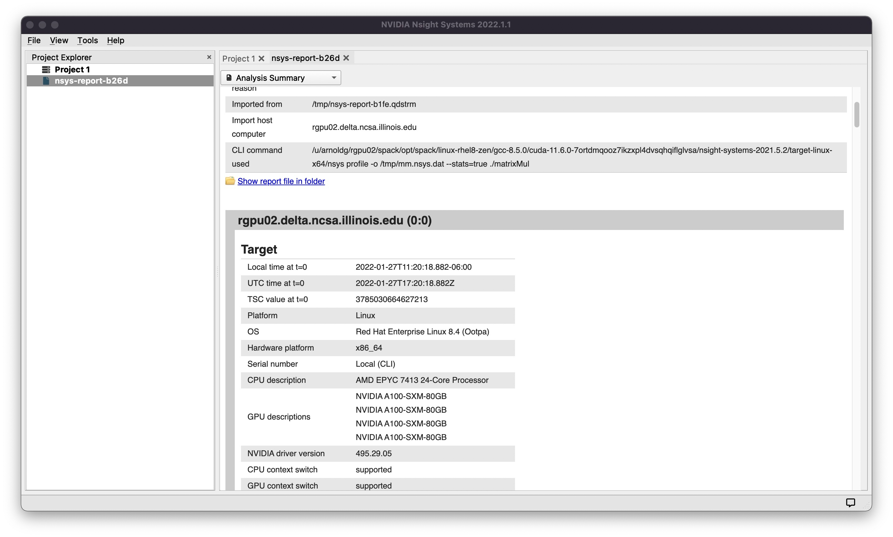
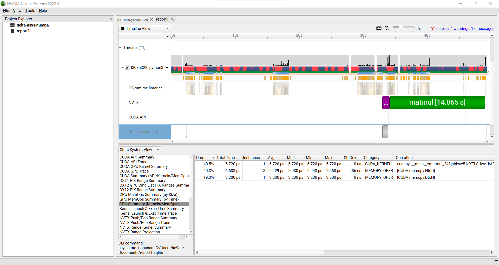
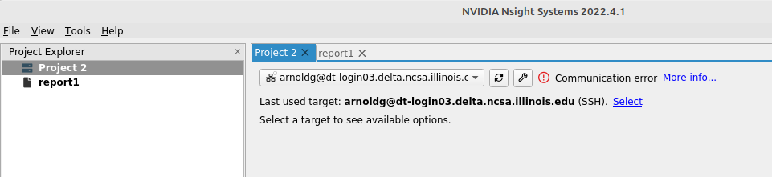
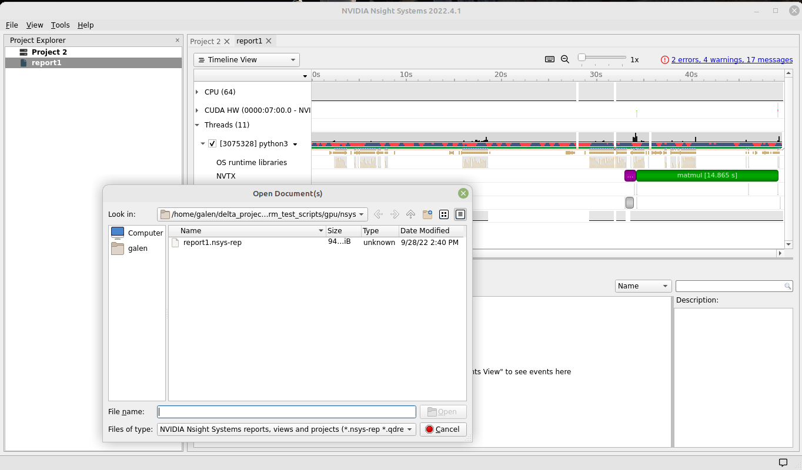
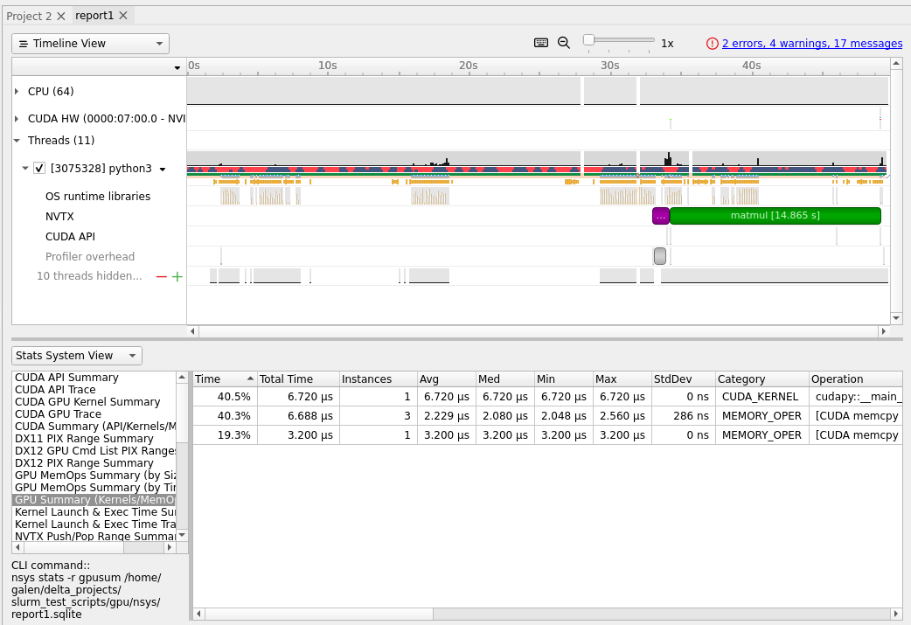

Installation (Delta system, rgpu02 preliminary documentation)
=============================================================

For admins/sw team: Use **Spack** to install cuda, and the nsys command
for Nsight Systems is included.

| 

::

   [arnoldg@rgpu02 rgpu02]$ module load cuda
   [arnoldg@rgpu02 rgpu02]$ which nsys
   ~/rgpu02/spack/opt/spack/linux-rhel8-zen/gcc-8.5.0/cuda-11.6.0-7ortdmqooz7ikzxpl4dvsqhqiflglvsa/bin/nsys
   [arnoldg@rgpu02 rgpu02]$ 

Installation (NVIDIA Nsight Systems client on local desktop/laptop)
===================================================================

Open https://developer.nvidia.com/tools-overview and navigate to the
*Developer Tools Downloads* button, then select *Nsight Systems* and
your operating system. If you don't have an account at
developer.nvidia.com set one up when prompted and when you have
completed the forms, your download will begin. Install the application
on your local machine. You will download output files from the server
command line application and use the GUI locally on your laptop.

Run application on Delta
========================

::

   $ srun nsys profile -o /path/to/mynysys.out --stats=true ./a.out]]>
   Run application on Delta

   $ srun nsys profile -o /path/to/mynysys.out --stats=true ./a.out

| 

::

   [arnoldg@dt-login03 gromacs]$ cat nsys_wrap.sh 
   #!/bin/bash
   # Use $PMI_RANK for MPICH, $OMPI_COMM_WORLD_RANK for openmpi, and $SLURM_PROCID with srun.
   if [ $SLURM_PROCID -eq 1 ]; then
     nsys profile -e NSYS_MPI_STORE_TEAMS_PER_RANK=1 -o gmx.nsys --gpu-metrics-set=2 "$@"
   else
     "$@"
   fi

| 

::

   #SBATCH --constraint=perf,nvperf
   ...
   # the slurm script should run the wrapper above instead of "nsys ..."
   time srun $SLURM_SUBMIT_DIR/nsys_wrap.sh \
     gmx_mpi mdrun -nb gpu -pin on -notunepme -dlb yes -v -resethway -noconfout -nsteps 4000 -s water_pme.tpr

   # see https://docs.nvidia.com/nsight-systems/UserGuide/index.html#cli-analyze-mpi-codes

MPI rank example result (viewing with nsight on local desktop )
---------------------------------------------------------------

Copy resultant files to your local laptop ( Downloads/ or Documents/ )
======================================================================

scp is shown below, you could also use globus online, sftp, or an sshfs
mount from your laptop.

::

   # Delta
   [arnoldg@rgpu02 rgpu02]$ ls /tmp/nsys*
   /tmp/nsys-report-988d.sqlite  /tmp/nsys-report-b26d.nsys-rep
   [arnoldg@rgpu02 rgpu02]$ 

   # local laptop (MacOS example)
   (base) galen@macbookair-m1-042020 ~ % cd Downloads
   (base) galen@macbookair-m1-042020 Downloads % pwd
   /Users/galen/Downloads
   (base) galen@macbookair-m1-042020 Downloads % sftp arnoldg@rgpu02.delta.ncsa.illinois.edu

   NCSA Delta System

   Login with NCSA Kerberos + Duo multi-factor.

   DUO Documentation:  https://go.ncsa.illinois.edu/2fa

   (arnoldg@rgpu02.delta.ncsa.illinois.edu) Password: 
   (arnoldg@rgpu02.delta.ncsa.illinois.edu) Duo two-factor login for arnoldg

   Enter a passcode or select one of the following options:

    1. Duo Push to XXX-XXX-1120
    2. Duo Push to Ipad mini (iOS)
    3. Duo Push to red ipod (iOS)

   Passcode or option (1-3): 1
   Connected to rgpu02.delta.ncsa.illinois.edu.
   sftp> cd /tmp
   sftp> mget nsys*
   Fetching /tmp/nsys-report-988d.sqlite to nsys-report-988d.sqlite
   /tmp/nsys-report-988d.sqlite                  100%  748KB   2.7MB/s   00:00    
   Fetching /tmp/nsys-report-b26d.nsys-rep to nsys-report-b26d.nsys-rep
   /tmp/nsys-report-b26d.nsys-rep                100%  288KB   1.7MB/s   00:00    
   sftp> 

Open NVIDIA Nsight Systems
==========================

Under the File menu, select "open" then navigate to your Downloads/
folder and select the nsys\* file of interest (nays-report-b26d.nsys-rep
in this example). Explore the data in the GUI application.

See also: `NVTX source code annotations blog article at
NVIDIA <https://developer.nvidia.com/blog/nvidia-tools-extension-api-nvtx-annotation-tool-for-profiling-code-in-python-and-c-c/>`__
(can annotate c/c++/python GPU or CPU code)

Python with NVTX
================

Install:
--------

::

   [arnoldg@rgpu02 nvtx]$ module load python cuda
   [arnoldg@rgpu02 nvtx]$ C_INCLUDE_PATH=$CUDA_HOME/include pip install nvtx
   Collecting nvtx
     Using cached nvtx-0.2.3.tar.gz (10 kB)
     Installing build dependencies ... done
     Getting requirements to build wheel ... done
     Preparing metadata (pyproject.toml) ... done
   Building wheels for collected packages: nvtx
     Building wheel for nvtx (pyproject.toml) ... done
     Created wheel for nvtx: filename=nvtx-0.2.3-cp39-cp39-linux_x86_64.whl size=177533 sha256=875e0f9d4322d07db4bce397b4281ce301f348cf72e00629b0d7bc23a7db0231
     Stored in directory: /u/arnoldg/.cache/pip/wheels/66/7a/44/68c48f02433263010768b540b0e90bf5a224dd7e6612d88887
   Successfully built nvtx
   Installing collected packages: nvtx
   Successfully installed nvtx-0.2.3
   [arnoldg@rgpu02 nvtx]$ 

Run with nsys cli:
------------------

::

   [arnoldg@rgpu02 nvtx]$ nsys profile -o nvtx_simple.profile --stats=true ./nvtx_simple.py 

   Warning: LBR backtrace method is not supported on this platform. DWARF backtrace method will be used.
   0
   1
   2
   3
   4
   Failed to create '/u/arnoldg/rgpu02/cuda/nvtx/nvtx_simple.profile.nsys-rep': File exists.
   Use `--force-overwrite true` to overwrite existing files.
   Generating '/tmp/nsys-report-1c93.qdstrm'
   [1/8] [========================100%] nsys-report-d073.nsys-rep
   Failed to create '/u/arnoldg/rgpu02/cuda/nvtx/nvtx_simple.profile.sqlite': File exists.
   Use `--force-overwrite true` to overwrite existing files.
   [2/8] [========================100%] nsys-report-e498.sqlite
   SKIPPED: /tmp/nsys-report-e498.sqlite does not contain CUDA trace data.
   SKIPPED: /tmp/nsys-report-e498.sqlite does not contain CUDA kernel data.
   SKIPPED: /tmp/nsys-report-e498.sqlite does not contain GPU memory data.
   SKIPPED: /tmp/nsys-report-e498.sqlite does not contain GPU memory data.
   [3/8] Executing 'nvtxsum' stats report

   NVTX Range Statistics:

    Time (%)  Total Time (ns)  Instances      Avg (ns)          Med (ns)         Min (ns)        Max (ns)       StdDev (ns)     Style   Range
    --------  ---------------  ---------  ----------------  ----------------  --------------  --------------  ---------------  -------  -----
        50.0   10,010,633,188          1  10,010,633,188.0  10,010,633,188.0  10,010,633,188  10,010,633,188              0.0  PushPop  f()  
        50.0   10,010,401,574          5   2,002,080,314.8   2,002,090,885.0          15,729   4,004,111,558  1,582,756,979.0  PushPop  loop 

   [4/8] Executing 'osrtsum' stats report

   Operating System Runtime API Statistics:

    Time (%)  Total Time (ns)  Num Calls     Avg (ns)         Med (ns)      Min (ns)    Max (ns)       StdDev (ns)           Name        
    --------  ---------------  ---------  ---------------  ---------------  --------  -------------  ---------------  -------------------
       100.0   10,010,198,683          5  2,002,039,736.6  2,002,047,874.0     3,025  4,004,056,124  1,582,740,553.2  select             
         0.0        1,005,734         46         21,863.8         21,656.0    18,866         27,070          1,608.1  open64             
         0.0          495,879         49         10,120.0          4,960.0     1,262         67,747         12,669.1  read               
         0.0           38,843         10          3,884.3          3,957.5     3,186          4,559            408.1  mmap64             
         0.0           34,164          1         34,164.0         34,164.0    34,164         34,164              0.0  write              
         0.0           27,391          4          6,847.8          4,182.5     2,655         16,371          6,410.6  fopen64            
         0.0            6,602          3          2,200.7          1,232.0     1,172          4,198          1,730.0  pthread_cond_signal
         0.0            3,647          1          3,647.0          3,647.0     3,647          3,647              0.0  sigaction          
         0.0            2,013          1          2,013.0          2,013.0     2,013          2,013              0.0  fread              
         0.0            1,923          1          1,923.0          1,923.0     1,923          1,923              0.0  fclose             
         0.0            1,472          1          1,472.0          1,472.0     1,472          1,472              0.0  fflush             

   [5/8] Executing 'cudaapisum' stats report
   [6/8] Executing 'gpukernsum' stats report
   [7/8] Executing 'gpumemtimesum' stats report
   [8/8] Executing 'gpumemsizesum' stats report
   Generated:
       /tmp/nsys-report-d073.nsys-rep
       /tmp/nsys-report-e498.sqlite
   [arnoldg@rgpu02 nvtx]$ 

| 

::

   nsys profile --gpu-metrics-device=all \
       --gpu-metrics-frequency=20000    # get metrics from the cuda libs/api

   ncu --metrics "regex:.*"    # get all gpu metrics from the hardware

Delta script and nsight-systems view of the resulting report
============================================================

::

   #!/bin/bash
   #SBATCH --job-name="numba_profile"
   #SBATCH --partition=gpuA100x4-interactive
   #SBATCH --mem=16G
   #SBATCH --nodes=1
   #SBATCH --ntasks-per-node=1
   #SBATCH --cpus-per-task=2   # spread out to use 1 core per numa
   #SBATCH --constraint="projects"
   #SBATCH --gpus-per-node=1
   #SBATCH --gpu-bind=closest   # select a cpu close to gpu on pci bus topology
   #SBATCH --account=bbka-delta-gpu
   #SBATCH -t 00:10:00

   cd $SLURM_SUBMIT_DIR
   module load anaconda3_gpu

   dcgmi profile --pause

   srun nsys profile \
     --gpu-metrics-device=all \
     ./nvtx-numba-jit.py

   srun ncu \
     --metrics "regex:.*" \
     --target-processes all \
     ./nvtx-numba-jit.py

   dcgmi profile --resume

(Transferred the report1.nsys-rep back to local system using Globus
Online , sftp ... )

Nsight-systems setup on local workstation to use with Delta
-----------------------------------------------------------

Login to: https://developer.nvidia.com/nsight-systems (make an account
if you need to), and download the client for your MacOS, Windows, or
Linux local system.

You can use Globus Online, rsync, sftp, or sshfs (linux) to transfer
files (or view files as local filesystem mounts in the case of sshfs )
with the local nsight-systems client.

sshfs mount example for linux box to Delta
~~~~~~~~~~~~~~~~~~~~~~~~~~~~~~~~~~~~~~~~~~

::

   galen@galen-HP-ProBook-455-G6:~$ sshfs arnoldg@dt-login03.delta.ncsa.illinois.edu:/projects/bbka delta_projects/
   arnoldg@dt-login03.delta.ncsa.illinois.edu's password: 
   (arnoldg@dt-login03.delta.ncsa.illinois.edu) Duo two-factor login for arnoldg

   Enter a passcode or select one of the following options:

    1. Duo Push to XXX-XXX-1120
    2. Duo Push to Ipad mini (iOS)
    3. Duo Push to red ipod (iOS)
    4. Duo Push to Android

   Passcode or option (1-4): 115489
   galen@galen-HP-ProBook-455-G6:~$ df -h delta_projects/
   Filesystem                                                 Size  Used Avail Use% Mounted on
   arnoldg@dt-login03.delta.ncsa.illinois.edu:/projects/bbka 1000T   60T  941T   6% /home/galen/delta_projects

Launch nsight-systems and define a target under the default opening
view. Even if you cannot get nsight-systems to ssh to the target, you
need to define it so that nsight-systems will present you with the
.nsys-rep file type when you try to open a profile from delta that was
transferred to local via GO/sftp/rsync or viewable via the sshfs fuse
mount like shown above:

Then open the profile report generated from an *srun nsys* ... at Delta.
(navigate to Download or the live sshfs fuse mount )

Proceed to use nsight-systems. A stats view of the GPU Summary is shown.
This is usually a good performance analysis starting point showing
utilization of kernels vs times to transfer data between the host
computer and the gpu accelerator.

https://docs.nvidia.com/cuda/cuda-c-programming-guide

`User Guide :: Nsight Systems Documentation
(nvidia.com) <https://docs.nvidia.com/nsight-systems/UserGuide/index.html>`__
(nsys higher level and cuda api )

`Nsight Compute CLI :: Nsight Compute Documentation
(nvidia.com) <https://docs.nvidia.com/nsight-compute/NsightComputeCli/index.html>`__
( ncu lower level and counters )

`GitHub -
quasiben/nvtx-examples <https://github.com/quasiben/nvtx-examples>`__ (
sample python test codes )
