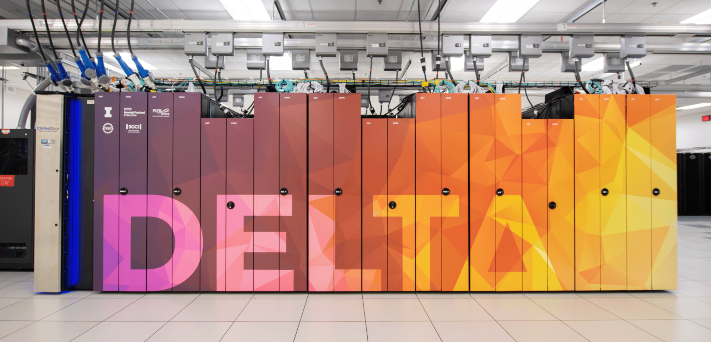

.. meta::
   :google-site-verification: e4nzdhTdNG9IaZP-vYECt1MDEosdI5u8j71h9PnpZdA

.. meta::
   :description: User documentation for the UIUC NCSA Delta HPC cluster. Topics include the Delta system architecture, how to log into Delta, how to run jobs, and much more.

################################################
Delta User Documentation
################################################

Introduction
=============

Delta is a dedicated, `ACCESS <https://access-ci.org>`_-allocated resource designed by HPE and NCSA, delivering a highly capable GPU-focused compute environment for GPU and CPU workloads.  
In addition to offering a mix of standard and reduced precision GPU resources, Delta also offers GPU-dense nodes with both NVIDIA and AMD GPUs.  
Delta provides high performance node-local SSD scratch filesystems, as well as both standard Lustre and relaxed-POSIX (not yet implemented) parallel filesystems spanning the entire resource.

Envisioned to lead change across the dimensions of computing, storage, and usability, Delta employs standards-based, fully customized science gateways with per-domain interfaces provided alongside the traditional command-line batch system interface. 
Enabled science gateways seamlessly integrate Delta into the cyberinfrastructure ecosystem alongside other resources to enable complex, multi-system workflows. 
To advance applications, the Delta project team continues the applications-focused, outcomes-oriented approach to drive the transition to GPU-accelerated applications alongside gateway-based productivity advances. 
Integrated with the NSF's Advanced Cyberinfrastructure Coordination Ecosystem: Services & Support (ACCESS) ecosystems, Delta leverages the substantial portfolio of services and support offered therein and together deliver unprecedented advances in researcher productivity.

Delta supports the ACCESS core software stack, including remote login, remote computation, data movement, science workflow support, and science gateway support toolkits.

Status Updates and Notices
============================

- `ACCESS support outages page <https://support.access-ci.org/outages>`_ (current outage information) 
- `ACCESS infrastructure news <https://operations.access-ci.org/infrastructure_news>`_ (outage and reconfiguration news) 
- `ACCESS Delta affinity group site <https://support.access-ci.org/affinity-groups/delta>`_ (links to news and the Slack channel for users)

Getting Started with High-Performance Computing
================================================

**There are no specific prerequisite courses or high-performance computing (HPC) experience required before using Delta.** However, if you are unfamiliar with using an HPC cluster, it is highly recommended that you take NCSA’s short tutorial `Using an HPC Cluster for Scientific Applications <https://www.hpc-training.org/moodle/course/view.php?id=71>`_ before continuing.

Browse NCSA’s `HPC-Moodle <https://www.hpc-training.org>`_ for a full list of HPC training opportunities including self-paced tutorials and training events (in-person and virtual).

.. toctree::
   :maxdepth: 2
   :hidden:

   status_updates
   quick_start
   faq
   support_services
   help

.. toctree::
   :maxdepth: 2
   :caption: User Guide
   :hidden:
   
   user_guide/architecture
   user_guide/accounts
   user_guide/login
   user_guide/citizenship
   user_guide/data_mgmt
   user_guide/prog_env
   user_guide/job_accounting
   user_guide/running_jobs
   user_guide/software
   user_guide/visualization
   user_guide/containers
   user_guide/ood/index
   user_guide/debug_perf
   user_guide/acknowledge
   
