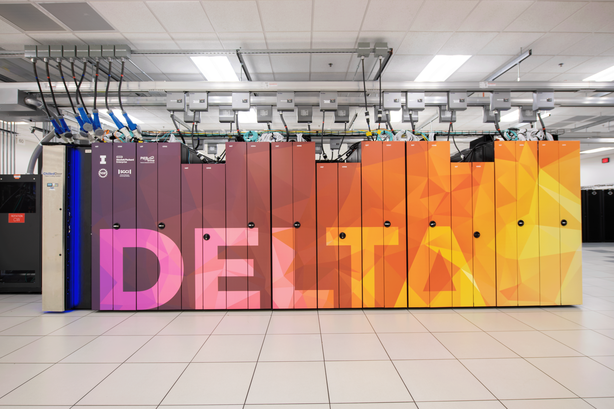

################################################
NCSA Delta System User Guide
################################################

*Delta* is in production.

System status, planned outages, and maintenance info:

current outages - https://support.access-ci.org/outages

infrastructure news -
https://operations.access-ci.org/infrastructure_news.

Delta Affinity Group site with links to news, slack channel for users :
https://support.access-ci.org/affinity-groups/delta.

Introduction
=================

*Delta* is a dedicated,\ `ACCESS <https://access-ci.org>`__\ -allocated
resource designed by HPE and NCSA, delivering a highly capable GPU-focused compute environment for GPU and CPU workloads.  Besides offering a mix of standard and reduced precision GPU resources, Delta also offers GPU-dense nodes with both NVIDIA and AMD GPUs.  Delta provides high performance node-local SSD scratch filesystems, as well as both standard Lustre and relaxed-POSIX parallel filesystems spanning the entire resource.

Delta's CPU nodes are each powered by two 64-core AMD EPYC 7763 ("Milan") processors, with 256 GB of DDR4 memory.  The Delta GPU resource has four node types: one with 4 NVIDIA A100 GPUs (40 GB HBM2 RAM each) connected via NVLINK and 1 64-core AMD EPYC 7763 ("Milan") processor, the second with 4 NVIDIA A40 GPUs (48 GB GDDR6 RAM) connected via PCIe 4.0 and 1 64-core AMD EPYC 7763 ("Milan") processor, the third with 8 NVIDIA A100 GPUs in a dual socket AMD EPYC 7763 (128-cores per node) node with 2 TB of DDR4 RAM and NVLINK,  and the fourth with 8 AMD MI100 GPUs (32GB HBM2 RAM each) in a dual socket AMD EPYC 7763 (128-cores per node) node with 2 TB of DDR4 RAM and PCIe 4.0. 

Delta has 124 standard CPU nodes, 100 4-way A100-based GPU nodes, 100 4-way A40-based GPU nodes, 5 8-way A100-based GPU nodes, and 1 8-way MI100-based GPU node.  Every Delta node has high-performance node-local SSD storage (740 GB for CPU nodes, 1.5 TB for GPU nodes), and is connected to the 7 PB Lustre parallel filesystem via the high-speed interconnect.  The Delta resource uses the SLURM workload manager for job scheduling.  

Delta supports the\ `ACCESS core software
stack <https://access-ci.atlassian.net/wiki/spaces/ACCESSdocumentation/pages/72421302>`__,
including remote login, remote computation, data movement, science
workflow support, and science gateway support toolkits.

Contents
--------

.. toctree::
   :maxdepth: 2
   
   status_updates
   architecture
   fee_overview
   accounts/index
   accessing/index
   citizenship
   file_mgmt/index
   prog_env/index
   running_jobs/index
   software/index
   visualization
   containers
   services/index
   debug_perf/index
   protected_data
   help
   
