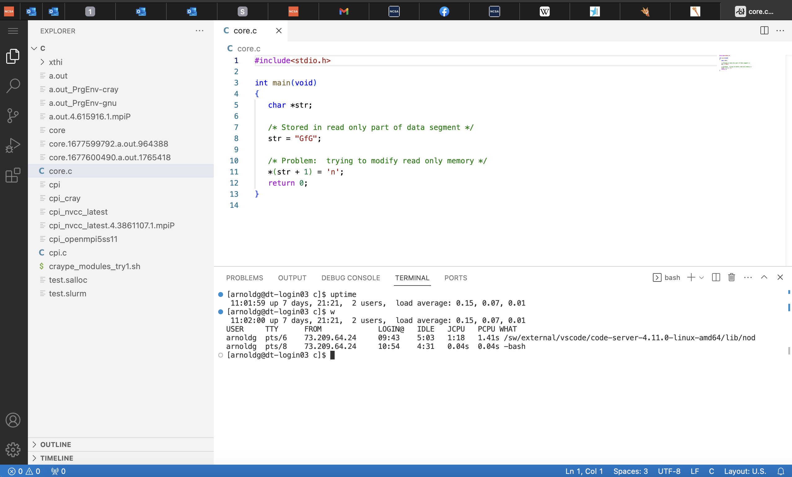
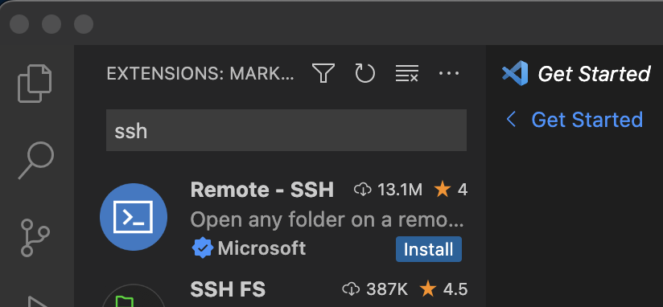
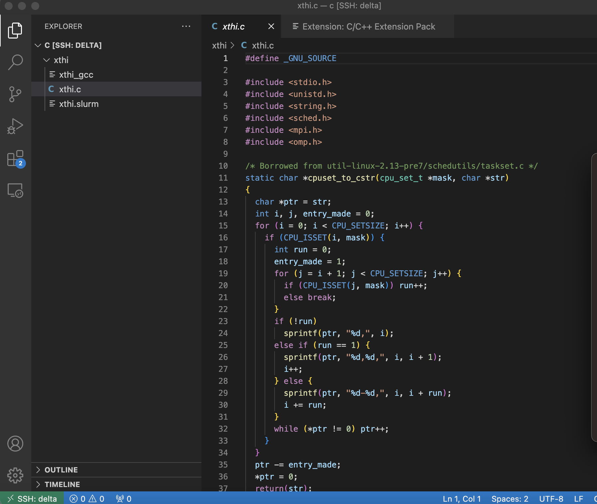
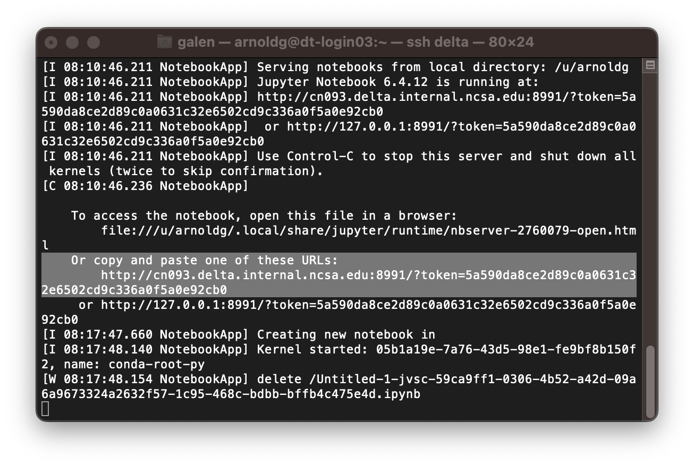
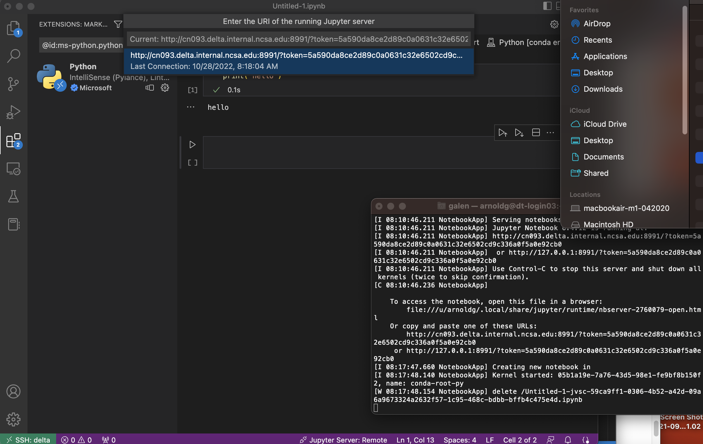

Programming Environment (Building Software)
===============================================

The Delta programming environment supports the GNU, AMD (AOCC), Intel
and NVIDIA HPC compilers. Support for the HPE/Cray Programming
environment is forthcoming.

Modules provide access to the compiler + MPI environment.

The default environment includes the GCC 11.2.0 compiler + OpenMPI with
support for cuda and gdrcopy. nvcc is in the cuda module and is loaded
by default.

AMD recommended compiler flags for GNU, AOCC, and Intel compilers for
Milan processors can be found in the `AMD Compiler Options Quick
Reference Guide for Epyc 7xx3
processors <https://developer.amd.com/wp-content/resources/Compiler%20Options%20Quick%20Ref%20Guide%20for%20AMD%20EPYC%207xx3%20Series%20Processors.pdf>`__.

..  image:: Compiler_Options_Quick_Ref_Guide_for_AMD_EPYC_7xx3_Series_Processors.pdf
    :alt: Compiler Options Quick Ref Guide for AMD EPYC 7xx3 Series Processors
    :width: 200px

Modules
-------------------------

Compilers
-------------------------

Serial
----------

To build (compile and link) a serial program in Fortran, C, and C++:

=================== ================= ====================
gcc                 aocc              nvhpc
gfortran *myprog*.f flang *myprog*.f  nvfortran *myprog*.f
gcc *myprog*.c      clang *myprog*.c  nvc *myprog*.c
g++ *myprog*.cc     clang *myprog*.cc nvc++ *myprog*.cc
=================== ================= ====================

MPI
-------------------------
To build (compile and link) a MPI program in Fortran, C, and C++:

+----------------------+----------------------+----------------------+
| MPI Implementation   | modulefiles for      | Build Commands       |
|                      | MPI/Compiler         |                      |
+----------------------+----------------------+----------------------+
| |                    | ::                   | |                    |
|                      |                      |                      |
| | OpenMPI            |                      | +-------+-------+    |
| | (`Home             |   aocc/3.2.0 openmpi | | Fo    | m     |    |
|   Page <http://w     |                      | | rtran | pif77 |    |
| ww.open-mpi.org/>`__ |                      | | 77:   | *mypr |    |
|   /                  |                      | |       | og*.f |    |
|   `Document          |   gcc/11.2.0 openmpi | +-------+-------+    |
| ation <http://www.op |                      | | Fo    | m     |    |
| en-mpi.org/doc/>`__) |                      | | rtran | pif90 |    |
|                      |                      | | 90:   | *m    |    |
|                      |   nvhpc/22.2 openmpi | |       | yprog |    |
|                      |                      | |       | *.f90 |    |
|                      |                      | +-------+-------+    |
|                      |    intel-oneapi      | | C:    | mpicc |    |
|                      | -compilers/2022.0.2  | |       | *mypr |    |
|                      |    openmpi           | |       | og*.c |    |
|                      |                      | +-------+-------+    |
|                      |                      | | C++:  | m     |    |
|                      |                      | |       | pic++ |    |
|                      |                      | |       | *     |    |
|                      |                      | |       | mypro |    |
|                      |                      | |       | g*.cc |    |
|                      |                      | +-------+-------+    |
|                      |                      |                      |
|                      |                      | |                    |
+----------------------+----------------------+----------------------+

Python
-------------------------

OpenMP
-------------------------

To build an OpenMP program, use the -fopenmp /-mp option:

+----------------------+----------------------+----------------------+
| gcc                  | aocc                 | nvhpc                |
+----------------------+----------------------+----------------------+
| gfortran -fopenmp    | flang -fopenmp       | nvfortran -mp        |
| *myprog*.f           | *myprog*.f           | *myprog*.f           |
| gcc -fopenmp         | clang -fopenmp       | nvc -mp *myprog*.c   |
| *myprog*.c           | *myprog*.c           | nvc++ -mp            |
| g++ -fopenmp         | clang -fopenmp       | *myprog*.cc          |
| *myprog*.cc          | *myprog*.cc          |                      |
+----------------------+----------------------+----------------------+

Hybrid MPI/OpenMP
-------------------

To build an MPI/OpenMP hybrid program, use the -fopenmp / -mp option
with the MPI compiling commands:

============================ =======================
GCC                            PGI/NVHPC
mpif77 -fopenmp *myprog*.f     mpif77 -mp *myprog*.f
mpif90 -fopenmp *myprog*.f90   mpif90 -mp *myprog*.f90
mpicc -fopenmp *myprog*.c      mpicc -mp *myprog*.c
mpic++ -fopenmp *myprog*.cc    mpic++ -mp *myprog*.cc
============================ =======================

Cray xthi.c sample code
---------------------------

`Document - XC Series User Application Placement Guide CLE6..0UP01
S-2496 \| HPE
Support <https://support.hpe.com/hpesc/public/docDisplay?docId=a00114008en_us&page=Run_an_OpenMP_Application.html>`__

This code can be compiled using the methods show above. The code appears
in some of the batch script examples below to demonstrate core placement
options.

::

   #define _GNU_SOURCE

   #include 
   #include 
   #include 
   #include 
   #include 
   #include 

   /* Borrowed from util-linux-2.13-pre7/schedutils/taskset.c */
   static char *cpuset_to_cstr(cpu_set_t *mask, char *str)
   {
     char *ptr = str;
     int i, j, entry_made = 0;
     for (i = 0; i < CPU_SETSIZE; i++) {
       if (CPU_ISSET(i, mask)) {
         int run = 0;
         entry_made = 1;
         for (j = i + 1; j < CPU_SETSIZE; j++) {
           if (CPU_ISSET(j, mask)) run++;
           else break;
         }
         if (!run)
           sprintf(ptr, "%d,", i);
         else if (run == 1) {
           sprintf(ptr, "%d,%d,", i, i + 1);
           i++;
         } else {
           sprintf(ptr, "%d-%d,", i, i + run);
           i += run;
         }
         while (*ptr != 0) ptr++;
       }
     }
     ptr -= entry_made;
     *ptr = 0;
     return(str);
   }

   int main(int argc, char *argv[])
   {
     int rank, thread;
     cpu_set_t coremask;
     char clbuf[7 * CPU_SETSIZE], hnbuf[64];

     MPI_Init(&argc, &argv);
     MPI_Comm_rank(MPI_COMM_WORLD, &rank);
     memset(clbuf, 0, sizeof(clbuf));
     memset(hnbuf, 0, sizeof(hnbuf));
     (void)gethostname(hnbuf, sizeof(hnbuf));
     #pragma omp parallel private(thread, coremask, clbuf)
     {
       thread = omp_get_thread_num();
       (void)sched_getaffinity(0, sizeof(coremask), &coremask);
       cpuset_to_cstr(&coremask, clbuf);
       #pragma omp barrier
       printf("Hello from rank %d, thread %d, on %s. (core affinity = %s)\n",
               rank, thread, hnbuf, clbuf);
     }
     MPI_Finalize();
     return(0);
   }

A version of xthi is also available from ORNL

::

   % git clone https://github.com/olcf/XC30-Training/blob/master/affinity/Xthi.c]]>
         A version of xthi is also available from ORNL

   % git clone https://github.com/olcf/XC30-Training/blob/master/affinity/Xthi.c

OpenACC
-------------------------

To build an OpenACC program, use the -acc option and the -mp option for
multi-threaded:

========================= =============================
NON-MULTITHREADED           MULTITHREADED
nvfortran -acc *myprog*.f   nvfortran -acc -mp *myprog*.f
nvc -acc *myprog*.c         nvc -acc -mp *myprog*.c
nvc++ -acc *myprog*.cc      nvc++ -acc -mp *myprog*.cc
========================= =============================

CUDA
-------------------------

Cuda compilers (nvcc) are included in the cuda module which is loaded by
default under modtree/gpu. For the cuda fortran compiler and other
Nvidia development tools, load the "nvhpc" module.

::

   [arnoldg@dt-login03 namd]$ nv
   nvaccelerror             nvidia-bug-report.sh     nvlink
   nvaccelinfo              nvidia-cuda-mps-control  nv-nsight-cu
   nvc                      nvidia-cuda-mps-server   nv-nsight-cu-cli
   nvc++                    nvidia-debugdump         nvprepro
   nvcc                     nvidia-modprobe          nvprof
   nvcpuid                  nvidia-persistenced      nvprune
   nvcudainit               nvidia-powerd            nvsize
   nvdecode                 nvidia-settings          nvunzip
   nvdisasm                 nvidia-sleep.sh          nvvp
   nvextract                nvidia-smi               nvzip
   nvfortran                nvidia-xconfig

See also: https://developer.nvidia.com/hpc-sdk

HIP/ROCm
-------------------------

To access the development environment for the gpuMI100x8 partition,
start a job on the node with srun or sbatch. Then set your PATH to
prefix /opt/rocm/bin where the HIP and ROCM tools are installed. A
sample batch script to obtain an xterm is shown along with setting the
path on the compute node:

::

   #!/bin/bash -x

   MYACCOUNT=$1
   GPUS=--gpus-per-node=1
   PARTITION=gpuMI100x8-interactive
   srun --tasks-per-node=1 --nodes=1 --cpus-per-task=4 \
     --mem=16g \
     --partition=$PARTITION \
     --time=00:30:00 \
     --account=$MYACCOUNT \
     $GPUS --x11 \
     xterm

| 

::

   [arnoldg@gpud01 bin]$ export PATH=/opt/rocm/bin:$PATH
   [arnoldg@gpud01 bin]$ hipcc
   No Arguments passed, exiting ...
   [arnoldg@gpud01 bin]$ 

| 

See also:
https://developer.amd.com/resources/rocm-learning-center/fundamentals-of-hip-programming/
, https://rocmdocs.amd.com/en/latest/

   
Visual Studio Code
==================

vscode code-server
------------------

We can run the code-server for vscode on Delta in manual mode (without
OpenOnDemand) following these steps:

#. Start the server.

   ::

      [arnoldg@dt-login03 bin]$  ./code-server --bind-addr 
      dt-login03:8899
      [2023-04-14T15:57:03.059Z] info  code-server 4.11.0 85e083580dec27ef19827ff42d3c9257d56ea7e3
      [2023-04-14T15:57:03.060Z] info  Using user-data-dir ~/.local/share/code-server
      [2023-04-14T15:57:03.132Z] info  Using config file ~/.config/code-server/config.yaml
      [2023-04-14T15:57:03.133Z] info  HTTP server listening on http://141.142.140.196:8899/
      [2023-04-14T15:57:03.133Z] info    - Authentication is enabled
      [2023-04-14T15:57:03.133Z] info      - Using password from ~/.config/code-server/config.yaml
      [2023-04-14T15:57:03.133Z] info    - Not serving HTTPS
      [10:57:12] 

   | 

#. Ssh to the login node where the server is waiting. Read the
   config.yaml noted above and copy the password to your clipboard.

   ::

      (base) galen@macbookair-m1-042020 ~ % ssh -l arnoldg -L 
      127.0.0.1:8899:dt-login03.delta.ncsa.illinois.edu:8899 dt-login03.delta.ncsa.illinois.edu
      ...
      Success. Logging you in...
      dt-login03.delta.internal.ncsa.edu (141.142.140.196)
        OS: RedHat 8.6   HW: HPE   CPU: 128x    RAM: 252 GB

            ΔΔΔΔΔ    ΔΔΔΔΔΔ   ΔΔ     ΔΔΔΔΔΔ   ΔΔ
            ΔΔ  ΔΔ   ΔΔ       ΔΔ       ΔΔ    ΔΔΔΔ
            ΔΔ  ΔΔ   ΔΔΔΔ     ΔΔ       ΔΔ   ΔΔ  ΔΔ
            ΔΔ  ΔΔ   ΔΔ       ΔΔ       ΔΔ   ΔΔΔΔΔΔ
            ΔΔΔΔΔ    ΔΔΔΔΔΔ   ΔΔΔΔΔΔ   ΔΔ   ΔΔ  ΔΔ

      [arnoldg@dt-login03 ~]$ more ~/.config/code-server/config.yaml
      bind-addr: 127.0.0.1:8080
      auth: password
      password: 9e8081e80d9999c3c525fe26
      cert: false

   | 

#. Open a local browser on your desktop system with URL =
   http://127.0.0.1:8899 . Login with the password copied from above and
   begin using vscode in your browser.

Remote - SSH
------------

Follow: https://code.visualstudio.com/docs/remote/ssh

As stated in the guide, install "Remote - SSH" into Visual Studio:

Then continue to follow the guide to setup a remote connection to Delta.
It helps if you have a local $HOME/.ssh/config with your commonly used
hosts already present on the laptop and ssh client where you will be
using visual studio. Here's an example entry for Delta. Change your
username to your login name on Delta. Visual Studio will show hosts in
your config in a pick list.

::

   Host delta
           HostName login.delta.ncsa.illinois.edu
           User arnoldg
           ForwardX11 True

Once connected, you can work with the remote system as if it were local.
When Visual Studio needs to install extension items on the remote
system, they will go into your $HOME/.vscode-server on Delta. Visual
Studio takes care of all the details for you:

::

   [arnoldg@dt-login03 ~]$ du -sh .vscode-server/
   523M    .vscode-server/
   [arnoldg@dt-login03 ~]$ 

Proceed to F1 → Remote SSH and connect to Delta, then following the
guide, use Visual Studio as normal. This is an example of working with a
C file remote on Delta.

Remote Jupyter
--------------

See:
https://code.visualstudio.com/docs/datascience/jupyter-notebooks#_connect-to-a-remote-jupyter-server
and (open 2 new browser tabs).

Install the Jupyter extension for Visual Studio if you have not already
done so.

Complete the 1st step from the Delta User guide where you srun a
jupyter-notebook on a compute node. Make note of and copy the 1st URL
after the job is running. That is the URI you will provide to Visual
Studio's "Connect to a Remote Jupyter Server" after clicking the Kernels
button. You may also need to select the remote jupyter kernel under the
kernels in VScode.

| 

| 

| 
