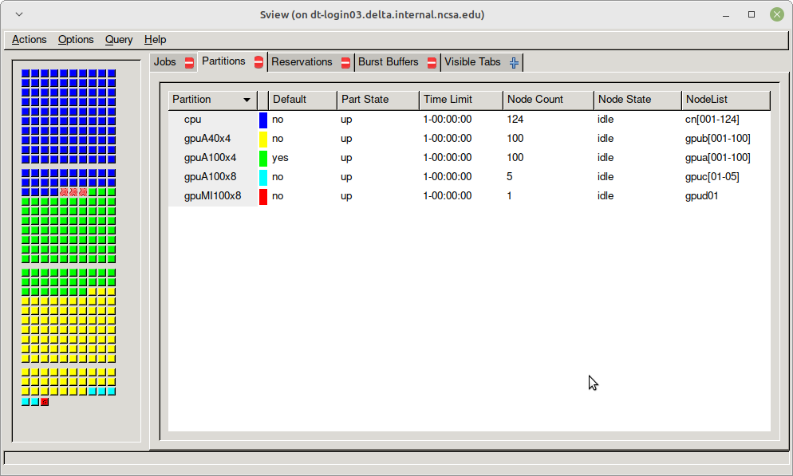

Running Jobs
===============

Accounting
-----------

The charge unit for Delta is the service unit (SU). 
This corresponds to the equivalent use of one compute core utilizing less than or equal to 2G of memory for one hour, or 1 GPU or fractional GPU using less than the corresponding amount of memory or cores for 1 hour (see table below). 
**Charges are based on the resources that are reserved for your job and do not necessarily reflect how the resources are used.**
Charges are based on either the number of cores or the fraction of the memory requested, whichever is larger. 
The minimum charge for any job is 1 SU.

+------------------------+-----------------------------------+
| Node Type              | Service Unit Equivalence          |
+                        +-------+--------------+------------+
|                        | Cores | GPU Fraction | Host Memory|
+========================+=======+==============+============+
| CPU Node               | 1     | N/A          | 2 GB       |
+----------+-------------+-------+--------------+------------+
| GPU Node | Quad A100   | 16    | 1 A100       | 62.5 GB    |
|          +-------------+-------+--------------+------------+
|          | Quad A40    | 16    | 1 A40        | 62.5 GB    |
|          +-------------+-------+--------------+------------+
|          | 8-way A100  | 16    | 1 A100       | 250 GB     |
|          +-------------+-------+--------------+------------+
|          | 8-way MI100 | 16    | 1 MI100      | 250 GB     |
+----------+-------------+-------+--------------+------------+

Please note that a weighting factor will discount the charge for the reduced-precision A40 nodes, as well as the novel AMD MI100 based node - this will be documented through the ACCESS SU converter.

Local Account Charging
~~~~~~~~~~~~~~~~~~~~~~~

Use the ``accounts`` command to list the accounts available for charging. 
CPU and GPU resources will have individual charge names. 
For example in the following, **``abcd-delta-cpu``** and **``abcd-delta-gpu``** are available for user gbauer to use for the CPU and GPU resources.

.. code-block::

   $ accounts
   Project Summary for User 'kingda':

   Project         Description                    Balance (Hours)    Deposited (Hours)
   --------------  ---------------------------  -----------------  -------------------
   bbka-delta-gpu  ncsa/delta staff allocation            5000000              5000000
   bbka-delta-cpu  ncsa/delta staff allocation          100000000            100000000 

Job Accounting Considerations
~~~~~~~~~~~~~~~~~~~~~~~~~~~~~~~

-  A node-exclusive job that runs on a compute node for one hour will be
   charged 128 SUs (128 cores x 1 hour)
-  A node-exclusive job that runs on a 4-way GPU node for one hour will
   be charge 4 SUs (4 GPU x 1 hour)
-  A node-exclusive job that runs on a 8-way GPU node for one hour will
   be charge 8 SUs (8 GPU x 1 hour)

QOSGrpBillingMinutes
~~~~~~~~~~~~~~~~~~~~~~

If you see QOSGrpBillingMinutes under the Reason column for the squeue command, as in:

.. code-block::

                JOBID PARTITION     NAME     USER ST       TIME  NODES NODELIST(REASON)
              1204221       cpu    myjob     .... PD       0:00      5 (QOSGrpBillingMinutes)

Then the resource allocation specified for the job (i.e. xyzt-delta-cpu) does not have sufficient balance to run the job based on the number of resources requested and the wallclock time. 
Sometimes it may be other jobs from the same project, also in the QOSGrpBillingMinutes state, using the same resource allocation that are preventing a job that would normally "fit" from running.
To resolve, the PI of the project needs to put in a supplement request using the same XRAS proposal system that was used for the current award (ACCESS or NCSA).

Reviewing Job Charges for a Project (jobcharge)
~~~~~~~~~~~~~~~~~~~~~~~~~~~~~~~~~~~~~~~~~~~~~~~~~

jobcharge in /sw/user/scripts/ will show job charges by user for a project. Example usage:

.. code-block::

   [arnoldg@dt-login03 ]$ jobcharge bbka-delta-gpu -b 10 --detail | tail -15
   106  1662443  gpuMI100x8                 0  nan                                                               kingda           bash                                    2023-04-06T09:39:01              0       0
   107  1662444  gpuMI100x8               291  billing=1000,cpu=2,gres/gpu:mi100=1,gres/gpu=1,mem=3G,node=1      kingda           bash                                    2023-04-06T09:44:11           1000       0.08
   108  1662449  gpuMI100x8               614  billing=1000,cpu=2,gres/gpu:mi100=1,gres/gpu=1,mem=3G,node=1      kingda           bash                                    2023-04-06T10:07:23           1000       0.17
   109  1662477  gpuMI100x8               446  billing=1000,cpu=2,gres/gpu:mi100=1,gres/gpu=1,mem=3G,node=1      kingda           bash                                    2023-04-06T10:15:08           1000       0.12
   110  1662492  gpuMI100x8               760  billing=8000,cpu=2,gres/gpu:mi100=8,gres/gpu=8,mem=3G,node=1      kingda           bash                                    2023-04-06T10:28:00           8000       1.69
   111  1662511  gpuMI100x8-interactive  1521  billing=16000,cpu=128,gres/gpu:mi100=8,gres/gpu=8,mem=64G,node=1  arnoldg          bash                                    Unknown                      16000       6.76
   _____SUMMARY___________________
   User               Charge (SU)
   ---------------  -------------
   arnoldg                  25.76
   babreu                    6.66
   kingda                    2.06
   rmokos                    0.96
   svcdeltajenkins           0.23
   Total                    35.67

   [arnoldg@dt-login03 scripts]$ jobcharge bbka-delta-gpu -b 10
   Output for 2023-03-27-11:25:24 through 2023-04-06-11:25:24:
   User               Charge (SU)
   ---------------  -------------
   arnoldg                  26.04
   babreu                    6.66
   kingda                    2.06
   rmokos                    0.96
   svcdeltajenkins           0.23
   Total                    35.95

   [arnoldg@dt-login03 ]$ jobcharge bbka-delta-gpu -h
   usage: jobcharge [-h] [-m MONTH] [-y YEAR] [-b DAYSBACK] [-s STARTTIME] [-e ENDTIME] [--detail]
                    accountstring

   positional arguments:
     accountstring         account name

   optional arguments:
     -h, --help            show this help message and exit
     -m MONTH, --month MONTH
                           Month (1-12) Default is current month
     -y YEAR, --year YEAR  Year (20XX) default is current year
     -b DAYSBACK, --daysback DAYSBACK
                           Number of days back
     -s STARTTIME, --starttime STARTTIME
                           Start time string in format (format: %Y-%m-%d-%H:%M:%S)
                           Example:2023-01-03-01:23:21)
     -e ENDTIME, --endtime ENDTIME
                           End time time string in format (format: %Y-%m-%d-%H:%M:%S)
                           Example:2023-01-03-01:23:21)
     --detail              detail output, per-job [svchydroswmanage@hydrol1 scripts]$ 

.. _examples:

Sample Scripts
----------------

Serial Jobs on CPU Nodes
~~~~~~~~~~~~~~~~~~~~~~~~~

.. code-block::

   $ cat job.slurm
   #!/bin/bash
   #SBATCH --mem=16g
   #SBATCH --nodes=1
   #SBATCH --ntasks-per-node=1
   #SBATCH --cpus-per-task=4    # <- match to OMP_NUM_THREADS
   #SBATCH --partition=cpu      # <- or one of: gpuA100x4 gpuA40x4 gpuA100x8 gpuMI100x8
   #SBATCH --account=account_name
   #SBATCH --job-name=myjobtest
   #SBATCH --time=00:10:00      # hh:mm:ss for the job
   #SBATCH --constraint="scratch"
   ### GPU options ###
   ##SBATCH --gpus-per-node=2
   ##SBATCH --gpu-bind=none     # <- or closest
   ##SBATCH --mail-user=you@yourinstitution.edu
   ##SBATCH --mail-type="BEGIN,END" See sbatch or srun man pages for more email options

   module reset # drop modules and explicitly load the ones needed
                # (good job metadata and reproducibility)
                # $WORK and $SCRATCH are now set
   module load python  # ... or any appropriate modules
   module list  # job documentation and metadata
   echo "job is starting on `hostname`"
   srun python3 myprog.py

MPI on CPU Nodes
~~~~~~~~~~~~~~~~

.. code-block::

   #!/bin/bash
   #SBATCH --mem=16g
   #SBATCH --nodes=2
   #SBATCH --ntasks-per-node=32
   #SBATCH --cpus-per-task=2    # <- match to OMP_NUM_THREADS
   #SBATCH --partition=cpu      # <- or one of: gpuA100x4 gpuA40x4 gpuA100x8 gpuMI100x8
   #SBATCH --account=account_name
   #SBATCH --job-name=mympi
   #SBATCH --time=00:10:00      # hh:mm:ss for the job
   #SBATCH --constraint="scratch"
   ### GPU options ###
   ##SBATCH --gpus-per-node=2
   ##SBATCH --gpu-bind=none     # <- or closest ##SBATCH --mail-user=you@yourinstitution.edu
   ##SBATCH --mail-type="BEGIN,END" See sbatch or srun man pages for more email options

   module reset # drop modules and explicitly load the ones needed
                # (good job metadata and reproducibility)
                # $WORK and $SCRATCH are now set
   module load gcc/11.2.0 openmpi  # ... or any appropriate modules
   module list  # job documentation and metadata
   echo "job is starting on `hostname`"
   srun osu_reduce

OpenMP on CPU Nodes
~~~~~~~~~~~~~~~~~~~~

.. code-block::

   #!/bin/bash
   #SBATCH --mem=16g
   #SBATCH --nodes=1
   #SBATCH --ntasks-per-node=1
   #SBATCH --cpus-per-task=32   # <- match to OMP_NUM_THREADS
   #SBATCH --partition=cpu      # <- or one of: gpuA100x4 gpuA40x4 gpuA100x8 gpuMI100x8
   #SBATCH --account=account_name
   #SBATCH --job-name=myopenmp
   #SBATCH --time=00:10:00      # hh:mm:ss for the job
   #SBATCH --constraint="scratch"
   ### GPU options ###
   ##SBATCH --gpus-per-node=2
   ##SBATCH --gpu-bind=none     # <- or closest
   ##SBATCH --mail-user=you@yourinstitution.edu
   ##SBATCH --mail-type="BEGIN,END" See sbatch or srun man pages for more email options

   module reset # drop modules and explicitly load the ones needed
                # (good job metadata and reproducibility)
                # $WORK and $SCRATCH are now set
   module load gcc/11.2.0  # ... or any appropriate modules
   module list  # job documentation and metadata
   echo "job is starting on `hostname`"
   export OMP_NUM_THREADS=32
   srun stream_gcc 

Hybrid (MPI + OpenMP or MPI+X) on CPU Nodes
~~~~~~~~~~~~~~~~~~~~~~~~~~~~~~~~~~~~~~~~~~~~~

.. code-block::

   #!/bin/bash
   #SBATCH --mem=16g
   #SBATCH --nodes=2
   #SBATCH --ntasks-per-node=4
   #SBATCH --cpus-per-task=4    # <- match to OMP_NUM_THREADS
   #SBATCH --partition=cpu      # <- or one of: gpuA100x4 gpuA40x4 gpuA100x8 gpuMI100x8
   #SBATCH --account=account_name
   #SBATCH --job-name=mympi+x
   #SBATCH --time=00:10:00      # hh:mm:ss for the job
   #SBATCH --constraint="scratch"
   ### GPU options ###
   ##SBATCH --gpus-per-node=2
   ##SBATCH --gpu-bind=none     # <- or closest
   ##SBATCH --mail-user=you@yourinstitution.edu
   ##SBATCH --mail-type="BEGIN,END" See sbatch or srun man pages for more email options

   module reset # drop modules and explicitly load the ones needed
                # (good job metadata and reproducibility)
                # $WORK and $SCRATCH are now set
   module load gcc/11.2.0 openmpi # ... or any appropriate modules
   module list  # job documentation and metadata
   echo "job is starting on `hostname`"
   export OMP_NUM_THREADS=4
   srun xthi 

4 GPUs Together on a Compute Node
~~~~~~~~~~~~~~~~~~~~~~~~~~~~~~~~~~

.. code-block::

   #!/bin/bash
   #SBATCH --job-name="a.out_symmetric"
   #SBATCH --output="a.out.%j.%N.out"
   #SBATCH --partition=gpuA100x4
   #SBATCH --mem=208G
   #SBATCH --nodes=1
   #SBATCH --ntasks-per-node=4  # could be 1 for py-torch
   #SBATCH --cpus-per-task=16   # spread out to use 1 core per numa, set to 64 if tasks is 1
   #SBATCH --constraint="scratch"
   #SBATCH --gpus-per-node=4
   #SBATCH --gpu-bind=closest   # select a cpu close to gpu on pci bus topology
   #SBATCH --account=bbjw-delta-gpu
   #SBATCH --exclusive  # dedicated node for this job
   #SBATCH --no-requeue
   #SBATCH -t 04:00:00

   export OMP_NUM_THREADS=1  # if code is not multithreaded, otherwise set to 8 or 16
   srun -N 1 -n 4 ./a.out > myjob.out
   # py-torch example, --ntasks-per-node=1 --cpus-per-task=64
   # srun python3 multiple_gpu.py

Parametric / Array / HTC Jobs
~~~~~~~~~~~~~~~~~~~~~~~~~~~~~

Not yet implemented.

Interactive Sessions
-------------------------

Interactive sessions can be implemented in several ways, depending on what is needed. To start up a bash shell terminal on a CPU or GPU node:

Single Core with 16GB of Memory, with One Task on a CPU Node
~~~~~~~~~~~~~~~~~~~~~~~~~~~~~~~~~~~~~~~~~~~~~~~~~~~~~~~~~~~~~~

.. code-block::

   srun --account=account_name --partition=cpu-interactive \
     --nodes=1 --tasks=1 --tasks-per-node=1 \
     --cpus-per-task=4 --mem=16g \
     --pty bash

Single Core with 20GB of Memory, with One Task on a A40 GPU Node
~~~~~~~~~~~~~~~~~~~~~~~~~~~~~~~~~~~~~~~~~~~~~~~~~~~~~~~~~~~~~~~~~~

.. code-block::

   srun --account=account_name --partition=gpuA40x4-interactive \
     --nodes=1 --gpus-per-node=1 --tasks=1 \
     --tasks-per-node=16 --cpus-per-task=1 --mem=20g \
     --pty bash 

MPI Interactive Jobs: Use salloc Followed by srun
~~~~~~~~~~~~~~~~~~~~~~~~~~~~~~~~~~~~~~~~~~~~~~~~~~

Since interactive jobs are already a child process of srun, one cannot srun (or mpirun) applications from within them. 
Within standard batch jobs submitted via sbatch, use ``srun`` to launch MPI codes. 
For true interactive MPI, use ``salloc`` in place of srun shown above, then "srun my_mpi.exe" after you get a prompt from salloc (exit to end the salloc interactive allocation).

.. code-block::

   [arnoldg@dt-login01 collective]$ cat osu_reduce.salloc
   salloc --account=bbka-delta-cpu --partition=cpu-interactive \
     --nodes=2 --tasks-per-node=4 \
     --cpus-per-task=2 --mem=0

   [arnoldg@dt-login01 collective]$ ./osu_reduce.salloc
   salloc: Pending job allocation 1180009
   salloc: job 1180009 queued and waiting for resources
   salloc: job 1180009 has been allocated resources
   salloc: Granted job allocation 1180009
   salloc: Waiting for resource configuration
   salloc: Nodes cn[009-010] are ready for job
   [arnoldg@dt-login01 collective]$ srun osu_reduce

   # OSU MPI Reduce Latency Test v5.9
   # Size       Avg Latency(us)
   4                       1.76
   8                       1.70
   16                      1.72
   32                      1.80
   64                      2.06
   128                     2.00
   256                     2.29
   512                     2.39
   1024                    2.66
   2048                    3.29
   4096                    4.24
   8192                    2.36
   16384                   3.91
   32768                   6.37
   65536                  10.49
   131072                 26.84
   262144                198.38
   524288                342.45
   1048576               687.78
   [arnoldg@dt-login01 collective]$ exit
   exit
   salloc: Relinquishing job allocation 1180009
   [arnoldg@dt-login01 collective]$ 

Interactive X11 Support
~~~~~~~~~~~~~~~~~~~~~~~

To run an X11 based application on a compute node in an interactive session, the use of the ``--x11`` switch with ``srun`` is needed. 
For example, to run a single core job that uses 1G of memory with X11 (in this case an xterm) do the following:

.. code-block::

   srun -A abcd-delta-cpu  --partition=cpu-interactive \
     --nodes=1 --tasks=1 --tasks-per-node=1 \
     --cpus-per-task=2 --mem=16g \
     --x11  xterm

.. _file-system-dependency-specification-for-jobs-1:

File System Dependency Specification for Jobs
---------------------------------------------

Please see the **link** section on setting job file system dependencies for jobs.

Jobs that do not specify a dependency on the WORK (/projects) and SCRATCH (/scratch) will be assumed to depend only on the HOME (/u) file system.

Job Management
-----------------

Batch jobs are submitted through a *job script* (as in the :ref:`examples`) using the sbatch command. 
Job scripts generally start with a series of Slurm *directives* that describe requirements of the job such as number of nodes and wall time required to the batch system/scheduler (Slurm directives can also be specified as options on the sbatch command line; command line options take precedence over those in the script). 
The rest of the batch script consists of user commands.

The syntax for sbatch is: **sbatch** [list of sbatch options] script_name

Refer to the sbatch man page for detailed information on the options.

squeue/scontrol/sinfo
~~~~~~~~~~~~~~~~~~~~~

Commands that display batch job and partition information.

+-------------------------+-------------------------------------------+
| Slurm Example Command   | Description                               |
+=========================+===========================================+
| squeue -a               | List the status of all jobs on the        |
|                         | system.                                   |
+-------------------------+-------------------------------------------+
| squeue -u $USER         | List the status of all your jobs in the   |
|                         | batch system.                             |
+-------------------------+-------------------------------------------+
| squeue -j JobID         | List nodes allocated to a running job in  |
|                         | addition to basic information..           |
+-------------------------+-------------------------------------------+
| scontrol show job JobID | List detailed information on a particular |
|                         | job.                                      |
+-------------------------+-------------------------------------------+
| sinfo -a                | List summary information on all the       |
|                         | partition.                                |
+-------------------------+-------------------------------------------+

See the manual (man) pages for other available options.

srun
~~~~~

The srun command initiates an interactive job on compute nodes.

For example, the following command will run an interactive job in the gpuA100x4 partition with a wall clock limit of 30 minutes, using one node and 16 cores per node and 1 GPU:

.. code-block::

   srun -A account_name --time=00:30:00 --nodes=1 --ntasks-per-node=16 \
   --partition=gpuA100x4 --gpus=1 --mem=16g --pty /bin/bash

After you enter the command, you will have to wait for Slurm to start the job. 
As with any job, your interactive job will wait in the queue until the specified number of nodes is available. 
If you specify a small number of nodes for smaller amounts of time, the wait should be shorter because your job will backfill among larger jobs. 
You will see something like this:

``srun: job 123456 queued and waiting for resources``

Once the job starts, you will see:

``srun: job 123456 has been allocated resources``

You will also be presented with an interactive shell prompt on the launch node. 
At this point, you can use the appropriate command to start your program.

When you are done with your work, you can use the ``exit`` command to end the job.

scancel
~~~~~~~~

The scancel command deletes a queued job or terminates a running job.

.. code-block::

   scancel JobID 

Deletes/terminates the job with the associated JobID.

Job Status
~~~~~~~~~~~

If the *NODELIST(REASON)* is MaxGRESPerAccount that means that a user has exceeded the number of cores or GPUs allotted per user or project for a given partition.

Useful Batch Job Environment Variables slurm_environment_variables

+-------------------------+-------------------------------------------+----------------------------------------------+
| Description             | Slurm Environment Variable                | Detail Description                           |
+=========================+===========================================+==============================================+
| Array JobID             | $SLURM_ARRAY_JOB_ID                       | Each member of a job array is assigned       |
|                         | $SLURM_ARRAY_TASK_ID                      | a unique identifier                          |
+-------------------------+-------------------------------------------+----------------------------------------------+
| Job Submission Directory| $SLURM_SUBMIT_DIR                         | By default, jobs start in the directory      |
|                         |                                           | that the job was submitted from. So the      |
|                         |                                           | "cd $SLURM_SUBMIT_DIR" command is not needed.|
+-------------------------+-------------------------------------------+----------------------------------------------+
| JobID                   | $SLURM_JOB_ID                             | Job identifier assigned to the job           |
+-------------------------+-------------------------------------------+----------------------------------------------+
| Machine(node) list      | $SLURM_NODELIST                           | Variable name that contains the list of nodes|
|                         |                                           | assigned to the batch job                    |
+-------------------------+-------------------------------------------+----------------------------------------------+

See the sbatch man page for additional environment variables available.

Accessing the Compute Nodes
-------------------------------

Delta implements the Slurm batch environment to manage access to the compute nodes. 
Use the Slurm commands to run batch jobs or for interactive access to compute nodes. 
See: https://slurm.schedmd.com/quickstart.html for an introduction to Slurm. 
There are two ways to access compute nodes on Delta.

Batch jobs can be used to access compute nodes. 
Slurm provides a convenient direct way to submit batch jobs. 
See https://slurm.schedmd.com/heterogeneous_jobs.html#submitting for details. 

Slurm supports job arrays for easy management of a set of similar jobs, see: https://slurm.schedmd.com/job_array.html.

Sample Slurm batch job scripts are provided in the :ref:`examples` section.

Direct SSH access to a compute node in a running batch job from a dt-loginNN node is enabled once the job has started.

.. code-block::

   $ squeue --job jobid
                JOBID PARTITION     NAME     USER ST       TIME  NODES NODELIST(REASON)
                12345       cpu     bash   gbauer  R       0:17      1 cn001

Then in a terminal session:

.. code-block::

   $ ssh cn001
   cn001.delta.internal.ncsa.edu (172.28.22.64)
     OS: RedHat 8.4   HW: HPE   CPU: 128x    RAM: 252 GB
     Site: mgmt  Role: compute
   $

See also:

.. toctree::
   :maxdepth: 2
   
   monitor_node/index 

Scheduler
-------------

For information, see the Slurm quick reference guide: https://slurm.schedmd.com/quickstart.html

..  image:: slurm_summary.pdf
    :alt: Slurm quick reference guide
    :width: 700px

Partitions (Queues)
-----------------------

======================= ==================
Delta Production Default Partition Values
------------------------------------------
Property                Value
======================= ==================
Default Memory per core 1000 MB
Default Wallclock time  30 minutes
======================= ==================

+-----------------------+-----------+-------------------+--------------+---------------------------+---------------+
|Delta Production Partitions/Queues                                                                                |
+-----------------------+-----------+-------------------+--------------+---------------------------+---------------+
| Partition/Queue       | Node Type | Max Nodes per Job | Max Duration | Max Running in Queue/user | Charge Factor |
+=======================+===========+===================+==============+===========================+===============+
| cpu                   | CPU       | TBD               | 48 hr        | TBD                       | 1.0           |
+-----------------------+-----------+-------------------+--------------+---------------------------+---------------+
| cpu-interactive       | CPU       | TBD               | 30 min       | TBD                       | 2.0           |
+-----------------------+-----------+-------------------+--------------+---------------------------+---------------+
| gpuA100x4             | quad-A100 | TBD               | 48 hr        | TBD                       | 1.0           |
|                       |           |                   |              |                           |               |
| gpuA100x4*            |           |                   |              |                           |               |
|                       |           |                   |              |                           |               |
| (asterisk             |           |                   |              |                           |               |
| indicates this        |           |                   |              |                           |               |
| is the default        |           |                   |              |                           |               |
| queue, but            |           |                   |              |                           |               |
| submit jobs to        |           |                   |              |                           |               |
| gpuA100x4)            |           |                   |              |                           |               |
+-----------------------+-----------+-------------------+--------------+---------------------------+---------------+
| gpuA100x4-interactive | quad-A100 | TBD               | 1 hr         | TBD                       | 2.0           |
+-----------------------+-----------+-------------------+--------------+---------------------------+---------------+
| gpuA100x8             | octa-A100 | TBD               | 48 hr        | TBD                       | 1.5           |
+-----------------------+-----------+-------------------+--------------+---------------------------+---------------+
| gpuA100x8-interactive | octa-A100 | TBD               | 1 hr         | TBD                       | 3.0           |
+-----------------------+-----------+-------------------+--------------+---------------------------+---------------+
| gpuA40x4              | quad-A40  | TBD               | 48 hr        | TBD                       | 0.6           |
+-----------------------+-----------+-------------------+--------------+---------------------------+---------------+
| gpuA40x4-interactive  | quad-A40  | TBD               | 1 hr         | TBD                       | 1.2           |
+-----------------------+-----------+-------------------+--------------+---------------------------+---------------+
| gpuMI100x8            | octa-MI100| TBD               | 48 hr        | TBD                       | 1.0           |
+-----------------------+-----------+-------------------+--------------+---------------------------+---------------+
| gpuMI100x8-interactive| octa-MI100| TBD               | 1 hr         | TBD                       | 2.0           |
+-----------------------+-----------+-------------------+--------------+---------------------------+---------------+

sview View of Slurm Partitions
~~~~~~~~~~~~~~~~~~~~~~~~~~~~~~~~

Node Policies
~~~~~~~~~~~~~

Node-sharing is the default for jobs. 
Node-exclusive mode can be obtained by specifying all the consumable resources for that node type or adding the following Slurm options:

.. code-block::

   --exclusive --mem=0

GPU NVIDIA MIG (GPU slicing) for the A100 will be supported at a future date.

Pre-emptive jobs will be supported at a future date.

Job Policies
----------------

The default job requeue or restart policy is set to not allow jobs to be automatically requeued or restarted (as of 12/19/2022).

To enable automatic requeue and restart of a job by Slurm, please add the following slurm directive:

.. code-block::

   --requeue 

When a job is requeued due to an event like a node failure, the batch script is initiated from its beginning. 
Job scripts need to be written to handle automatically restarting from checkpoints.

Monitoring a Node During a Job
---------------------------------

.. toctree::
   :maxdepth: 2
   
  monitor_node/index 

Refunds
------------

Refunds are considered, when appropriate, for jobs that failed due to circumstances beyond user control.

To request a refund, email help@ncsa.illinois.edu. Please include the batch job ids and the standard error and output files produced by the job(s).
