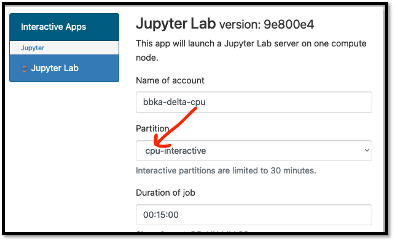
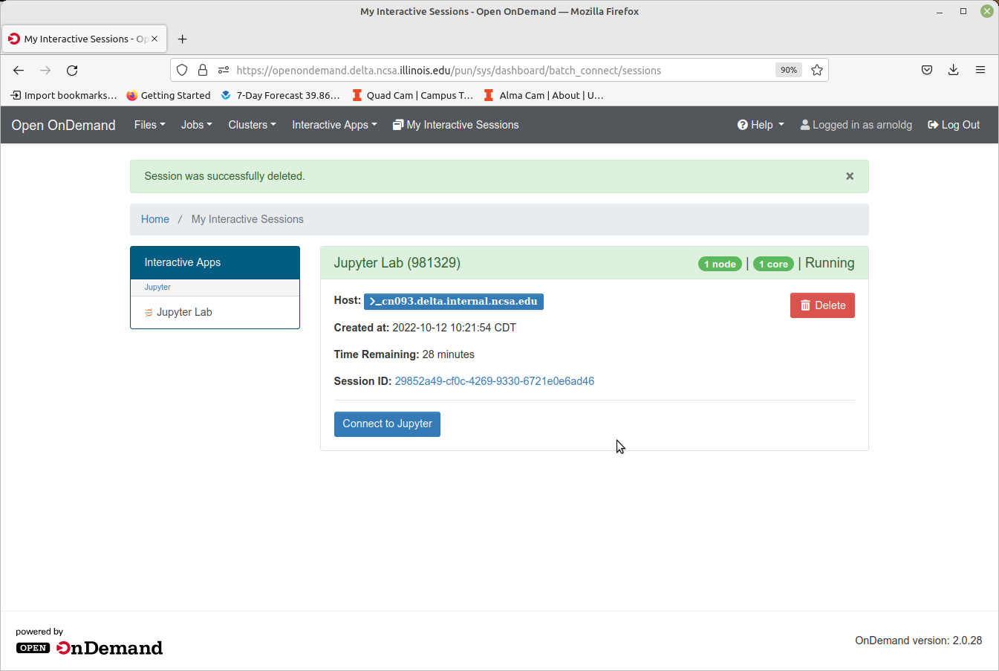
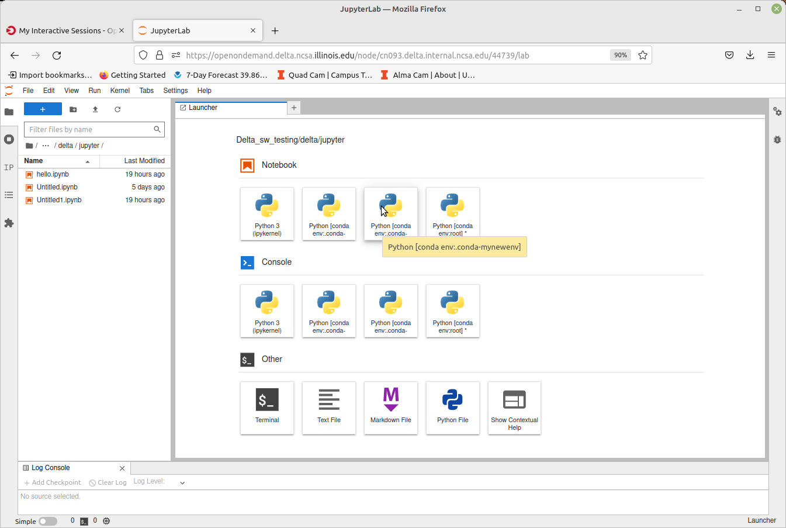
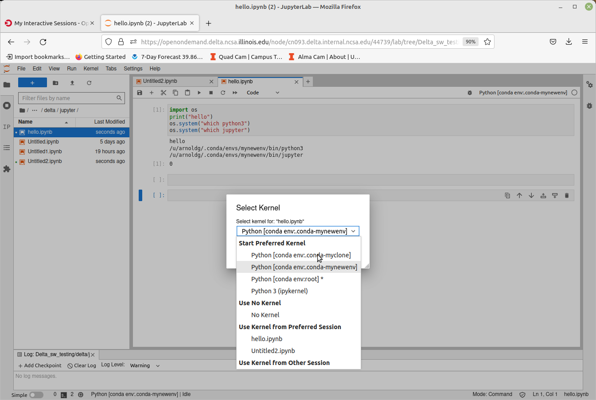
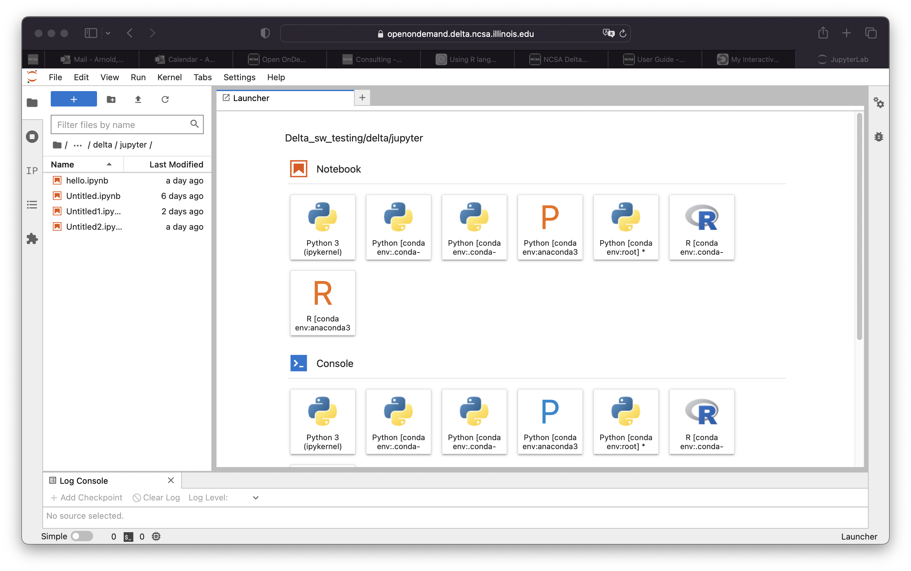
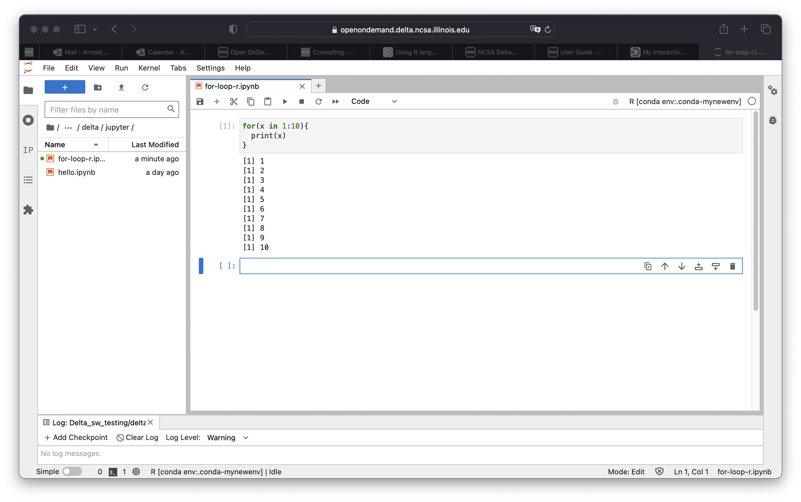

Services
===========

Open OnDemand
-------------------------

The Delta Open OnDemand portal is now available for use. Current
supported Interactive apps: Jupyter notebooks.

To connect to the Open OnDemand portal, point a browser
to\ https://openondemand.delta.ncsa.illinois.edu/\ and use your NCSA
username, password with NCSA Duo with the CILogin page.

Please make sure to match the account to charge with the resource
partition as shown below. The account names end in -cpu and -gpu. The
matching partition would start with cpu or gpu (as in gpuA100x4
interactive).

To customize your JupyterLab experience for Python or R, see:

Customizing Open OnDemand
-----------------------------

Customizing Jupyterlab with Anaconda environments
~~~~~~~~~~~~~~~~~~~~~~~~~~~~~~~~~~~~~~~~~~~~~~~~~~~~~

Step one is to load an anaconda_<cpu, gpu, mi100> that you want to use
as your base installation and initialize your default login shell to use
conda environments.

Select an anaconda3:
$$$$$$$$$$$$$$$$$$$$$$$$$

::

   [arnoldg@dt-login03 scripts]$ module load anaconda3_cpu
   [arnoldg@dt-login03 scripts]$ conda init bash
   ...
   [arnoldg@dt-login03 scripts]$ bash
   (base) 

*After you have run "conda init bash" you will not need to load
anaconda3_cpu (or gpu ) modules again. Just use your new custom
environment.*

conda init bash error messages

You may see error messages from conda init bash above. Just control-c
through them and continue. As long as conda added code to the end of
your .bashrc (or similar for other shells), things will work properly.

Start a new shell with bash or a new terminal or login session with
Delta. You'll now see this prompt showing that you are within the conda
environment you initially chose. If you want to change environments
later (say to anaconda3_mi100) you can edit your .bashrc and do another
"conda init bash" with that new module loaded.

To create a new custom environment, you have 2 options.

Create a new empty environment:
$$$$$$$$$$$$$$$$$$$$$$$$$$$$$$$$$

cpu, gpu, or mi100

If you will be making custom environments for more than one partition
type (cpu, gpu, mi100), it may be helpful to include that metadata in
the name of your environment.

Install jupyter into the environment in order to use it with
OpenOnDemand. This option adds about 150 python modules to your
environment and requires about 1.3 GB in your $HOME. Setup time: about
10 minutes.

::

   (base) conda create --name mynewenv

   Collecting package metadata (current_repodata.json): done
   Solving environment: done

   ## Package Plan ##

     environment location: /u/arnoldg/.conda/envs/mynewenv

   Proceed ([y]/n)? y

   Preparing transaction: done
   Verifying transaction: done
   Executing transaction: done
   #
   # To activate this environment, use
   #
   #     $ conda activate mynewenv
   #
   # To deactivate an active environment, use
   #
   #     $ conda deactivate

   Retrieving notices: ...working... done
   (base) conda activate mynewenv
   (mynewenv) conda install jupyter
   Collecting package metadata (current_repodata.json): done
   Solving environment: done

   ## Package Plan ##

     environment location: /u/arnoldg/.conda/envs/mynewenv

     added / updated specs:
       - jupyter

   The following NEW packages will be INSTALLED:

     _libgcc_mutex      pkgs/main/linux-64::_libgcc_mutex-0.1-main None
     _openmp_mutex      pkgs/main/linux-64::_openmp_mutex-5.1-1_gnu None
     anyio              pkgs/main/linux-64::anyio-3.5.0-py310h06a4308_0 None
     argon2-cffi        pkgs/main/noarch::argon2-cffi-21.3.0-pyhd3eb1b0_0 None
   ...
   (mynewenv) conda list | grep jupyter
   jupyter                   1.0.0           py310h06a4308_8  
   jupyter_client            7.3.5           py310h06a4308_0  
   jupyter_console           6.4.3              pyhd3eb1b0_0  
   jupyter_core              4.11.1          py310h06a4308_0  
   jupyter_server            1.18.1          py310h06a4308_0  
   jupyterlab                3.4.4           py310h06a4308_0  
   jupyterlab_pygments       0.1.2                      py_0  
   jupyterlab_server         2.15.2          py310h06a4308_0  
   jupyterlab_widgets        1.0.0              pyhd3eb1b0_1  
   (mynewenv) conda list | wc -l
   152
   (mynewenv) du -sh $HOME/.conda/envs/mynewenv
   1.3G    /u/arnoldg/.conda/envs/mynewenv

...or create a new clone of your chosen anaconda3_<cpu, gpu, mi100> module:
$$$$$$$$$$$$$$$$$$$$$$$$$$$$$$$$$$$$$$$$$$$$$$$$$$$$$$$$$$$$$$$$$$$$$$$$$$$$$$$$$

Jupyter (and everything else from your loaded anaconda3\_ module will be
copied into this environment). This option adds about 500 python modules
to your environment and requires about 6.3 GB in your $HOME. Install
time can be up to 1/2 hr.

::

   (base) time conda create --name myclone --clone base 
   Source:      /sw/external/python/anaconda3_cpu
   Destination: /u/arnoldg/.conda/envs/myclone
   The following packages cannot be cloned out of the root environment:
    - defaults/linux-64::conda-env-2.6.0-1
    - defaults/linux-64::conda-22.9.0-py39h06a4308_0
    - defaults/linux-64::conda-build-3.21.8-py39h06a4308_2
    - defaults/noarch::conda-token-0.4.0-pyhd3eb1b0_0
    - defaults/linux-64::_anaconda_depends-2022.05-py39_0
    - defaults/linux-64::anaconda-navigator-2.1.4-py39h06a4308_0
    - defaults/linux-64::anaconda-custom-py39_1
   Packages: 447
   Files: 24174
   Preparing transaction: done
   Verifying transaction: done
   Executing transaction: \ 
   ...

   Retrieving notices: ...working... done

   real    24m10.605s
   user    0m54.353s
   sys     1m56.843s 
   (base) conda activate myclone
   (myclone) conda list | wc -l
   501
   (myclone) du -sh $HOME/.conda/envs/myclone
   6.3G    /u/arnoldg/.conda/envs/myclone

Start an `OpenOnDemand
Jupyterlab <https://wiki.ncsa.illinois.edu/display/DSC/Delta+User+Guide#DeltaUserGuide-Jupyternotebooks>`__
session and access one of your environments (remember to match your
partition and account types for gpu, cpu), then select the matching
kernel for your Jupyter work:

Launch Jupyterlab
$$$$$$$$$$$$$$$$$$$$$$

After filling in the OpenOnDemand form and submitting your job, it will
start in a few minutes showing the "Connect to Jupyter" button when
ready.

    
Hover over items in the Launcher view to see which environment will be
used, selecting the one you want for this session.

Change your kernel to match if you are opening a notebook from a
different environment.

R
~~~~~

R is available in Jupyterlab by activating the environment via the
module *anaconda_Rcpu*. Append the module load line to your .bashrc. R
will run on the cpu cores (not gpu enabled).

::

   $ tail .bashrc

   module load anaconda3_Rcpu
   $

After modifying your .bashrc and getting a new shell, your login prompt
should reflect that you are within the anaconda3_Rcpu environment, R
will be in your $PATH, and starting Jupyterlab from the OpenOnDemand
interface will automatically offer you the R options with the Launcher.

Proceed to use R:

Debugging OpenOnDemand problems:
================================

For internal staff debugging (also useful for new OOD

Delta Science Gateway
---------------------

Globus
-------------------------
