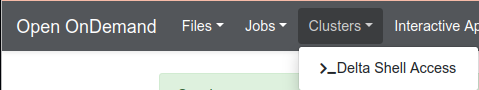

.. _access:

Accessing the System
=========================

.. _direct_access:

Direct Access Login Nodes
-----------------------------

Direct access to the Delta login nodes is via SSH using your NCSA username, password, and NCSA Duo MFA. See the `NCSA Allocation and Account Management <https://wiki.ncsa.illinois.edu/display/USSPPRT/NCSA+Allocation+and+Account+Management>`_ page for links to NCSA Identity and NCSA Duo services. The login nodes provide access to the CPU and GPU resources on Delta.

See `NCSA Allocation and Account Management <https://wiki.ncsa.illinois.edu/display/USSPPRT/NCSA+Allocation+and+Account+Management>`_ for the steps to change your NCSA password for direct access and set up NCSA Duo. 

For ACCESS awarded projects, to find your local NCSA username go to your `ACCESS Profile page <https://allocations.access-ci.org/profile>`_ and scroll to the bottom for the **Resource Provider Site Usernames** table. If you do not know your NCSA username, submit a support request (:ref:`help`) for assistance.

+------------------------------------+--------------------------------------------------------+
|   Login Node Hostname              |   Example Usage with SSH                               |
+====================================+========================================================+
|                                    | .. code-block:: terminal                               |
| dt-login01.delta.ncsa.illinois.edu |                                                        |
|                                    |    ssh -Y username@dt-login01.delta.ncsa.illinois.edu  |
|                                    |                                                        |
|                                    | ( -Y allows X11 forwarding from Linux hosts )          |
|                                    |                                                        |    
+------------------------------------+--------------------------------------------------------+
| dt-login02.delta.ncsa.illinois.edu | .. code-block:: terminal                               |
|                                    |                                                        |
|                                    |    ssh -l username dt-login02.delta.ncsa.illinois.edu  |
|                                    |                                                        |
|                                    | ( -l username alt. syntax for ``user@host`` )          |
|                                    |                                                        |
+------------------------------------+--------------------------------------------------------+
| **login.delta.ncsa.illinois.edu**  | .. code-block:: terminal                               |
|                                    |                                                        |    
| (round robin DNS name for the set  |    ssh username@login.delta.ncsa.illinois.edu          |   
| of login nodes)                    |                                                        |    
+------------------------------------+--------------------------------------------------------+

Use of SSH key pairs is disabled for general use. Please submit a support request (:ref:`help`) for key pair use by Gateway allocations.

Maintaining Persistent Sessions: tmux
~~~~~~~~~~~~~~~~~~~~~~~~~~~~~~~~~~~~~~

tmux is available on the login nodes to maintain persistent sessions.
See the tmux man page for more information. 
After making note of the hostname, use the targeted login hostnames (dt-login01 or dt-login02) to attach to the login node where you started tmux. 
Avoid the round-robin hostname when using tmux.

SSH Keyboard-Interactive
~~~~~~~~~~~~~~~~~~~~~~~~~

For command line SSH clients, use the following settings if you have trouble logging in to Delta:

.. code-block::
   
   ssh -o PreferredAuthentications=keyboard-interactive,password

Open OnDemand
-------------

An Open OnDemand shell interface is available at: https://openondemand.delta.ncsa.illinois.edu/pun/sys/shell/ssh/dt-login02.

VS Code
-------
See: 
`Visual Studio Code, Remote ssh <https://ncsa-delta-doc.readthedocs-hosted.com/en/latest/user_guide/prog_env.html#remote-ssh>`_
