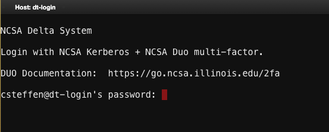

.. _access:

Delta Login Methods
=========================

.. _direct_access:

Direct Access Login Nodes
-----------------------------

Direct access to the Delta login nodes is via SSH using your NCSA username, password, and NCSA Duo MFA. See the `NCSA Allocation and Account Management <https://wiki.ncsa.illinois.edu/display/USSPPRT/NCSA+Allocation+and+Account+Management>`_ page for links to NCSA Identity and NCSA Duo services. The login nodes provide access to the CPU and GPU resources on Delta.

See `NCSA Allocation and Account Management <https://wiki.ncsa.illinois.edu/display/USSPPRT/NCSA+Allocation+and+Account+Management>`_ for the steps to change your NCSA password for direct access and set up NCSA Duo. 

For ACCESS awarded projects, to find your local NCSA username go to your `ACCESS Profile page <https://allocations.access-ci.org/profile>`_ and scroll to the bottom for the **Resource Provider Site Usernames** table. If you do not know your NCSA username, submit a support request (:ref:`help`) for assistance.

.. warning::

  In January 2024, Delta was upgraded to Slingshot11. Please use the round robin login, login.delta.ncsa.illinois.edu, to SSH into the system. For single host SSH, use dt-login03.delta.ncsa.illinois.edu or dt-login04.delta.ncsa.illinois.edu. See the `ACCESS Delta Notice: Delta maintenance 01-23-2024 - 01-25-2024 <https://operations.access-ci.org/node/671>`_ for more details. 

Login Node Hostnames
~~~~~~~~~~~~~~~~~~~~~~~

.. table:: Login Node Hostnames

   =======================================   ==============================
   Login Node Hostname                       Description
   =======================================   ==============================
   ``login.delta.ncsa.illinois.edu``         *This is the preferred hostname*. Alias that round robin logs into one of the two Delta login nodes. 
   ``dt-login.delta.ncsa.illinois.edu``      Alias that round robin logs into one of the two Delta login nodes.
   ``dt-login03.delta.ncsa.illinois.edu``    One of the two Delta login nodes.
   ``dt-login04.delta.ncsa.illinois.edu``    One of the two Delta login nodes.
   =======================================   ==============================

SSH Examples
~~~~~~~~~~~~~~

In the examples below, replace ``username`` with your Delta login username.

- Round robin log into a login node

  .. code-block:: terminal

     ssh username@login.delta.ncsa.illinois.edu

- ``-l username`` is an alternative syntax for ``<user>@<host>``

  .. code-block:: terminal

     ssh -l username login.delta.ncsa.illinois.edu

- ``-Y`` allows X11 forwarding from Linux hosts

  .. code-block:: terminal

     ssh -Y username@login.delta.ncsa.illinois.edu

Use of SSH key pairs is disabled for general use.  This means that most individual users, even PIs, are **not allowed** to use SSH key pairs to log in instead of 2-factor authentication.  

The one exception is: if you are the PI of a Gateway allocation (this is not most projects), then please submit a support request (:ref:`help`) to get the Gateway account's key pairs set up.  

Maintaining Persistent Sessions: tmux
~~~~~~~~~~~~~~~~~~~~~~~~~~~~~~~~~~~~~~

tmux is available on the login nodes to maintain persistent sessions.
See the tmux man page for more information. 
After making note of the hostname, use the targeted login hostnames (dt-login01 or dt-login02) to attach to the login node where you started tmux. 
Avoid the round-robin hostname when using tmux.

SSH Keyboard-Interactive
~~~~~~~~~~~~~~~~~~~~~~~~~

For command line SSH clients, use the following settings if you have trouble logging in to Delta:

.. code-block::
   
   ssh -o PreferredAuthentications=keyboard-interactive,password

Open OnDemand
-------------

The general Open OnDemand interface to Delta is here: https://openondemand.delta.ncsa.illinois.edu/.

An Open OnDemand shell interface is available at: https://openondemand.delta.ncsa.illinois.edu/pun/sys/shell/ssh/dt-login.

VS Code
-------
See: 
`Visual Studio Code, Remote ssh <https://ncsa-delta-doc.readthedocs-hosted.com/en/latest/user_guide/prog_env.html#remote-ssh>`_
