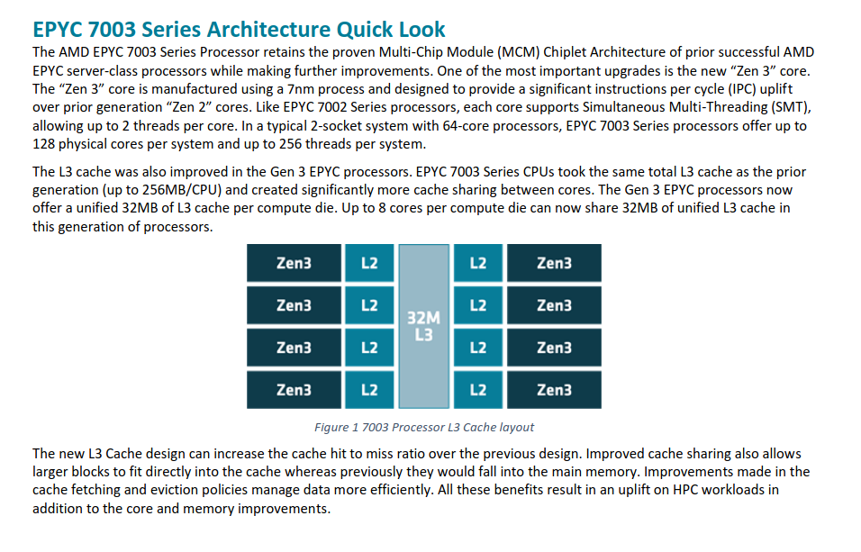

System Architecture
=======================

Delta is designed to help applications transition from CPU-only to GPU or hybrid CPU-GPU codes. 
Delta has some important architectural features to facilitate new discovery and insight:

-  A single processor architecture (AMD) across all node types: CPU and GPU
-  Support for NVIDIA A100 MIG GPU partitioning, allowing for fractional use of the A100s if your workload is not able to exploit an entire A100 efficiently
-  Raytracing hardware support from the NVIDIA A40 GPUs
-  Nine large memory (2 TB) nodes
-  A low latency and high bandwidth HPE/Cray Slingshot interconnect between compute nodes
-  Lustre for home, projects, and scratch file systems
-  Support for relaxed and non-POSIX I/O (feature not yet implemented)
-  Shared-node jobs and the single core and single MIG GPU slice
-  Resources for persistent services in support of Gateways, Open OnDemand, and Data Transport nodes
-  Unique AMD MI100 resource

Model Compute Nodes
----------------------

The Delta compute ecosystem is composed of five node types:

- Dual-socket, CPU-only compute nodes
- Single socket, 4-way NVIDIA A100 GPU compute nodes
- Single socket, 4-way NVIDIA A40 GPU compute nodes
- Dual-socket, 8-way NVIDIA A100 GPU compute nodes
- Single socket, 8-way AMD MI100 GPU compute nodes

| The CPU-only and 4-way GPU nodes have 256 GB of RAM per node; the 8-way GPU nodes have 2 TB of RAM. 
| The CPU-only node has 0.74 TB of local storage; all GPU nodes have 1.5 TB of local storage.

Each socket contains an AMD 7763 processor. Consistent with AMD's advice for HPC nodes and NCSA's testing, all Delta nodes have Simultaneous Multi Treading (SMT) turned off.  

CPU Compute Node Specifications
~~~~~~~~~~~~~~~~~~~~~~~~~~~~~~~~~~~~~~

.. table:: CPU Compute Node Specs

   ========================= ===================
   Specification             Value
   ========================= ===================
   Number of nodes           132
   CPU                       AMD EPYC 7763
                             "Milan" (PCIe Gen4)
   Sockets per node          2
   Cores per socket          64
   Cores per node            128
   Hardware threads per core 1
   Hardware threads per node 128
   Clock rate (GHz)          ~ 2.45
   RAM (GB)                  256
   Cache (KB) L1/L2/L3       64/512/32768
   Local storage (TB)        0.74 TB
   ========================= ===================

The AMD CPUs are set for 4 NUMA domains per socket (NPS=4).

4-Way NVIDIA A40 GPU Compute Node Specifications
~~~~~~~~~~~~~~~~~~~~~~~~~~~~~~~~~~~~~~~~~~~~~~~~~~~~~~~

.. table:: 4-Way A40 GPU Compute Node Specs

   +---------------------------+-----------------------------------------+
   | Specification             | Value                                   |
   +===========================+=========================================+
   | Number of nodes           | 100                                     |
   +---------------------------+-----------------------------------------+
   | GPU                       | NVIDIA A40                              |
   |                           | (`Vendor                                |
   |                           | page <https://www.nvidi                 |
   |                           | a.com/en-us/data-center/a40/#specs>`__) |
   +---------------------------+-----------------------------------------+
   | GPUs per node             | 4                                       |
   +---------------------------+-----------------------------------------+
   | GPU Memory (GB)           | 48 DDR6 with ECC                        |
   +---------------------------+-----------------------------------------+
   | CPU                       | AMD Milan                               |
   +---------------------------+-----------------------------------------+
   | CPU sockets per node      | 1                                       |
   +---------------------------+-----------------------------------------+
   | Cores per socket          | 64                                      |
   +---------------------------+-----------------------------------------+
   | Cores per node            | 64                                      |
   +---------------------------+-----------------------------------------+
   | Hardware threads per core | 1 (SMT off)                             |
   +---------------------------+-----------------------------------------+
   | Hardware threads per node | 64                                      |
   +---------------------------+-----------------------------------------+
   | Clock rate (GHz)          | ~ 2.45                                  |
   +---------------------------+-----------------------------------------+
   | RAM (GB)                  | 256                                     |
   +---------------------------+-----------------------------------------+
   | Cache (KB) L1/L2/L3       | 64/512/32768                            |
   +---------------------------+-----------------------------------------+
   | Local storage (TB)        | 1.5 TB                                  |
   +---------------------------+-----------------------------------------+

The AMD CPUs are set for 4 NUMA domains per socket (NPS=4).

4-Way NVIDIA A40 Mapping and GPU-CPU Affinitization
$$$$$$$$$$$$$$$$$$$$$$$$$$$$$$$$$$$$$$$$$$$$$$$$$$$$$

The A40 GPUs are connected via PCIe Gen4 and have the following affinitization to NUMA nodes on the CPU. Note that the relationship between GPU index and NUMA domain is inverse.

.. table:: 4-Way A40 Mapping and Affinitization

   +--------+----+----+----+----+---+------------+-------------+
   |        |GPU0|GPU1|GPU2|GPU3|HSN|CPU Affinity|NUMA Affinity|
   +========+====+====+====+====+===+============+=============+
   |**GPU0**|X   |SYS |SYS |SYS |SYS|48-63       |3            |
   +--------+----+----+----+----+---+------------+-------------+
   |**GPU1**|SYS |X   |SYS |SYS |SYS|32-47       |2            |
   +--------+----+----+----+----+---+------------+-------------+
   |**GPU2**|SYS |SYS |X   |SYS |SYS|16-31       |1            |
   +--------+----+----+----+----+---+------------+-------------+
   |**GPU3**|SYS |SYS |SYS |X   |PHB|0-15        |0            |
   +--------+----+----+----+----+---+------------+-------------+
   |**HSN** |SYS |SYS |SYS |PHB |X  |            |             |
   +--------+----+----+----+----+---+------------+-------------+

Table Legend:

- X = Self
- SYS = Connection traversing PCIe as well as the SMP interconnect between NUMA nodes (e.g., QPI/UPI)
- NODE = Connection traversing PCIe as well as the interconnect between PCIe Host Bridges within a NUMA node
- PHB = Connection traversing PCIe as well as a PCIe Host Bridge (typically the CPU)
- NV# = Connection traversing a bonded set of # NVLinks

4-Way NVIDIA A100 GPU Compute Node Specifications
~~~~~~~~~~~~~~~~~~~~~~~~~~~~~~~~~~~~~~~~~~~~~~~~~~~~~~~~

.. table:: 4-Way A100 GPU Compute Node Specs

   +---------------------------+-----------------------------------------+
   | Specification             | Value                                   |
   +===========================+=========================================+
   | Number of nodes           | 100                                     |
   +---------------------------+-----------------------------------------+
   | GPU                       | NVIDIA A100                             |
   |                           | (`Vendor                                |
   |                           | page <https://www.nvidia.com/en-u       |
   |                           | s/data-center/a100/#specifications>`__) |
   +---------------------------+-----------------------------------------+
   | GPUs per node             | 4                                       |
   +---------------------------+-----------------------------------------+
   | GPU Memory (GB)           | 40                                      |
   +---------------------------+-----------------------------------------+
   | CPU                       | AMD Milan                               |
   +---------------------------+-----------------------------------------+
   | CPU sockets per node      | 1                                       |
   +---------------------------+-----------------------------------------+
   | Cores per socket          | 64                                      |
   +---------------------------+-----------------------------------------+
   | Cores per node            | 64                                      |
   +---------------------------+-----------------------------------------+
   | Hardware threads per core | 1 (SMT off)                             |
   +---------------------------+-----------------------------------------+
   | Hardware threads per node | 64                                      |
   +---------------------------+-----------------------------------------+
   | Clock rate (GHz)          | ~ 2.45                                  |
   +---------------------------+-----------------------------------------+
   | RAM (GB)                  | 256                                     |
   +---------------------------+-----------------------------------------+
   | Cache (KB) L1/L2/L3       | 64/512/32768                            |
   +---------------------------+-----------------------------------------+
   | Local storage (TB)        | 1.5 TB                                  |
   +---------------------------+-----------------------------------------+

The AMD CPUs are set for 4 NUMA domains per socket (NPS=4).

4-Way NVIDIA A100 Mapping and GPU-CPU Affinitization
$$$$$$$$$$$$$$$$$$$$$$$$$$$$$$$$$$$$$$$$$$$$$$$$$$$$$

.. table:: 4-Way A100 Mapping and Affinitization

   +--------+----+----+----+----+---+------------+-------------+
   |        |GPU0|GPU1|GPU2|GPU3|HSN|CPU Affinity|NUMA Affinity|
   +========+====+====+====+====+===+============+=============+
   |**GPU0**|X   |NV4 |NV4 |NV4 |SYS|48-63       |3            |
   +--------+----+----+----+----+---+------------+-------------+
   |**GPU1**|NV4 |X   |NV4 |NV4 |SYS|32-47       |2            |
   +--------+----+----+----+----+---+------------+-------------+
   |**GPU2**|NV4 |NV4 |X   |NV4 |SYS|16-31       |1            |
   +--------+----+----+----+----+---+------------+-------------+
   |**GPU3**|NV4 |NV4 |NV4 |X   |PHB|0-15        |0            |
   +--------+----+----+----+----+---+------------+-------------+
   |**HSN** |SYS |SYS |SYS |PHB |X  |            |             |
   +--------+----+----+----+----+---+------------+-------------+

Table Legend:

- X = Self
- SYS = Connection traversing PCIe as well as the SMP interconnect between NUMA nodes (e.g., QPI/UPI)
- NODE = Connection traversing PCIe as well as the interconnect between PCIe Host Bridges within a NUMA node
- PHB = Connection traversing PCIe as well as a PCIe Host Bridge (typically the CPU)
- NV# = Connection traversing a bonded set of # NVLinks

8-Way NVIDIA A100 GPU Large Memory Compute Node Specifications
~~~~~~~~~~~~~~~~~~~~~~~~~~~~~~~~~~~~~~~~~~~~~~~~~~~~~~~~~~~~~~~~~~~~~

.. table:: 8-Way A100 GPU compute node specs

   +---------------------------+-----------------------------------------+
   | Specification             | Value                                   |
   +===========================+=========================================+
   | Number of nodes           | 6                                       |
   +---------------------------+-----------------------------------------+
   | GPU                       | NVIDIA A100                             |
   |                           | (`Vendor                                |
   |                           | page <https://www.nvidia.com/en-u       |
   |                           | s/data-center/a100/#specifications>`__) |
   +---------------------------+-----------------------------------------+
   | GPUs per node             | 8                                       |
   +---------------------------+-----------------------------------------+
   | GPU Memory (GB)           | 40                                      |
   +---------------------------+-----------------------------------------+
   | CPU                       | AMD Milan                               |
   +---------------------------+-----------------------------------------+
   | CPU sockets per node      | 2                                       |
   +---------------------------+-----------------------------------------+
   | Cores per socket          | 64                                      |
   +---------------------------+-----------------------------------------+
   | Cores per node            | 128                                     |
   +---------------------------+-----------------------------------------+
   | Hardware threads per core | 1 (SMT off)                             |
   +---------------------------+-----------------------------------------+
   | Hardware threads per node | 128                                     |
   +---------------------------+-----------------------------------------+
   | Clock rate (GHz)          | ~ 2.45                                  |
   +---------------------------+-----------------------------------------+
   | RAM (GB)                  | 2,048                                   |
   +---------------------------+-----------------------------------------+
   | Cache (KB) L1/L2/L3       | 64/512/32768                            |
   +---------------------------+-----------------------------------------+
   | Local storage (TB)        | 1.5 TB                                  |
   +---------------------------+-----------------------------------------+

The AMD CPUs are set for 4 NUMA domains per socket (NPS=4).

8-Way NVIDIA A100 Mapping and GPU-CPU Affinitization
$$$$$$$$$$$$$$$$$$$$$$$$$$$$$$$$$$$$$$$$$$$$$$$$$$$$$$$

.. table:: 8-Way A100 Mapping and Affinitization

   +--------+------+------+------+------+------+------+------+------+-----+--------------+---------------+
   |        | GPU0 | GPU1 | GPU2 | GPU3 | GPU4 | GPU5 | GPU6 | GPU7 | HSN | CPU Affinity | NUMA          |
   |        |      |      |      |      |      |      |      |      |     |              |               |
   |        |      |      |      |      |      |      |      |      |     |              | Affinity      |
   +========+======+======+======+======+======+======+======+======+=====+==============+===============+
   |**GPU0**| X    | NV12 | NV12 | NV12 | NV12 | NV12 | NV12 | NV12 | SYS | 48-63        | 3             |
   +--------+------+------+------+------+------+------+------+------+-----+--------------+---------------+
   |**GPU1**| NV12 | X    | NV12 | NV12 | NV12 | NV12 | NV12 | NV12 | SYS | 48-63        | 3             |
   +--------+------+------+------+------+------+------+------+------+-----+--------------+---------------+
   |**GPU2**| NV12 | NV12 | X    | NV12 | NV12 | NV12 | NV12 | NV12 | SYS | 16-31        | 1             |
   +--------+------+------+------+------+------+------+------+------+-----+--------------+---------------+
   |**GPU3**| NV12 | NV12 | NV12 | X    | NV12 | NV12 | NV12 | NV12 | SYS | 16-31        | 1             |
   +--------+------+------+------+------+------+------+------+------+-----+--------------+---------------+
   |**GPU4**| NV12 | NV12 | NV12 | NV12 | X    | NV12 | NV12 | NV12 | SYS | 112-127      | 7             |
   +--------+------+------+------+------+------+------+------+------+-----+--------------+---------------+
   |**GPU5**| NV12 | NV12 | NV12 | NV12 | NV12 | X    | NV12 | NV12 | SYS | 112-127      | 7             |
   +--------+------+------+------+------+------+------+------+------+-----+--------------+---------------+
   |**GPU6**| NV12 | NV12 | NV12 | NV12 | NV12 | NV12 | X    | NV12 | SYS | 80-95        | 5             |
   +--------+------+------+------+------+------+------+------+------+-----+--------------+---------------+
   |**GPU7**| NV12 | NV12 | NV12 | NV12 | NV12 | NV12 | NV12 | X    | SYS | 80-95        | 5             |
   +--------+------+------+------+------+------+------+------+------+-----+--------------+---------------+
   |**HSN** | SYS  | SYS  | SYS  | SYS  | SYS  | SYS  | SYS  | SYS  | X   |              |               |
   +--------+------+------+------+------+------+------+------+------+-----+--------------+---------------+

Table Legend:

- X = Self
- SYS = Connection traversing PCIe as well as the SMP interconnect between NUMA nodes (e.g., QPI/UPI)
- NODE = Connection traversing PCIe as well as the interconnect between PCIe Host Bridges within a NUMA node
- PHB = Connection traversing PCIe as well as a PCIe Host Bridge (typically the CPU)
- NV# = Connection traversing a bonded set of # NVLinks

8-Way AMD MI100 GPU Large Memory Compute Node Specifications
~~~~~~~~~~~~~~~~~~~~~~~~~~~~~~~~~~~~~~~~~~~~~~~~~~~~~~~~~~~~~~~~~~~

.. table:: 8-Way MI100 GPU Compute Node Specs

   +---------------------------+-----------------------------------------+
   | Specification             | Value                                   |
   +===========================+=========================================+
   | Number of nodes           | 1                                       |
   +---------------------------+-----------------------------------------+
   | GPU                       | AMD MI100                               |
   |                           | (`Vendor                                |
   |                           | page <https://www.amd.com/en/products/  |
   |                           | server-accelerators/instinct-mi100>`__) |
   +---------------------------+-----------------------------------------+
   | GPUs per node             | 8                                       |
   +---------------------------+-----------------------------------------+
   | GPU Memory (GB)           | 32                                      |
   +---------------------------+-----------------------------------------+
   | CPU                       | AMD Milan                               |
   +---------------------------+-----------------------------------------+
   | CPU sockets per node      | 2                                       |
   +---------------------------+-----------------------------------------+
   | Cores per socket          | 64                                      |
   +---------------------------+-----------------------------------------+
   | Cores per node            | 128                                     |
   +---------------------------+-----------------------------------------+
   | Hardware threads per core | 1 (SMT off)                             |
   +---------------------------+-----------------------------------------+
   | Hardware threads per node | 128                                     |
   +---------------------------+-----------------------------------------+
   | Clock rate (GHz)          | ~ 2.45                                  |
   +---------------------------+-----------------------------------------+
   | RAM (GB)                  | 2,048                                   |
   +---------------------------+-----------------------------------------+
   | Cache (KB) L1/L2/L3       | 64/512/32768                            |
   +---------------------------+-----------------------------------------+
   | Local storage (TB)        | 1.5 TB                                  |
   +---------------------------+-----------------------------------------+

Login Nodes
~~~~~~~~~~~~~

Login nodes provide interactive support for code compilation. See :ref:`access` for more information.

Specialized Nodes
~~~~~~~~~~~~~~~~~~~~

Delta supports data transfer nodes (serving the "NCSA Delta" Globus collection) and nodes in support of other services.

Network
------------
Delta is connected to the NPCF core router and exit infrastructure via two 100Gbps connections, NCSA's 400Gbps+ of WAN connectivity carry traffic to/from users on an optimal peering.

Delta resources are inter-connected with HPE/Cray's 200Gbps Slingshot 11 interconnect.  

File Systems
---------------

.. warning::
 
   **No** Delta file systems (internal or external) have backups or snapshots **of any kind**. You are responsible for backing up your files. There is no mechanism to retrieve a file if you have removed it, or to recover an older version of any file or data.  

Users of Delta have access to three file systems at the time of system launch, a fourth relaxed-POSIX file system will be made available at a later date.

Delta (Internal)
~~~~~~~~~~~~~~~~~~~~~~

The Delta storage infrastructure provides users with their HOME and SCRATCH areas. 
These file systems are mounted across all Delta nodes and are accessible on the Delta DTN Endpoints. 
The aggregate performance of this subsystem is 70GB/s and it has 6PB of usable space. 
These file systems run Lustre via DDN's ExaScaler 6 stack (Lustre 2.14 based).

Hardware
$$$$$$$$$

DDN SFA7990XE (Quantity: 3), each unit contains:

-  One additional SS9012 enclosure
-  168 x 16TB SAS Drives
-  7 x 1.92TB SAS SSDs

The HOME file system has 4 OSTs and is set with a default stripe size of 1.

The SCRATCH file system has 8 OSTs and has Lustre Progressive File Layout (PFL) enabled which automatically restripes a file as the file grows. 
The thresholds for PFL striping for SCRATCH are:

.. table:: PFL Striping for SCRATCH

   ========= ============
   File Size Stripe Count
   ========= ============
   0-32M     1 OST
   32M-512M  4 OST
   512M+     8 OST
   ========= ============

Best Practices
$$$$$$$$$$$$$$$

To reduce the load on the file system metadata services, the ls option for context dependent font coloring, **--color**, is disabled by default.

Future Hardware
$$$$$$$$$$$$$$$$$

An additional pool of NVME flash from DDN was installed in early summer 2022. 
This flash is initially deployed as a tier for "hot" data in SCRATCH. 
This subsystem will have an aggregate performance of 500GB/s and will have 3PB of raw capacity. 
This subsystem will transition to an independent relaxed-POSIX namespace file system, communications on that timeline will be announced as updates are available.

Taiga (External to Delta)
~~~~~~~~~~~~~~~~~~~~~~~~~~~~~~~~~~~~~~~~~~~~~~~~~~

Taiga is NCSA’s global file system which provides users with their $WORK area. 
This file system is mounted across all Delta systems at /taiga (note that Taiga is used to provision the Delta /projects file system from /taiga/nsf/delta) and is accessible on both the Delta and Taiga DTN endpoints. 
For NCSA and Illinois researchers, Taiga is also mounted across NCSA's HAL, HOLL-I, and Radiant compute environments. 
This storage subsystem has an aggregate performance of 110GB/s and 1PB of its capacity is allocated to users of the Delta system. 
/taiga is a Lustre file system running DDN's Exascaler 6 Lustre stack. 
See the `Taiga and Granite NCSA wiki site <https://wiki.ncsa.illinois.edu/pages/viewpage.action?pageId=148538533>`_ for more information.

Hardware
$$$$$$$$$$

DDN SFA400NVXE (Quantity: 2), each unit contains:

-  4 x SS9012 enclosures
-  NVME for metadata and small files

DDN SFA18XE (Quantity: 1), each unit contains:

-  10 x SS9012 enclosures
-  NVME for metadata and small files

.. note::

   A “module reset” in a job script populates $WORK and $SCRATCH environment variables automatically, or you may set them as WORK=/projects/<account>/$USER, SCRATCH=/scratch/<account>/$USER.

.. table:: File System Specs

   +---------------+-------------------------------------+---------------+---------------+--------------------------------------------+
   | File System   | Quota                               | Snapshots     | Purged        | Key Features                               |
   +===============+=====================================+===============+===============+============================================+
   | HOME (/u)     | **50 GB.** 600,000 files per user.  | No/TBA        | No            | Area for software, scripts, job files, and |
   |               |                                     |               |               |                                            |
   |               |                                     |               |               | so on. **Not** intended as a               |
   |               |                                     |               |               |                                            |
   |               |                                     |               |               | source/destination for I/O during jobs.    |
   |               |                                     |               |               |                                            |
   +---------------+-------------------------------------+---------------+---------------+--------------------------------------------+
   | WORK          | **500 GB.** Up to 1-25 TB by        | No/TBA        | No            | Area for shared data for a project, common |
   |               |                                     |               |               |                                            |
   | (/projects)   | allocation request. Large requests  |               |               | data sets, software, results, and so on.   |
   |               |                                     |               |               |                                            |
   |               | may have a monetary fee.            |               |               |                                            |
   +---------------+-------------------------------------+---------------+---------------+--------------------------------------------+
   | SCRATCH       | **1000 GB.** Up to 1-100 TB by      | No            | No            | Area for computation, largest allocations, |
   |               |                                     |               |               |                                            |
   | (/scratch)    | allocation reqeust.                 |               |               | where I/O from jobs should occur.          |
   +---------------+-------------------------------------+---------------+---------------+--------------------------------------------+
   | /tmp          | **0.74 (CPU) or 1.50 TB (GPU)**     | No            | After each job| Locally attached disk for fast small file  |
   |               |                                     |               |               |                                            |
   |               | shared or dedicated depending on    |               |               | I/O.                                       |
   |               |                                     |               |               |                                            |
   |               | node usage by job(s), no quotas in  |               |               |                                            |
   |               |                                     |               |               |                                            |
   |               | place.                              |               |               |                                            |
   +---------------+-------------------------------------+---------------+---------------+--------------------------------------------+

Quota Usage
~~~~~~~~~~~~

The ``quota`` command allows you to view your use of the file systems and use by your projects. 
Below is a sample output for a person, "user", who is in two projects: aaaa and bbbb. 
The home directory quota does not depend on which project group the file is written with.

.. code-block::

   <user>@dt-login01 ~]$ quota
   Quota usage for user <user>:
   -------------------------------------------------------------------------------------------
   | Directory Path | User | User | User  | User | User   | User |
   |                | Block| Soft | Hard  | File | Soft   | Hard |
   |                | Used | Quota| Limit | Used | Quota  | Limit|
   --------------------------------------------------------------------------------------
   | /u/<user>      | 20k  | 50G  | 27.5G | 5    | 600000 | 660000 |
   --------------------------------------------------------------------------------------
   Quota usage for groups user <user> is a member of:
   -------------------------------------------------------------------------------------
   | Directory Path | Group | Group | Group | Group | Group  | Group |
   |                | Block | Soft  | Hard  | File  | Soft   | Hard  |
   |                | Used  | Quota | Limit | Used  | Quota  | Limit |
   -------------------------------------------------------------------------------------------
   | /projects/aaaa | 8k    | 500G  | 550G  | 2     | 300000 | 330000 |
   | /projects/bbbb | 24k   | 500G  | 550G  | 6     | 300000 | 330000 |
   | /scratch/aaaa  | 8k    | 552G  | 607.2G| 2     | 500000 | 550000 |
   | /scratch/bbbb  | 24k   | 9.766T| 10.74T| 6     | 500000 | 550000 |
   ------------------------------------------------------------------------------------------

File Sharing
~~~~~~~~~~~~~~~~~
Users may share files from the /projects file system on Delta to external users via Globus. 

Create a directory to share from in your /projects directory.  If your four-character allocation code is "XXXX" then do something like: 

.. code-block::

    mkdir /projects/XXXX/globus_shared/
    mkdir /projects/XXXX/globus_shared/my_data/

Then move or copy whatever data you want to share to that directory. 

Follow the instructions on this `Globus sharing page <https://docs.globus.org/guides/tutorials/manage-files/share-files/>`_ to share that directory.  You will need to authenticate and connect to the "ACCESS Delta" endpoint to make this work.  Share the collection from the directory you created; in the above example: "/projects/XXXX/globus_shared/my_data/".  

.. _depend_arch:

File System Dependency Specification for Jobs
~~~~~~~~~~~~~~~~~~~~~~~~~~~~~~~~~~~~~~~~~~~~~

NCSA requests that jobs specify the file system or systems being used to enable response to resource availability issues. 
All jobs are assumed to depend on the HOME file system.

.. table:: Slurm Feature/Constraint Labels
   
   ================= ======================== ==================
   File System       Feature/Constraint Label Note
   ================= ======================== ==================
   WORK (/projects)  projects                 
   SCRACH (/scratch) scratch                  
   IME (/ime)        ime                      depends on scratch
   TAIGA (/taiga)    taiga                    
   ================= ======================== ==================

The Slurm constraint specifier and Slurm Feature attribute for jobs are used to add file system dependencies to a job.

Slurm Feature Specification
$$$$$$$$$$$$$$$$$$$$$$$$$$$$$

For already submitted and pending (PD) jobs, please use the Slurm Feature attribute as follows:

.. code-block::

   $ scontrol update job=JOBID Features="feature1&feature2"

For example, to add scratch and ime Features to an already submitted job:

.. code-block::

   $ scontrol update job=713210 Features="scratch&ime"

To verify the setting:

.. code-block::

   $ scontrol show job 713210 | grep Feature
      Features=scratch&ime DelayBoot=00:00:00

Slurm Constraint Specification
$$$$$$$$$$$$$$$$$$$$$$$$$$$$$$$$

To add Slurm job constraint attributes when submitting a job with sbatch (or with ``srun`` as a command line argument) use:

.. code-block::

   #SBATCH --constraint="constraint1&constraint2.."

For example, to add scratch and ime constraints when submitting a job:

.. code-block::

   #SBATCH --constraint="scratch&ime"

To verify the setting:

.. code-block::

   $ scontrol show job 713267 | grep Feature
      Features=scratch&ime DelayBoot=00:00:00

