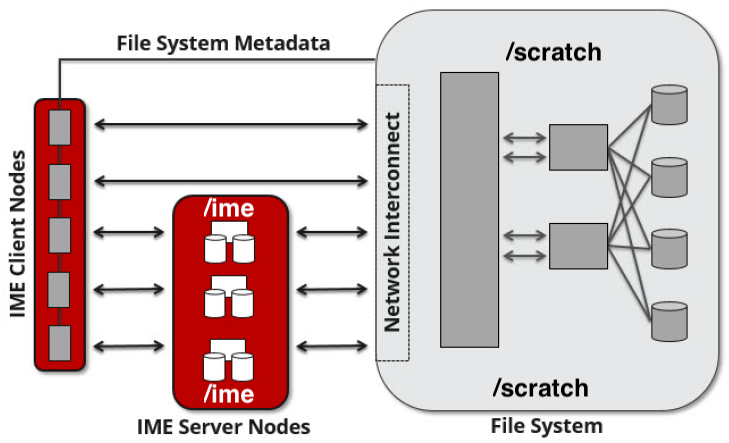

Data Management
================

File Systems
----------------

Each user has a home directory, **$HOME**, located at **/u/$USER**.

For example, a user (with username: **auser**) who has an allocated project with a local project serial code **abcd** will see the following entries in their $HOME and entries in the projects and scratch file systems.

.. code-block:: bash

   $ ls -ld /u/$USER
   drwxrwx---+ 12 root root 12345 Feb 21 11:54 /u/$USER

   $ ls -ld /projects/abcd
   drwxrws---+  45 root   delta_abcd      4096 Feb 21 11:54 /projects/abcd

   $ ls -l /projects/abcd
   total 0
   drwxrws---+ 2 auser delta_abcd 6 Feb 21 11:54 auser
   drwxrws---+ 2 buser delta_abcd 6 Feb 21 11:54 buser
   ...

   $ ls -ld /scratch/abcd
   drwxrws---+  45 root   delta_abcd      4096 Feb 21 11:54 /scratch/abcd

   $ ls -l /scratch/abcd
   total 0
   drwxrws---+ 2 auser delta_abcd 6 Feb 21 11:54 auser
   drwxrws---+ 2 buser delta_abcd 6 Feb 21 11:54 buser
   ...

Determine the mapping of ACCESS project to local project using the ``accounts`` command.

Directory access changes can be made using the `facl <https://linux.die.net/man/1/setfacl>`_ command. 
Submit a support request (see :ref:`help`) if you need assistance enabling access for specific users and projects.

To avoid issues when file systems become unstable or non-responsive, do not put symbolic links from **$HOME** to the projects and scratch spaces.

/tmp on Compute Nodes (Job Duration)
~~~~~~~~~~~~~~~~~~~~~~~~~~~~~~~~~~~~~~

The high performance ssd storage (740GB CPU, 1.5TB GPU) is available in /tmp (*unique to each node and job – not a shared file system*) and may contain less than the expected free space if the node(s) are running multiple jobs. 
Codes that need to perform i/o to many small files should target /tmp on each node of the job and save results to other file systems before the job ends.

.. _transfer:

Transferring Data
--------------------

.. note::

   | **GUI applications need to support Duo multi-factor authentication (MFA)**
   | Many GUI apps that support ssh/scp/sftp will work with Duo MFA. A good first step is to use the interactive (not stored/saved) password option with those apps. The interactive login should present you with the first password prompt (your Kerberos password) followed by the second password prompt for Duo (push to device or passcode from the Duo app).

To transfer files to and from the Delta system:

-  ``scp`` - Use it for small to modest transfers to avoid impacting the usability of the Delta login node (*login.delta.ncsa.illinois.edu*).

-  ``rsync`` - Use it for small to modest transfers to avoid impacting the usability of the Delta login node.

   -  `Campus Cluster storage and data guide <https://docs.ncsa.illinois.edu/systems/icc/en/latest/user_guide/storage_data.html>`_ (``scp``, ``sftp``, ``rsync``)

-  Globus - Use it for large data transfers.

   - `Upgrade your Globus Connect Personal to at least version 3.2.0 <https://docs.globus.org/ca-update-2022/#notice>`_

   -  Use the Delta collection "**NCSA Delta**" (see screen capture below).
      
      .. image:: images/data_mgmt/globus_on_delta.jpeg
          :alt: Globus on Delta
          :width: 700px

   -  If you're new to Globus, review the `How To Log In and Transfer Files with Globus <https://docs.globus.org/guides/tutorials/manage-files/transfer-files/>`_ page for instructions on getting started.

Infinite Memory Engine (IME)
-----------------------------------

What is DDN IME?
~~~~~~~~~~~~~~~~~

Infinite Memory Engine (IME®) is a DDN solution for fast data tiering between the compute nodes and a file system in a high-performance computing environment.

Conceptually, the storage subsystem looks like the following:

© DDN 2020

How to Use IME
~~~~~~~~~~~~~~~

The preferred way to use the Delta IME is as a **read-cache** for frequently read data and as a **write/read cache** for small file i/o.

It is possible to use exiting utilities and applications with files residing or created on /ime. 
Performance will be equal to or better than using /scratch directly for i/o to files.

.. warning::

   | **IME and metadata**
   | IME performance for directory/metadata operations is slower than /scratch (it is not the place to extract or copy millions of files). Do those operations (``rsync``, ``tar``, etc) in /scratch.

To get additional performance from the IME software features without changing i/o routines, use the posix2ime library (LD_PRELOAD'd), to intercept standard POSIX i/o calls with IME API calls. 
There is an included module, *posix2ime*, that does this for you (see more about posix2ime at :ref:`posix2`, below).

.. note::

   | **shared namespace: /ime , /scratch**
   | The /scratch and /ime file systems share the same namespace. The ``rm`` command will delete files on both file systems.

You can purge the contents of files from the cache, but not the presence of the file; see :ref:`purge`, below.

There are some important caveats when using the /ime file system for something other than a **read-cache**. See section 2.2 Data Consistency Model in the :download:`developer guide document <images/data_mgmt/IME1-4DeveloperGuide.pdf>`.

   *Users must maintain close-to-open consistency when multiple clients access the same files. 
   This requirement guarantees that any other client will see the latest changes made by one client as soon as the client opens the file. 
   A client must synchronize all file data and metadata changes when it closes a file and unconditionally retrieve a file’s attributes when it opens a file, ignoring any information it may have cached about the file. 
   IME implements an enhanced close-to-open consistency model, allowing IME to be lock free.*

IME Commands
~~~~~~~~~~~~~

See the man page for ``ime-ctl`` or the attached :download:`developer guide document <images/data_mgmt/IME1-4DeveloperGuide.pdf>` for details.

.. _purge:

Stage In and Out Single Files
$$$$$$$$$$$$$$$$$$$$$$$$$$$$$$$

The ``ime-ctl`` command is used to stage and purge files from the caching /ime file system:

.. code-block::

   ime-ctl --prestage 
   /ime/abcd/${USER}/file01

To sync the contents of a file created or changed that resides on /ime:

.. code-block::

   ime-ctl --sync /ime/abcd/${USER}/file01]]>
   To sync the contents of a file created or changed that resides on /ime

   ime-ctl --sync /ime/abcd/${USER}/file01

To purge the cached contents of a file on /ime:

.. code-block::

   ime-ctl --purge 
   /ime/abcd/${USER}/file01

Note that purging a file only clears the contents of the file from /ime.
The /scratch and /ime file systems share the same name space which allows files and directories to be seen from either the caching front-end /ime or back-end /scratch.

Staging Multiple Files and Directories
$$$$$$$$$$$$$$$$$$$$$$$$$$$$$$$$$$$$$$$$

To recursively stage the contents of a directory and the files and directories, see below. In this case, a directory called /scratch/abcd/${USER}/data_di uses the recursive.

.. code-block::

   ime-ctl --prestage --recursive --block 
   /ime/abcd/${USER}/data_dir

The ``--block`` option ensures the stage or sync is complete before returning.

Checking File Stage/Cache Status
$$$$$$$$$$$$$$$$$$$$$$$$$$$$$$$$$$

To check if a file has been staged to the IME cache in /ime or has its contents synced back to the back-end file system use the ``ime-ctl  --frag-stat`` command.

In this example, a file that was created as **/scratch/abcd/${USER}/file01** has not been staged to /ime. 
The file will be visible as **/ime/abcd/${USER}/file01**.
Not staged to /ime, all entries are showing "0" for the Dirty, Clean and Syncing entries:

.. code-block::

   $ 
   ime-ctl --frag-stat /ime/abcd/${USER}/file01
      File: `/ime/abcd/${USER}/file01'
            Number of bytes:
     Dirty: 0
     Clean: 0
   Syncing: 0
   Data on Slices:

After staging the file to /ime, the number of bytes in the "Clean" category shows that the data on the cache is current:

.. code-block::

   $ ime-ctl --prestage /ime/abcd/${USER}/file01
   $ ime-ctl --frag-stat /ime/abcd/${USER}/file01
      File: `/ime/abcd/${USER}/file01'
            Number of bytes:
     Dirty: 0
     Clean: 16777216
   Syncing: 0
   Data on Slices:  0

If the file **/ime/abcd/${USER}/file01** was modified (appended, replaced, and so on) one would see entries in the Dirty category:

.. code-block::

   $ ime-ctl --frag-stat /ime/abcd/${USER}/file01
      File: `/ime/abcd/${USER}/file01'
            Number of bytes:
     Dirty: 8388608
     Clean: 16777216
   Syncing: 0
   Data on Slices:  0

After using ``ime-ctl --sync`` to flush the changes to the back-end file system, the dirty entries will be back to 0:

.. code-block::

   $ ime-ctl --sync /ime/abcd/${USER}/file01
   $ ime-ctl --frag-stat /ime/abcd/${USER}/file01
      File: `/ime/abcd/${USER}/file01'
            Number of bytes:
     Dirty: 0
     Clean: 25165824
   Syncing: 0
   Data on Slices:  0

.. _posix2:

IME posix2ime Library
~~~~~~~~~~~~~~~~~~~~~~

The posix2ime module is available and loading it will LD_PRELOAD the library for your shell or batch script and all subsequent commands. 
The library is described at: `DDNStorage/posix_2_ime: POSIX to IME Native API (github.com) <https://github.com/DDNStorage/posix_2_ime>`_.

.. note::

   | **posix2ime requires dedicated nodes**
   | At this time, use of the posix2ime library requires dedicated (#SBATCH --exclusive) nodes for your job script or srun command.

.. code-block::

   #!/bin/bash 
   #SBATCH --mem=64g
   #SBATCH --nodes=4
   #SBATCH --ntasks-per-node=4
   #SBATCH --exclusive
   #SBATCH --cpus-per-task=16
   #SBATCH --partition=cpu
   #SBATCH --account=bbka-delta-cpu
   #SBATCH --time=00:15:00
   #SBATCH --job-name=posix2ime-ior-dedicated
    
   BFS_DIR=/scratch/bbka/arnoldg/ime_example
   IME_DIR=/ime/bbka/arnoldg/ime_example
   SAMPLE_INPUT_FILE=myinputfile
    
   # do many-files operations in /scratch before 
   # using ime: cd $BFS_DIR; tar xvf inputbundle.tar ...

   # bring the scratch directory into IME
   ime-ctl --recursive --block --prestage $IME_DIR

   # run the job/workflow in IME
   # do serialized commands (avoiding many-files types of operations)
   cd $IME_DIR
   stat $SAMPLE_INPUT_FILE

   # Use posix2ime for large block and/or parallel i/o 
   module load posix2ime
   time srun /u/arnoldg/ior/src/ior -F -b64m
   # turn off posix2ime
   unset LD_PRELOAD  # turns off posix2ime module

   # synchronize IME back out to the Scratch directory ( $BFS_DIR )
   ime-ctl --recursive --block --sync $IME_DIR

   exit
