Debugging and Performance Analysis
=====================================

Tools that access hardware counters on the AMD CPU, NVIDIA GPU, or AMD GPU need to add an additional Slurm directive.

- For CPU jobs, add  ``--constraint=perf``

- For GPU jobs, add  ``--constraint=perf,nvperf``

See below for use cases and sample job script excerpts.

AMDuProf Guide
-----------------

Run and Collect Data
~~~~~~~~~~~~~~~~~~~~~~~~~

Run a batch job and collect data:

.. code-block::

   ...
   #SBATCH --constraint=perf  # perf,nvperf for gpu nodes

   cd $SLURM_SUBMIT_DIR
   export PATH=/sw/external/amd/AMDuProf_Linux_x64_4.0.341/bin:$PATH

   set -v
   srun AMDuProfCLI collect --config tbp  -o `pwd`/uprof_tbp  `pwd`/stream.22gb
   srun AMDuProfCLI collect --config inst_access  -o `pwd`/uprof_inst_access  `pwd`/stream.22gb
   srun AMDuProfCLI collect --config assess  -o `pwd`/uprof_assess  `pwd`/stream.22gb
   srun AMDuProfCLI collect --config assess_ext  -o `pwd`/uprof_assess_ext  `pwd`/stream.22gb

Generate Report
~~~~~~~~~~~~~~~~~

After collecting data from a batch job, generate reports with the AMDuProfCLI report option:

.. code-block::

   [arnoldg@dt-login03 uprof_tbp]$ export PATH=/sw/external/amd/AMDuProf_Linux_x64_4.0.341/bin:$PATH
   [arnoldg@dt-login03 uprof_tbp]$ AMDuProfCLI report -i AMDuProf-stream-TBP_Dec-19-2022_09-40-27/
   /sw/external/amd/AMDuProf_Linux_x64_4.0.341/bin/AMDuProfCLI
   Translation started ...
   Translation finished
   Generated database file : cpu
   Report generation started...
   Generating report file...

   Report generation completed...

   Generated report file: /projects/bbka/slurm_test_scripts/cpu/stream/uprof_tbp/AMDuProf-stream-TBP_Dec-19-2022_09-40-27/report.csv

Visualize and Explore Report Data
~~~~~~~~~~~~~~~~~~~~~~~~~~~~~~~~~~~

You can view the data in AMDuProf on Delta or locally with a copy you install on your desktop system. 
If you install locally, you may need to replicate some paths or add paths to the binary in order to get full functionality.

Launch AMDuProf (no CLI suffix for the GUI) and import the profile session from a completed batch job run with AMDuProfCLI collect.

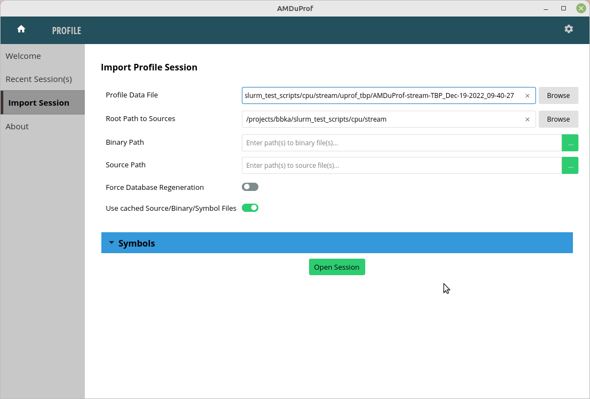
    
The summary view gives a high-level overview of how time was spent. This is the time-based-profile (tbp) summary.

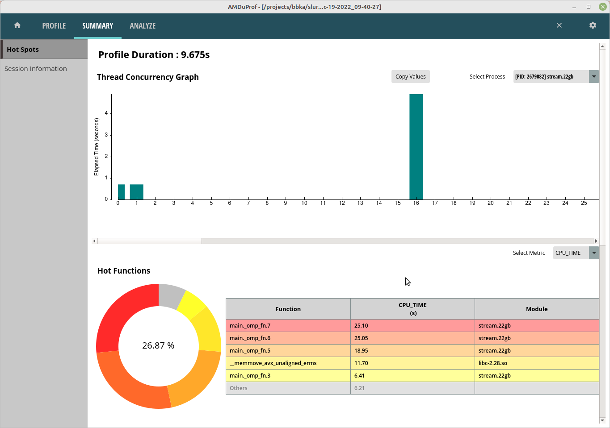

The Analyze tab shows hot routines or lines in more detail. The tbp, assess, and inst_access Analyze views follow.

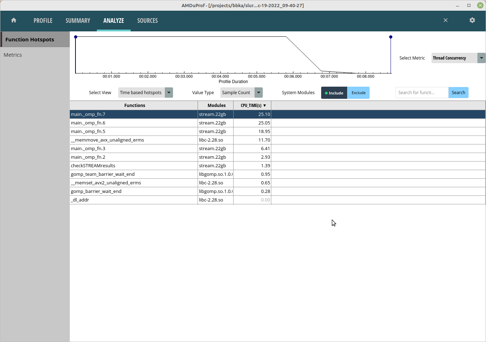

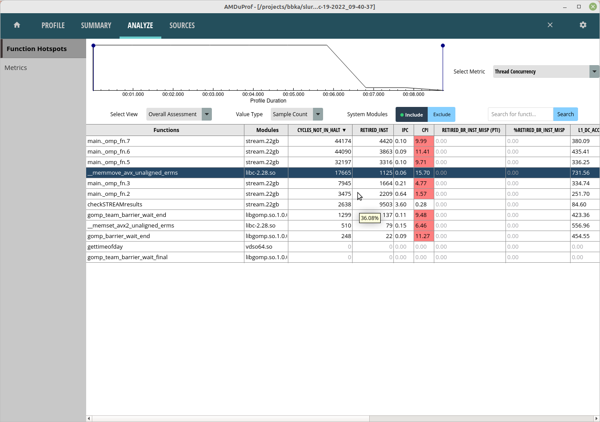

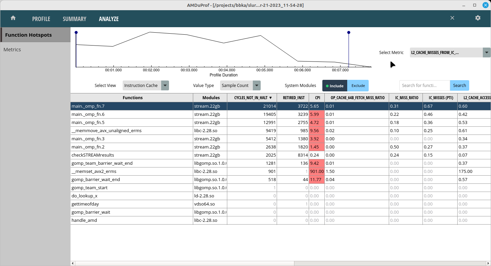

Selecting one of the lines or routines will take you to the Sources view where you can see the assembly used in that portion of the code.

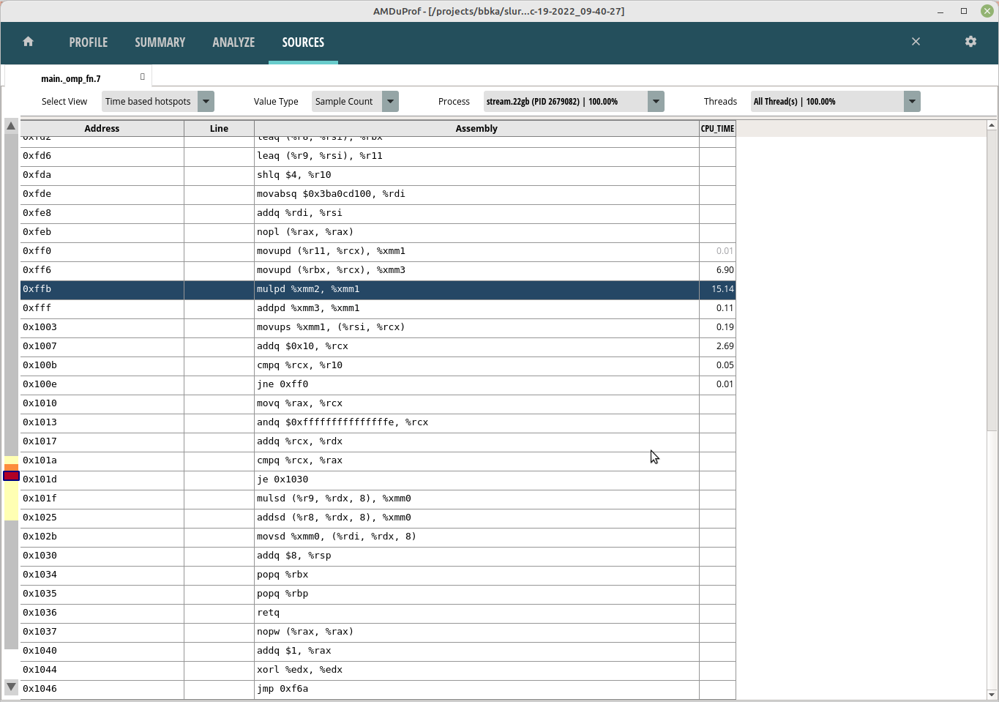

The Session Info is under the Summary tab and displays more detail about the profiling session.

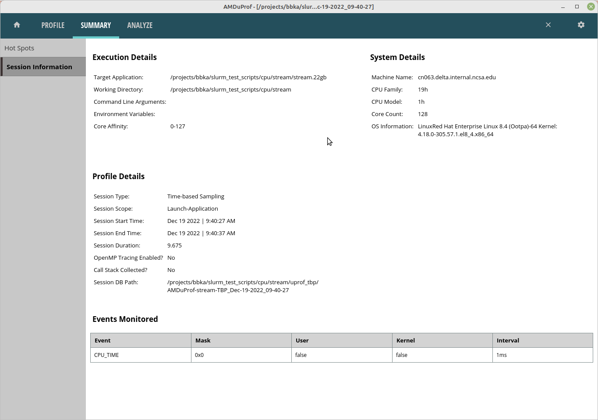

Rooflines
~~~~~~~~~~

Rooflines are currently disabled. Information on rooflines is in the `AMD uProf user guide <https://www.amd.com/content/dam/amd/en/documents/developer/uprof-v4.0-gaGA-user-guide.pdf>`_ (section 3.5.2). Below are the roofline error messages from the OS.

.. code-block::

   srun AMDuProfPcm roofline -o stream-roofline.csv -- ./stream.22gb
   Error: NMI watchdog is enabled. NMI uses one Core HW PMC counter.
   Please disable NMI watchdog - run with root privilege: echo 0 > /proc/sys/kernel/nmi_watchdog
   srun: error: cn061: task 0: Exited with exit code 255

References
~~~~~~~~~~~~~
`AMD uProf user guide <https://www.amd.com/content/dam/amd/en/documents/developer/uprof-v4.0-gaGA-user-guide.pdf>`_

NVIDIA Nsight Systems
-------------------------

Installation
~~~~~~~~~~~~~~~~~~

The Nsight Systems is included in the CUDA toolkit. A cuda module is  loaded by default on Delta.

.. code-block::

   [arnoldg@dt-login01 ~]$ which nsys
   /sw/spack/deltas11-2023-03/apps/linux-rhel8-zen3/gcc-11.4.0/cuda-11.8.0-vfixfmc/bin/nsys
  

Installation (NVIDIA Nsight Systems Client on Local Desktop/Laptop)
~~~~~~~~~~~~~~~~~~~~~~~~~~~~~~~~~~~~~~~~~~~~~~~~~~~~~~~~~~~~~~~~~~~~~

#. Open the `NVIDIA developer tools overview <https://developer.nvidia.com/tools-overview>`_ and navigate to the **Developer Tools Downloads** button.
#. Select **Nsight Systems** and your operating system. 
   If you do not have an account at developer.nvidia.com, set one up when prompted. When you have completed the forms, your download will begin. 
#. Install the application on your local machine. 
   You will download output files from the server command line application and use the GUI locally on your laptop.

Run Application on Delta
~~~~~~~~~~~~~~~~~~~~~~~~~

nsys with serial or python CUDA code
$$$$$$$$$$$$$$$$$$$$$$$$$$$$$$$$$$$$$$

.. code-block::

   $ srun nsys profile -o /path/to/mynysys.out --stats=true ./a.out

nsys wrapper for MPI and HPC CUDA codes
$$$$$$$$$$$$$$$$$$$$$$$$$$$$$$$$$$$$$$$$$

.. code-block::

   [arnoldg@dt-login03 gromacs]$ cat nsys_wrap.sh 
   #!/bin/bash
   # Use $PMI_RANK for MPICH, $OMPI_COMM_WORLD_RANK for openmpi, and $SLURM_PROCID with srun.
   if [ $SLURM_PROCID -eq 1 ]; then
     nsys profile -e NSYS_MPI_STORE_TEAMS_PER_RANK=1 -o gmx.nsys --gpu-metrics-set=2 "$@"
   else
     "$@"
   fi

batch script , --constraint=
$$$$$$$$$$$$$$$$$$$$$$$$$$$$$

.. code-block::

   #SBATCH --constraint=perf,nvperf
   ...
   # the slurm script should run the wrapper above instead of "nsys ..."
   time srun $SLURM_SUBMIT_DIR/nsys_wrap.sh \
     gmx_mpi mdrun -nb gpu -pin on -notunepme -dlb yes -v -resethway -noconfout -nsteps 4000 -s water_pme.tpr

   # see https://docs.nvidia.com/nsight-systems/UserGuide/index.html#cli-analyze-mpi-codes

MPI Rank Example Result (Viewing with Nsight on Local Desktop)
~~~~~~~~~~~~~~~~~~~~~~~~~~~~~~~~~~~~~~~~~~~~~~~~~~~~~~~~~~~~~~~~~~~

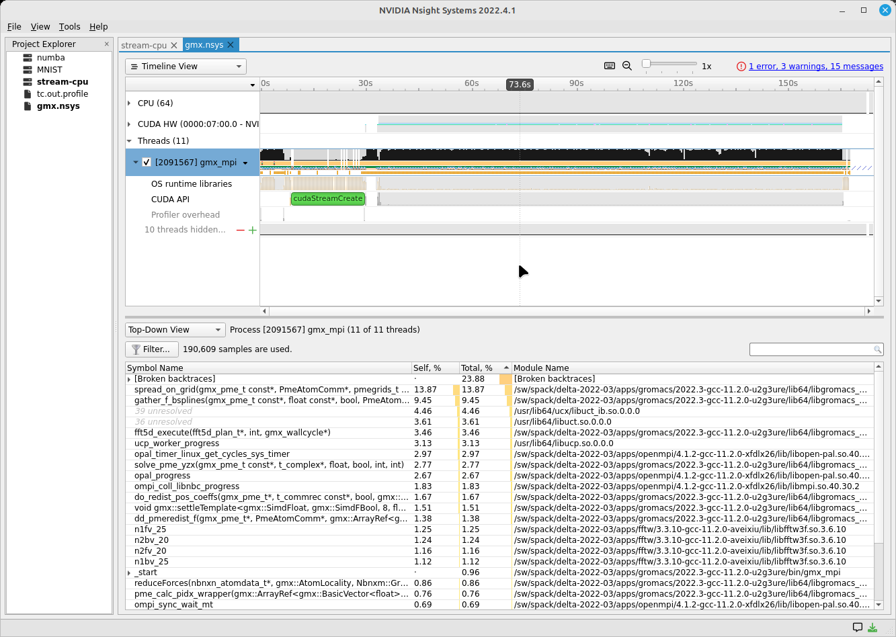

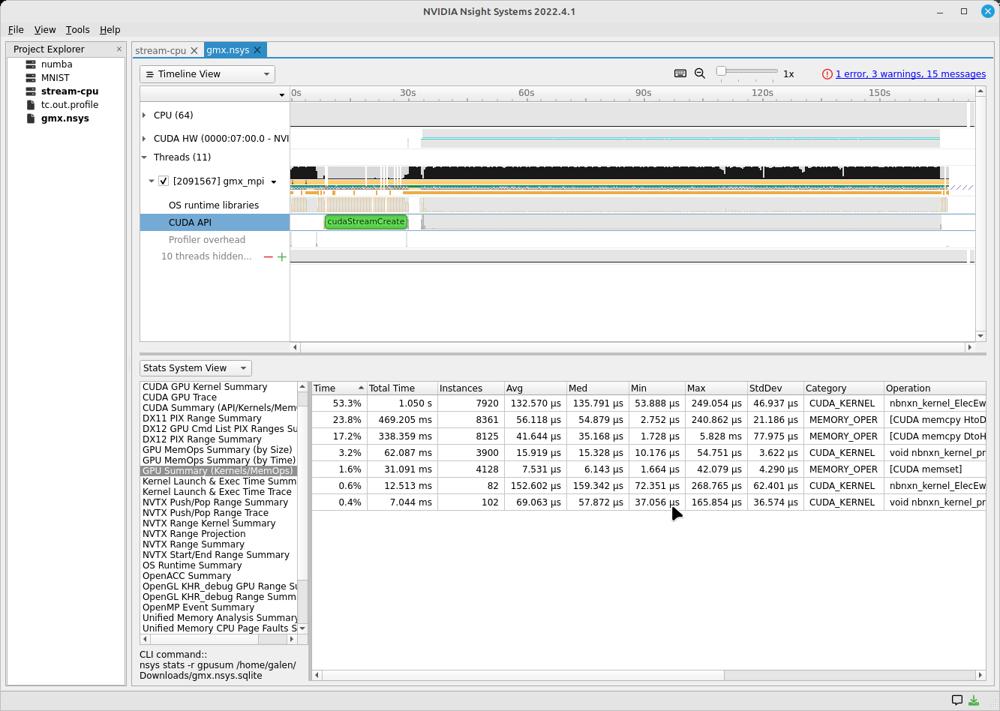

Copy Resultant Files to Your Local Laptop (Downloads/ or Documents/)
~~~~~~~~~~~~~~~~~~~~~~~~~~~~~~~~~~~~~~~~~~~~~~~~~~~~~~~~~~~~~~~~~~~~~~~~~~~~

scp is shown below. You could also use Globus Online, sftp, or an sshfs mount from your laptop.

.. code-block::

   # Delta
   [arnoldg@rgpu02 rgpu02]$ ls /tmp/nsys*
   /tmp/nsys-report-988d.sqlite  /tmp/nsys-report-b26d.nsys-rep
   [arnoldg@rgpu02 rgpu02]$ 

   # local laptop (MacOS example)
   (base) galen@macbookair-m1-042020 ~ % cd Downloads
   (base) galen@macbookair-m1-042020 Downloads % pwd
   /Users/galen/Downloads
   (base) galen@macbookair-m1-042020 Downloads % sftp arnoldg@rgpu02.delta.ncsa.illinois.edu

   NCSA Delta System

   Login with NCSA Kerberos + Duo multi-factor.

   DUO Documentation:  https://go.ncsa.illinois.edu/2fa

   (arnoldg@rgpu02.delta.ncsa.illinois.edu) Password: 
   (arnoldg@rgpu02.delta.ncsa.illinois.edu) Duo two-factor login for arnoldg

   Enter a passcode or select one of the following options:

    1. Duo Push to XXX-XXX-1120
    2. Duo Push to Ipad mini (iOS)
    3. Duo Push to red ipod (iOS)

   Passcode or option (1-3): 1
   Connected to rgpu02.delta.ncsa.illinois.edu.
   sftp> cd /tmp
   sftp> mget nsys*
   Fetching /tmp/nsys-report-988d.sqlite to nsys-report-988d.sqlite
   /tmp/nsys-report-988d.sqlite                  100%  748KB   2.7MB/s   00:00    
   Fetching /tmp/nsys-report-b26d.nsys-rep to nsys-report-b26d.nsys-rep
   /tmp/nsys-report-b26d.nsys-rep                100%  288KB   1.7MB/s   00:00    
   sftp> 

Open NVIDIA Nsight Systems
~~~~~~~~~~~~~~~~~~~~~~~~~~~~~~

Under the File menu, select **open**, and then navigate to your Downloads/ folder and select the nsys\* file of interest (nays-report-b26d.nsys-rep in this example). 
Explore the data in the GUI application.

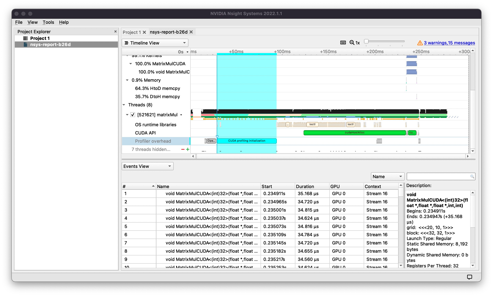

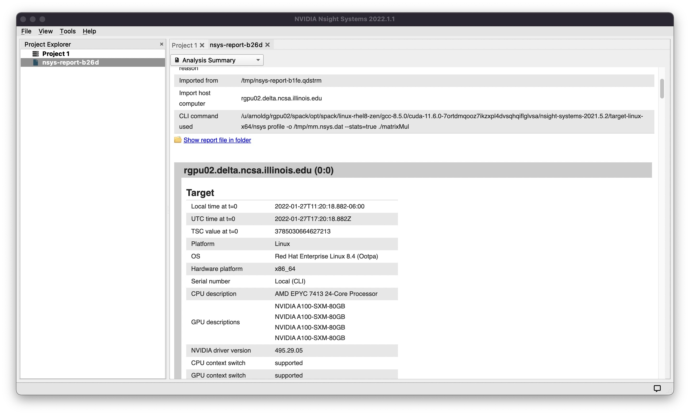

See also: `NVTX source code annotations blog article at NVIDIA <https://developer.nvidia.com/blog/nvidia-tools-extension-api-nvtx-annotation-tool-for-profiling-code-in-python-and-c-c/>`_ (can annotate C/C++/python GPU or CPU code)

Python with NVTX
~~~~~~~~~~~~~~~~~~~~

Installing NVTX via pip
$$$$$$$$$$$$$$$$$$$$$$$$

.. code-block::

   [arnoldg@rgpu02 nvtx]$ module load python cuda
   [arnoldg@rgpu02 nvtx]$ C_INCLUDE_PATH=$CUDA_HOME/include pip install nvtx
   Collecting nvtx
     Using cached nvtx-0.2.3.tar.gz (10 kB)
     Installing build dependencies ... done
     Getting requirements to build wheel ... done
     Preparing metadata (pyproject.toml) ... done
   Building wheels for collected packages: nvtx
     Building wheel for nvtx (pyproject.toml) ... done
     Created wheel for nvtx: filename=nvtx-0.2.3-cp39-cp39-linux_x86_64.whl size=177533 sha256=875e0f9d4322d07db4bce397b4281ce301f348cf72e00629b0d7bc23a7db0231
     Stored in directory: /u/arnoldg/.cache/pip/wheels/66/7a/44/68c48f02433263010768b540b0e90bf5a224dd7e6612d88887
   Successfully built nvtx
   Installing collected packages: nvtx
   Successfully installed nvtx-0.2.3
   [arnoldg@rgpu02 nvtx]$ 

Run with NSYS CLI
~~~~~~~~~~~~~~~~~~~~~~~

.. code-block::

   [arnoldg@rgpu02 nvtx]$ nsys profile -o nvtx_simple.profile --stats=true ./nvtx_simple.py 

   Warning: LBR backtrace method is not supported on this platform. DWARF backtrace method will be used.
   0
   1
   2
   3
   4
   Failed to create '/u/arnoldg/rgpu02/cuda/nvtx/nvtx_simple.profile.nsys-rep': File exists.
   Use `--force-overwrite true` to overwrite existing files.
   Generating '/tmp/nsys-report-1c93.qdstrm'
   [1/8] [========================100%] nsys-report-d073.nsys-rep
   Failed to create '/u/arnoldg/rgpu02/cuda/nvtx/nvtx_simple.profile.sqlite': File exists.
   Use `--force-overwrite true` to overwrite existing files.
   [2/8] [========================100%] nsys-report-e498.sqlite
   SKIPPED: /tmp/nsys-report-e498.sqlite does not contain CUDA trace data.
   SKIPPED: /tmp/nsys-report-e498.sqlite does not contain CUDA kernel data.
   SKIPPED: /tmp/nsys-report-e498.sqlite does not contain GPU memory data.
   SKIPPED: /tmp/nsys-report-e498.sqlite does not contain GPU memory data.
   [3/8] Executing 'nvtxsum' stats report

   NVTX Range Statistics:

    Time (%)  Total Time (ns)  Instances      Avg (ns)          Med (ns)         Min (ns)        Max (ns)       StdDev (ns)     Style   Range
    --------  ---------------  ---------  ----------------  ----------------  --------------  --------------  ---------------  -------  -----
        50.0   10,010,633,188          1  10,010,633,188.0  10,010,633,188.0  10,010,633,188  10,010,633,188              0.0  PushPop  f()  
        50.0   10,010,401,574          5   2,002,080,314.8   2,002,090,885.0          15,729   4,004,111,558  1,582,756,979.0  PushPop  loop 

   [4/8] Executing 'osrtsum' stats report

   Operating System Runtime API Statistics:

    Time (%)  Total Time (ns)  Num Calls     Avg (ns)         Med (ns)      Min (ns)    Max (ns)       StdDev (ns)           Name        
    --------  ---------------  ---------  ---------------  ---------------  --------  -------------  ---------------  -------------------
       100.0   10,010,198,683          5  2,002,039,736.6  2,002,047,874.0     3,025  4,004,056,124  1,582,740,553.2  select             
         0.0        1,005,734         46         21,863.8         21,656.0    18,866         27,070          1,608.1  open64             
         0.0          495,879         49         10,120.0          4,960.0     1,262         67,747         12,669.1  read               
         0.0           38,843         10          3,884.3          3,957.5     3,186          4,559            408.1  mmap64             
         0.0           34,164          1         34,164.0         34,164.0    34,164         34,164              0.0  write              
         0.0           27,391          4          6,847.8          4,182.5     2,655         16,371          6,410.6  fopen64            
         0.0            6,602          3          2,200.7          1,232.0     1,172          4,198          1,730.0  pthread_cond_signal
         0.0            3,647          1          3,647.0          3,647.0     3,647          3,647              0.0  sigaction          
         0.0            2,013          1          2,013.0          2,013.0     2,013          2,013              0.0  fread              
         0.0            1,923          1          1,923.0          1,923.0     1,923          1,923              0.0  fclose             
         0.0            1,472          1          1,472.0          1,472.0     1,472          1,472              0.0  fflush             

   [5/8] Executing 'cudaapisum' stats report
   [6/8] Executing 'gpukernsum' stats report
   [7/8] Executing 'gpumemtimesum' stats report
   [8/8] Executing 'gpumemsizesum' stats report
   Generated:
       /tmp/nsys-report-d073.nsys-rep
       /tmp/nsys-report-e498.sqlite
   [arnoldg@rgpu02 nvtx]$ 

.. code-block::

   nsys profile --gpu-metrics-device=all \
       --gpu-metrics-frequency=20000 <application>   # get metrics from the cuda libs/api

   ncu --metrics "regex:.*" <application>   # get all gpu metrics from the hardware

Delta Script and Nsight Systems View of the Resulting Report
~~~~~~~~~~~~~~~~~~~~~~~~~~~~~~~~~~~~~~~~~~~~~~~~~~~~~~~~~~~~~~~

.. code-block::

   #!/bin/bash
   #SBATCH --job-name="numba_profile"
   #SBATCH --partition=gpuA100x4-interactive
   #SBATCH --mem=16G
   #SBATCH --nodes=1
   #SBATCH --ntasks-per-node=1
   #SBATCH --cpus-per-task=2   # spread out to use 1 core per numa
   #SBATCH --constraint="projects"
   #SBATCH --gpus-per-node=1
   #SBATCH --gpu-bind=closest   # select a cpu close to gpu on pci bus topology
   #SBATCH --account=account_name    # <- match to a "Project" returned by the "accounts" command
   #SBATCH -t 00:10:00

   cd $SLURM_SUBMIT_DIR
   module load anaconda3_gpu

   dcgmi profile --pause

   srun nsys profile \
     --gpu-metrics-device=all \
     ./nvtx-numba-jit.py

   srun ncu \
     --metrics "regex:.*" \
     --target-processes all \
     ./nvtx-numba-jit.py

   dcgmi profile --resume

(Transferred the report1.nsys-rep back to local system using Globus Online, sftp, etc.)

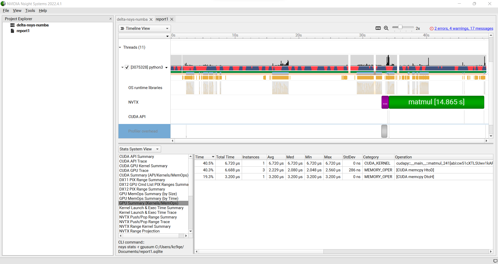

Nsight Systems Setup on Local Workstation to Use with Delta
~~~~~~~~~~~~~~~~~~~~~~~~~~~~~~~~~~~~~~~~~~~~~~~~~~~~~~~~~~~~~~~~~

#. Log into the `NVIDIA Nsight systems developer page <https://developer.nvidia.com/nsight-systems>`_ (make an account if you need to), and download the client for your MacOS, Windows, or Linux local system.

   You can use Globus Online, rsync, sftp, or sshfs (Linux) to transfer files (or view files as local filesystem mounts in the case of sshfs) with the local Nsight Systems client.

   **sshfs Mount Example for Linux Box to Delta:**

   .. code-block::

      galen@galen-HP-ProBook-455-G6:~$ sshfs arnoldg@dt-login03.delta.ncsa.illinois.edu:/projects/bbka delta_projects/
      arnoldg@dt-login03.delta.ncsa.illinois.edu's password: 
      (arnoldg@dt-login03.delta.ncsa.illinois.edu) Duo two-factor login for arnoldg

      Enter a passcode or select one of the following options:

       1. Duo Push to XXX-XXX-1120
       2. Duo Push to Ipad mini (iOS)
       3. Duo Push to red ipod (iOS)
       4. Duo Push to Android

      Passcode or option (1-4): 115489
      galen@galen-HP-ProBook-455-G6:~$ df -h delta_projects/
      Filesystem                                                 Size  Used Avail Use% Mounted on
      arnoldg@dt-login03.delta.ncsa.illinois.edu:/projects/bbka 1000T   60T  941T   6% /home/galen/delta_projects

#. Launch Nsight Systems and define a target under the default opening view. 
   Even if you cannot get Nsight Systems to SSH to the target, you need to define it so that Nsight Systems will present you with the .nsys-rep file type when you try to open a profile from delta that was transferred to local via GO/sftp/rsync or viewable via the sshfs fuse mount like shown above:

   ..  image:: images/debug_perf/06_nsight-systems-project-target.png
       :alt: project target
       :width: 1000px

#. Then open the profile report generated from an *srun nsys* ... at Delta (navigate to Download or the live sshfs fuse mount).

   ..  image:: images/debug_perf/07-nsight-systems-file-open-sshfs.png
       :alt: profile report
       :width: 1000px

#. Proceed to use Nsight Systems. 
   A stats view of the GPU Summary is shown. 
   This is usually a good performance analysis starting point showing utilization of kernels vs times to transfer data between the host computer and the GPU accelerator.

   ..  image:: images/debug_perf/08-nsight-systems-stats-system-view.png
       :alt: GPU stats summary
       :width: 1000px

Linux Perf performance counting
-------------------------------
The linux perf subsystem can access hardware performance counters and summarize them per application execution.

refer to: `<https://perfwiki.github.io/main/>`_

   .. code-block::

      [arnoldg@dt-login03 stream]$ srun -n 1 perf stat ./stream.22gb
      ...
      -------------------------------------------------------------
      Function    Best Rate MB/s  Avg time     Min time     Max time
      Copy:           42048.7     0.380511     0.380511     0.380511
      Scale:          23543.7     0.679587     0.679587     0.679587
      Add:            26716.7     0.898315     0.898315     0.898315
      Triad:          26639.3     0.900925     0.900925     0.900925
      -------------------------------------------------------------
      Solution Validates: avg error less than 1.000000e-13 on all three arrays
      -------------------------------------------------------------

       Performance counter stats for './stream.22gb':

              17,206.19 msec task-clock:u              #    1.000 CPUs utilized          
                      0      context-switches:u        #    0.000 /sec                   
                      0      cpu-migrations:u          #    0.000 /sec                   
              4,822,101      page-faults:u             #  280.254 K/sec                  
         30,092,687,800      cycles:u                  #    1.749 GHz                      (83.33%)
             36,504,747      stalled-cycles-frontend:u #    0.12% frontend cycles idle     (83.34%)
          3,916,402,169      stalled-cycles-backend:u  #   13.01% backend cycles idle      (83.33%)
         49,637,948,722      instructions:u            #    1.65  insn per cycle         
                                                       #    0.08  stalled cycles per insn  (83.33%)
          5,128,886,029      branches:u                #  298.084 M/sec                    (83.33%)
              4,838,605      branch-misses:u           #    0.09% of all branches          (83.33%)

           17.212796833 seconds time elapsed

            8.291209000 seconds user
            8.693619000 seconds sys

      [arnoldg@dt-login03 stream]$ 

Linux/Unix gprof
----------------
gprof generates a sampling profile of function calls in a program.  It's a good general purpose command-line profiler to use when
getting started and it has low overhead.

see:

- `<https://ftp.gnu.org/old-gnu/Manuals/gprof-2.9.1/html_mono/gprof.html>`_
- `<https://www.ibm.com/docs/en/aix/7.3?topic=g-gprof-command>`_
- `<https://cvw.cac.cornell.edu/profiling-debugging/profiling/profiling-parallel>`_

Per the last link, set GMON_OUT_PREFIX for MPI programs so that you get a gprof per rank and compile with "-pg" or "-p" flags.

Linux/Unix strace
-----------------
strace will trace or summarize system call activity for a program (the portion of time going to system due to i/o, networking, memory allocations
or anything else provided by the kernel to the executing code).

see:

- `<https://strace.io/>`_

   .. code-block::

      [arnoldg@dt-login03 stream]$ srun -n 1 strace -c ./stream.22gb
      ...
      -------------------------------------------------------------
      Function    Best Rate MB/s  Avg time     Min time     Max time
      Copy:           39529.6     0.404760     0.404760     0.404760
      Scale:          19414.2     0.824138     0.824138     0.824138
      Add:            16855.4     1.423877     1.423877     1.423877
      Triad:           8487.3     2.827755     2.827755     2.827755
      -------------------------------------------------------------
      Solution Validates: avg error less than 1.000000e-13 on all three arrays
      -------------------------------------------------------------
      % time     seconds  usecs/call     calls    errors syscall
      ------ ----------- ----------- --------- --------- ------------------
       46.11    0.001084           9       113       107 openat
       24.16    0.000568           5        99        91 stat
       14.25    0.000335         335         1           execve
        3.32    0.000078           5        14           mmap
        2.30    0.000054           5        10           mprotect
        2.17    0.000051          25         2           getdents64
        1.62    0.000038           3        12           futex
        1.15    0.000027           3         7           read
        1.02    0.000024           3         7           fstat
        0.81    0.000019           3         6           close
        0.38    0.000009           9         1           write
        0.38    0.000009           3         3           lseek
        0.38    0.000009           9         1           munmap
        0.38    0.000009           3         3           brk
        0.26    0.000006           3         2           rt_sigaction
        0.26    0.000006           6         1         1 access
        0.26    0.000006           3         2         1 arch_prctl
        0.17    0.000004           4         1           getrandom
        0.13    0.000003           3         1           rt_sigprocmask
        0.13    0.000003           3         1           sched_getaffinity
        0.13    0.000003           3         1           set_tid_address
        0.13    0.000003           3         1           set_robust_list
        0.13    0.000003           3         1           prlimit64
      ------ ----------- ----------- --------- --------- ------------------
      100.00    0.002351           8       290       200 total
      [arnoldg@dt-login03 stream]$ 

`NVIDIA CUDA C++ programming guide <https://docs.nvidia.com/cuda/cuda-c-programming-guide>`_

`NVIDIA Nsight Systems user guide <https://docs.nvidia.com/nsight-systems/UserGuide/index.html>`_ (nsys higher level and cuda api )

`NVIDIA Nsight Compute CLI documentation <https://docs.nvidia.com/nsight-compute/NsightComputeCli/index.html>`_ (ncu lower level and counters )

`GitHub - quasiben/nvtx-examples <https://github.com/quasiben/nvtx-examples>`_ (sample python test codes )

Debugging MPI (OpenMPI) codes
-----------------------------

See: `Debugging applications in parallel - <https://www.open-mpi.org/faq/?category=debugging>`_ (OpenMPI faq on debugging MPI code )

Debugging Open OnDemand Problems
---------------------------------

Go to :ref:`debug_ood`.
