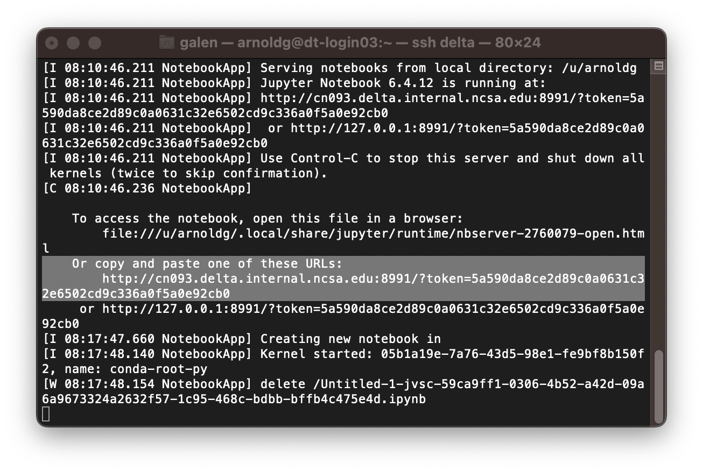
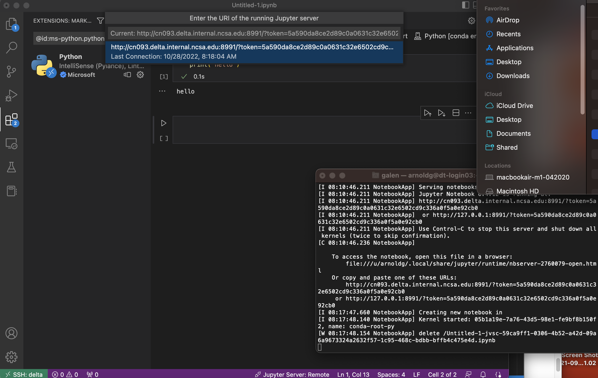

Programming Environment (Building Software)
===============================================

The Delta programming environment supports the GNU, AMD (AOCC), Intel and NVIDIA HPC compilers. 
Support for the HPE/Cray Programming environment is forthcoming.

Modules provide access to the compiler + MPI environment.

The default environment includes the GCC 11.2.0 compiler + OpenMPI with support for CUDA and gdrcopy; nvcc is in the CUDA module and is loaded by default.

AMD recommended compiler flags for GNU, AOCC, and Intel compilers for Milan processors can be found in the `AMD Compiler Options Quick Reference Guide for Epyc 7xx3 processors <https://www.amd.com/system/files/TechDocs/compiler-options-quick-ref-guide-epyc-7xx3-series-processors.pdf>`_.

Serial
----------

To build (compile and link) a serial program in Fortran, C, and C++:

.. table:: Serial Program Commands

   =================== ================= ====================
   GCC                 AOCC              NVHPC
   =================== ================= ====================
   gfortran *myprog*.f flang *myprog*.f  nvfortran *myprog*.f
   gcc *myprog*.c      clang *myprog*.c  nvc *myprog*.c
   g++ *myprog*.cc     clang *myprog*.cc nvc++ *myprog*.cc
   =================== ================= ====================

MPI
-------------------------

To build (compile and link) a MPI program in Fortran, C, and C++:

.. table:: MPI Program Commands

   +---------------------------------+--------------------------------------------+-------------------------------------------+
   | MPI Implementation              | Module Files for                           | Build Commands                            |
   |                                 | MPI/Compiler                               |                                           |
   +=================================+============================================+===========================================+
   |                                 | .. code-block::                            |                                           |
   |                                 |                                            |                                           |
   | OpenMPI                         |    gcc openmpi                             |                                           |
   |                                 |        openmpi+cuda                        | - **Fortran 77:** mpif77 myprog.f         |
   |                                 |        (GPU-direct)                        |                                           |
   |                                 |                                            |                                           |
   | - `Open MPI Home Page`_         | .. code-block::                            |                                           |
   | - `Open MPI Documentation`_     |                                            |                                           |
   |                                 |    aocc openmpi                            | - **Fortran 90:** mpif90 myprog.f90       |
   |                                 |                                            |                                           |
   |                                 | .. code-block::                            |                                           |
   |                                 |                                            |                                           |
   |                                 |    nvhpc openmpi+cuda                      | - **C:** mpicc myprog.c                   |
   |                                 |    (GPU-direct)                            |                                           |
   |                                 |                                            |                                           |
   |                                 | .. code-block::                            | - **C++:** mpic++ myprog.cc               |
   |                                 |                                            |                                           |
   |                                 |    intel openmpi                           |                                           |
   +---------------------------------+--------------------------------------------+-------------------------------------------+
   | Cray MPICH                      | .. code-block::                            |                                           |
   |                                 |                                            |                                           |
   |                                 |     PrgEnv-gnu cuda craype-x86-milan \     |                                           |
   |                                 |     craype-accel-ncsa                      | - **Fortran 77:** fortran myprog.f        |
   |                                 |     (GPU-direct)                           |                                           |
   | - PrgEnv-gnu                    |                                            | - **Fortran 90:** fortran myprog.f90      |
   |   *or*                          |                                            |                                           |
   | - PrgEnv-cray (unsupported)     |                                            | - **C:** cc myprog.c                      |
   |                                 |                                            |                                           |
   |                                 |                                            |                                           |
   |                                 |                                            | - **C++:** CC myprog.cc                   |
   +---------------------------------+--------------------------------------------+-------------------------------------------+

.. _Open MPI Home Page: http://www.open-mpi.org

.. _Open MPI Documentation: http://www.open-mpi.org/doc

OpenMP
-------------------------

To build an OpenMP program, use the **-fopenmp** / **-mp** option.

.. table:: OpenMP Program Commands

   ================================ ============================ =======================
   GCC                              AOCC                         NVHPC
   ================================ ============================ =======================
   gfortran -fopenmp *myprog*.f     flang -fopenmp *myprog*.f    nvfortran -mp *myprog*.f
   gcc -fopenmp *myprog*.c          clang -fopenmp *myprog*.c    nvc -mp *myprog*.c 
   g++ -fopenmp *myprog*.cc         clang -fopenmp *myprog*.cc   nvc++ -mp *myprog*.cc
   ================================ ============================ =======================

Hybrid MPI/OpenMP
-------------------

To build an MPI/OpenMP hybrid program, use the **-fopenmp** / **-mp** option with the MPI compiling commands.

.. table:: Hybrid MPI/OpenMP Program Commands

   ============================ =======================
   GCC                            PGI/NVHPC
   ============================ =======================
   mpif77 -fopenmp *myprog*.f     mpif77 -mp *myprog*.f
   mpif90 -fopenmp *myprog*.f90   mpif90 -mp *myprog*.f90
   mpicc -fopenmp *myprog*.c      mpicc -mp *myprog*.c
   mpic++ -fopenmp *myprog*.cc    mpic++ -mp *myprog*.cc
   ============================ =======================

Cray xthi.c Sample Code
---------------------------

`Document - XC Series User Application Placement Guide CLE6..0UP01 S-2496 | HPE Support <https://support.hpe.com/hpesc/public/docDisplay?docId=a00114008en_us&page=Run_an_OpenMP_Application.html>`_

This code can be compiled using the methods show above. The code appears in some of the batch script examples below to demonstrate core placement options.

.. code-block::

   #define _GNU_SOURCE

   #include <stdio.h>
   #include <unistd.h>
   #include <string.h>
   #include <sched.h>
   #include <mpi.h>
   #include <omp.h>

   /* Borrowed from util-linux-2.13-pre7/schedutils/taskset.c */
   static char *cpuset_to_cstr(cpu_set_t *mask, char *str)
   {
     char *ptr = str;
     int i, j, entry_made = 0;
     for (i = 0; i < CPU_SETSIZE; i++) {
       if (CPU_ISSET(i, mask)) {
         int run = 0;
         entry_made = 1;
         for (j = i + 1; j < CPU_SETSIZE; j++) {
           if (CPU_ISSET(j, mask)) run++;
           else break;
         }
         if (!run)
           sprintf(ptr, "%d,", i);
         else if (run == 1) {
           sprintf(ptr, "%d,%d,", i, i + 1);
           i++;
         } else {
           sprintf(ptr, "%d-%d,", i, i + run);
           i += run;
         }
         while (*ptr != 0) ptr++;
       }
     }
     ptr -= entry_made;
     *ptr = 0;
     return(str);
   }

   int main(int argc, char *argv[])
   {
     int rank, thread;
     cpu_set_t coremask;
     char clbuf[7 * CPU_SETSIZE], hnbuf[64];

     MPI_Init(&argc, &argv);
     MPI_Comm_rank(MPI_COMM_WORLD, &rank);
     memset(clbuf, 0, sizeof(clbuf));
     memset(hnbuf, 0, sizeof(hnbuf));
     (void)gethostname(hnbuf, sizeof(hnbuf));
     #pragma omp parallel private(thread, coremask, clbuf)
     {
       thread = omp_get_thread_num();
       (void)sched_getaffinity(0, sizeof(coremask), &coremask);
       cpuset_to_cstr(&coremask, clbuf);
       #pragma omp barrier
       printf("Hello from rank %d, thread %d, on %s. (core affinity = %s)\n",
               rank, thread, hnbuf, clbuf);
     }
     MPI_Finalize();
     return(0);
   }

A version of xthi is also available from ORNL:

.. code-block::

   % git clone https://github.com/olcf/XC30-Training/blob/master/affinity/Xthi.c

OpenACC
-------------------------

To build an OpenACC program, use the **-acc** option and the **-mp** option for multi-threaded:

.. table:: OpenACC Program Commands

   ========================= ================================
   Non-Multi-threaded          Multi-threaded
   ========================= ================================
   nvfortran -acc *myprog*.f   nvfortran -acc -mp *myprog*.f
   nvc -acc *myprog*.c         nvc -acc -mp *myprog*.c
   nvc++ -acc *myprog*.cc      nvc++ -acc -mp *myprog*.cc
   ========================= ================================

CUDA
-------------------------

CUDA compilers (nvcc) are included in the CUDA module which is loaded by default under modtree/gpu. For the CUDA Fortran compiler and other NVIDIA development tools, load the **nvhpc** module.

nv* commands when nvhpc is loaded
~~~~~~~~~~~~~~~~~~~~~~~~~~~~~~~~~~~~

.. code-block::

   [arnoldg@dt-login03 namd]$ nv
   nvaccelerror             nvidia-bug-report.sh     nvlink
   nvaccelinfo              nvidia-cuda-mps-control  nv-nsight-cu
   nvc                      nvidia-cuda-mps-server   nv-nsight-cu-cli
   nvc++                    nvidia-debugdump         nvprepro
   nvcc                     nvidia-modprobe          nvprof
   nvcpuid                  nvidia-persistenced      nvprune
   nvcudainit               nvidia-powerd            nvsize
   nvdecode                 nvidia-settings          nvunzip
   nvdisasm                 nvidia-sleep.sh          nvvp
   nvextract                nvidia-smi               nvzip
   nvfortran                nvidia-xconfig

See the `NVIDIA HPC SDK <https://developer.nvidia.com/hpc-sdk>`_ page for more information.

Note: The Multi-Process Service (MPS) is not currently enabled on Delta GPU nodes. Submit a support request (:ref:`help`) for assistance if you have questions about MPS status.

HIP/ROCm (AMD MI100)
-------------------------

.. note::
   If using hipcc on the login nodes, add **--offload-arch=gfx908** to the flags to match the gpu on the MI100 node.

To access the development environment for the gpuMI100x8 partition, start a job on the node with :ref:`srun` or :ref:`sbatch`. 

Next, set your PATH to prefix /opt/rocm/bin where the HIP and ROCm tools are installed. 

A sample batch script to obtain an xterm (interactive xterm batch script for Slurm) is shown below:

.. code-block::

   #!/bin/bash -x

   MYACCOUNT=$1
   GPUS=--gpus-per-node=1
   PARTITION=gpuMI100x8-interactive
   srun --tasks-per-node=1 --nodes=1 --cpus-per-task=4 \
     --mem=16g \
     --partition=$PARTITION \
     --time=00:30:00 \
     --account=$MYACCOUNT \
     $GPUS --x11 \
     xterm

AMD HIP development environment on gpud01 (setting the path on the compute node):

.. code-block::

   [arnoldg@gpud01 bin]$ export PATH=/opt/rocm/bin:$PATH
   [arnoldg@gpud01 bin]$ hipcc
   No Arguments passed, exiting ...
   [arnoldg@gpud01 bin]$ 

See the `AMD HIP documentation <https://docs.amd.com/projects/HIP/en/docs-5.0.0/index.html>`_ and `AMD ROCm documentation <https://rocmdocs.amd.com/en/latest/>`_ for more information.
   
Visual Studio Code
---------------------

VS Code code-server
~~~~~~~~~~~~~~~~~~~~

`Microsoft VS Code documentation <https://code.visualstudio.com/docs>`_

The code-server for VS Code can be run on Delta in manual mode (without Open OnDemand) by following these steps:

#. Start the server.

   | **/sw/external/vscode/code-server/bin/code-server:**
   .. code-block::

      [arnoldg@dt-login03 bin]$  ./code-server --bind-addr 
      dt-login03:8899
      [2023-04-14T15:57:03.059Z] info  code-server 4.11.0 85e083580dec27ef19827ff42d3c9257d56ea7e3
      [2023-04-14T15:57:03.060Z] info  Using user-data-dir ~/.local/share/code-server
      [2023-04-14T15:57:03.132Z] info  Using config file ~/.config/code-server/config.yaml
      [2023-04-14T15:57:03.133Z] info  HTTP server listening on http://141.142.140.196:8899/
      [2023-04-14T15:57:03.133Z] info    - Authentication is enabled
      [2023-04-14T15:57:03.133Z] info      - Using password from ~/.config/code-server/config.yaml
      [2023-04-14T15:57:03.133Z] info    - Not serving HTTPS
      [10:57:12] 

#. SSH to the login node where the server is waiting. Read the config.yaml noted above and copy the password to your clipboard.

   | **SSH tunnel to login node running code-server:**
   .. code-block::

      (base) galen@macbookair-m1-042020 ~ % ssh -l arnoldg -L 
      127.0.0.1:8899:dt-login03.delta.ncsa.illinois.edu:8899 dt-login03.delta.ncsa.illinois.edu
      ...
      Success. Logging you in...
      dt-login03.delta.internal.ncsa.edu (141.142.140.196)
        OS: RedHat 8.6   HW: HPE   CPU: 128x    RAM: 252 GB

            ΔΔΔΔΔ    ΔΔΔΔΔΔ   ΔΔ     ΔΔΔΔΔΔ   ΔΔ
            ΔΔ  ΔΔ   ΔΔ       ΔΔ       ΔΔ    ΔΔΔΔ
            ΔΔ  ΔΔ   ΔΔΔΔ     ΔΔ       ΔΔ   ΔΔ  ΔΔ
            ΔΔ  ΔΔ   ΔΔ       ΔΔ       ΔΔ   ΔΔΔΔΔΔ
            ΔΔΔΔΔ    ΔΔΔΔΔΔ   ΔΔΔΔΔΔ   ΔΔ   ΔΔ  ΔΔ

      [arnoldg@dt-login03 ~]$ more ~/.config/code-server/config.yaml
      bind-addr: 127.0.0.1:8080
      auth: password
      password: 9e8081e80d9999c3c525fe26
      cert: false

#. Open a local browser on your desktop system with URL = http://127.0.0.1:8899. Log in with the password copied from above and begin using VS Code in your browser.

   ..  image:: images/prog_env/vscode_in_browser.png
       :alt: vscode in a web browser
       :width: 1000px

Remote - SSH
~~~~~~~~~~~~~~~~~

Follow the `Visual Studio Code remote development using SSH <https://code.visualstudio.com/docs/remote/ssh>`_ guide.

#. As stated in the guide, install "Remote - SSH" into Visual Studio:

   ..  image:: images/prog_env/01_remote_ssh.png
       :alt: remote ssh extension in visual studio
       :width: 500px

#. Continue to follow the guide to set up a remote connection to Delta.
   It helps if you have a local $HOME/.ssh/config with your commonly used hosts already present on the laptop and SSH client where you will be using Visual Studio. 
   Here is an example entry for Delta, change your username to your login name on Delta. Visual Studio will show hosts in your config in a pick list.

   | **SSH config:**
   .. code-block::
   
      Host delta
              HostName login.delta.ncsa.illinois.edu
              User arnoldg
              ForwardX11 True

#. Once connected, you can work with the remote system as if it were local.
   When Visual Studio needs to install extension items on the remote system, it will go into your $HOME/.vscode-server on Delta. 
   Visual Studio takes care of all the details for you:

   | **remote server VS extensions:**
   .. code-block::

      [arnoldg@dt-login03 ~]$ du -sh .vscode-server/
      523M    .vscode-server/
      [arnoldg@dt-login03 ~]$ 

#. Proceed to F1 → Remote SSH and connect to Delta. Then, following the guide, use Visual Studio as normal. 
   
   Windows users: The login box of vscode will display your login as 2fa<delta_username>, and you may not see a 2nd login box for 2fa Duo until you press the "details" link at lower right after you enter your password. Use the Duo passcode after pressing "details" link when the next password prompt appears at the top.  Also see the `Visual Studio Code remote development troubleshooting <https://code.visualstudio.com/docs/remote/troubleshooting>`_ guide and search for "two-factor".

   Example of working with a C file remote on Delta:

   ..  image:: images/prog_env/02_remote_c_file.png
       :alt: using visual studio to work with a C file on delta
       :width: 1000px

Remote Jupyter
~~~~~~~~~~~~~~~~~

See the `Visual Studio Code working with Juypter Notebooks <https://code.visualstudio.com/docs/datascience/jupyter-notebooks#_connect-to-a-remote-jupyter-server>`_ guide and :ref:`jupyter` (open two new browser tabs).

#. Install the Jupyter extension for Visual Studio, if you have not already done so.

#. Complete the first step from the Delta user guide (second link above) where you srun a jupyter-notebook on a compute node. 

#. Make note of and copy the first URL after the job is running, that is the URI you will provide to Visual Studio's "Connect to a Remote Jupyter Server" after clicking the Kernels button. 

   You may also need to select the remote jupyter kernel under the kernels in VScode.

