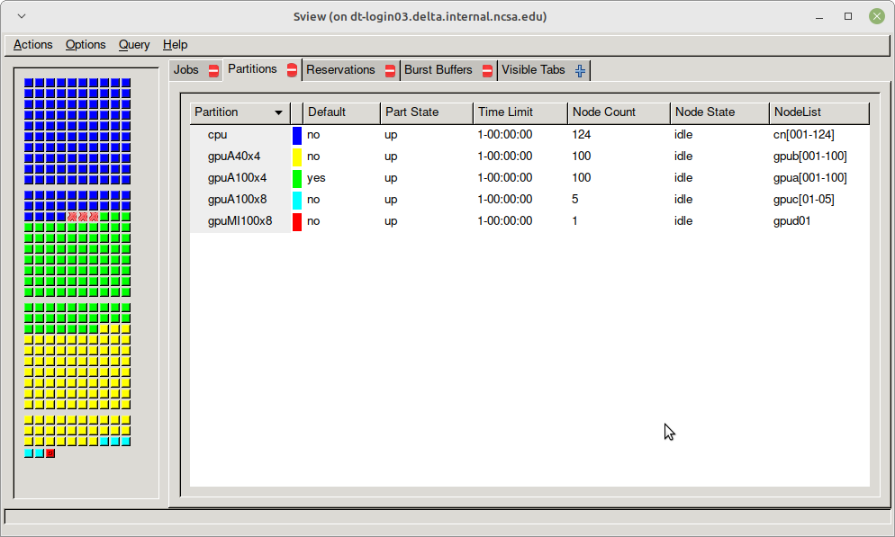
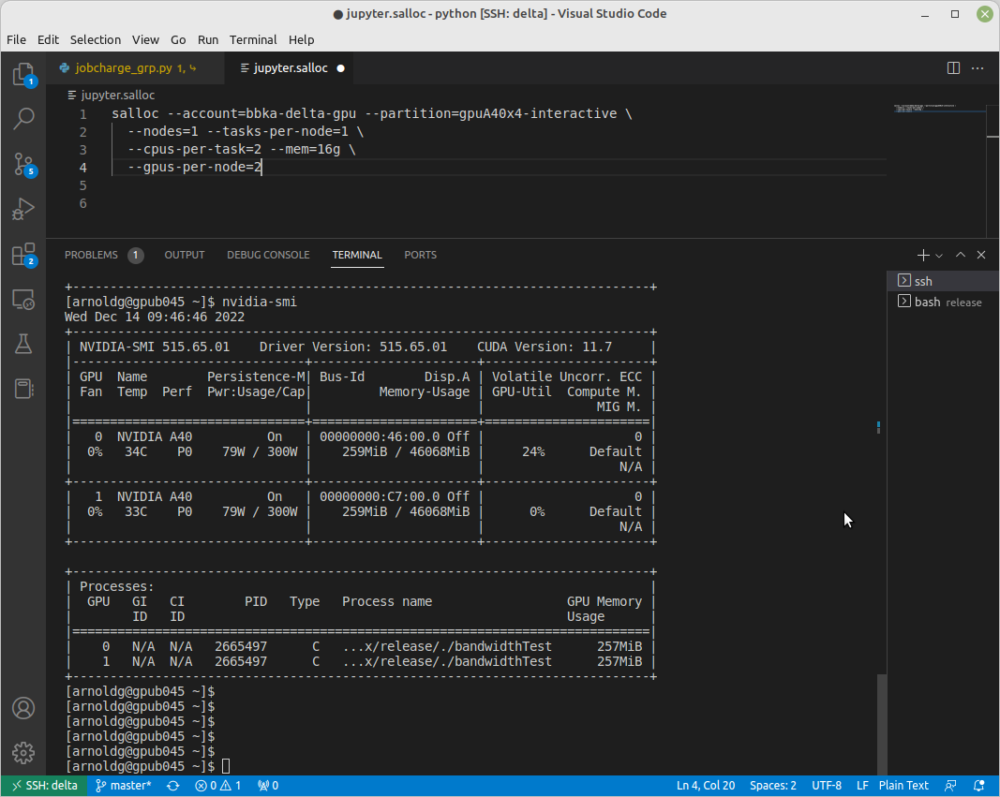
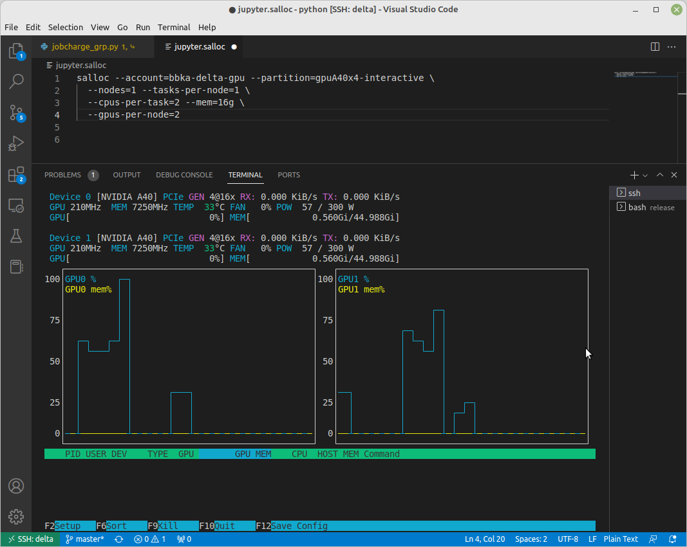
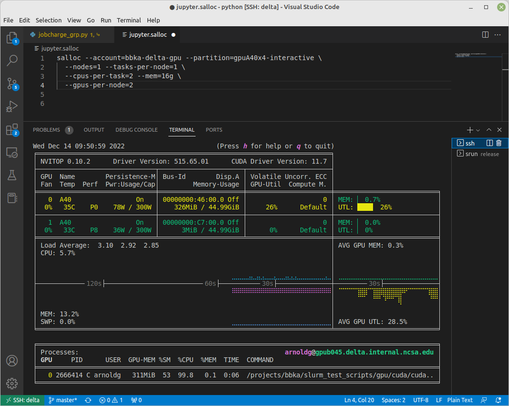
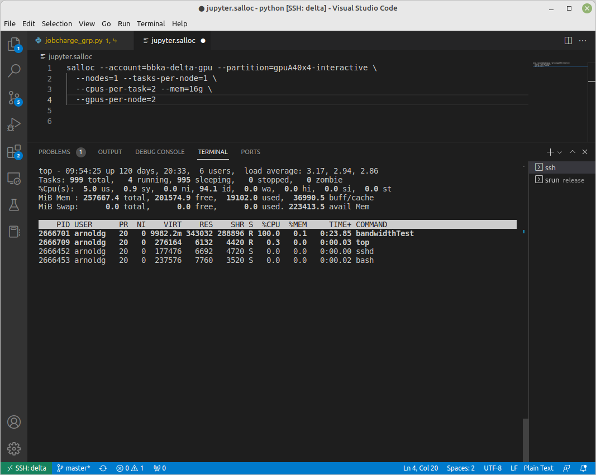

Running Jobs
===============

Accessing the Compute Nodes
-------------------------------

Delta implements the Slurm batch environment to manage access to the compute nodes. 
Use the Slurm commands to run batch jobs or for interactive access to compute nodes. 
See the `Slurm quick start guide <https://slurm.schedmd.com/quickstart.html>`_ for an introduction to Slurm. 
There are multiple ways to access compute nodes on Delta.

Batch scripts (sbatch) or Interactive (srun , salloc), which is right for me?

- :ref:`sbatch` . Use batch scripts for jobs that are debugged, ready to run, and don't require interaction.
  Sample Slurm batch job scripts are provided in the :ref:`examples` section.
  For mixed resource heterogeneous jobs see the `Slurm job support documentation <https://slurm.schedmd.com/heterogeneous_jobs.html#submitting>`_. 
  Slurm also supports job arrays for easy management of a set of similar jobs, see the `Slurm job array documentation <https://slurm.schedmd.com/job_array.html>`_ for more information.

- :ref:`srun` . For interactive use of a compute node, srun will run a single command through Slurm on a compute node. srun blocks, it will wait until Slurm has scheduled compute resources, and when it returns, the job is complete.

- :ref:`salloc` . Also interactive, use salloc when you want to reserve compute resources for a period of time and interact with them using multiple commands.  Each command you type after your salloc session begins will run on the login node if it is just a normal command, or on your reserved compute resources if prefixed with srun.  Type ``exit`` when finished with an salloc allocation if you want to end it before the time expires.

Direct SSH access to a compute node in a running job from a dt-loginNN node is enabled once the job has started:

.. code-block::

   $ squeue --job jobid
                JOBID PARTITION     NAME     USER ST       TIME  NODES NODELIST(REASON)
                12345       cpu     bash   gbauer  R       0:17      1 cn001

Then in a terminal session:

.. code-block::

   $ ssh cn001
   cn001.delta.internal.ncsa.edu (172.28.22.64)
     OS: RedHat 8.4   HW: HPE   CPU: 128x    RAM: 252 GB
     Site: mgmt  Role: compute
   $

See also, :ref:`mon_node`.

Scheduler
-------------

For information, see the `Slurm quick start user guide <https://slurm.schedmd.com/quickstart.html>`_.

..  figure:: images/running_jobs/slurm_summary.pdf
    :alt: Slurm quick reference guide
    :width: 500

.. _partitions:

Partitions (Queues)
-----------------------

Delta Production Default Partition Values
~~~~~~~~~~~~~~~~~~~~~~~~~~~~~~~~~~~~~~~~~

.. table:: Delta Default Partition Values

   ======================= ==================
   Property                Value
   ======================= ==================
   Default Memory per core 1000 MB
   Default Wall-clock time 30 minutes
   ======================= ==================

Delta Production Partitions/Queues
~~~~~~~~~~~~~~~~~~~~~~~~~~~~~~~~~~~

.. table:: Delta Partitions/Queues

   +-----------------------+-----------+-------------------+--------------+---------------------------+---------------+
   | Partition/Queue       | Node Type | Max Nodes         | Max Duration | Max Running in            | Charge Factor |
   |                       |           |                   |              |                           |               |
   |                       |           | per Job           |              | Queue/user*               |               |
   +=======================+===========+===================+==============+===========================+===============+
   | cpu                   | CPU       | TBD               | 48 hr        | TBD                       | 1.0           |
   +-----------------------+-----------+-------------------+--------------+---------------------------+---------------+
   | cpu-interactive       | CPU       | TBD               | 30 min       | TBD                       | 2.0           |
   +-----------------------+-----------+-------------------+--------------+---------------------------+---------------+
   | cpu-preempt           | CPU       | TBD               | 48 hr        | TBD                       | 0.5           | 
   +-----------------------+-----------+-------------------+--------------+---------------------------+---------------+
   | gpuA100x4             | quad-A100 | TBD               | 48 hr        | TBD                       | 1.0           |
   |                       |           |                   |              |                           |               |
   | gpuA100x4*            |           |                   |              |                           |               |
   |                       |           |                   |              |                           |               |
   | (* this is the default|           |                   |              |                           |               |
   |                       |           |                   |              |                           |               |
   | queue, but submit jobs|           |                   |              |                           |               |
   |                       |           |                   |              |                           |               |
   | to gpuA100x4)         |           |                   |              |                           |               |
   +-----------------------+-----------+-------------------+--------------+---------------------------+---------------+
   | gpuA100x4-interactive | quad-A100 | TBD               | 1 hr         | TBD                       | 2.0           |
   +-----------------------+-----------+-------------------+--------------+---------------------------+---------------+
   | gpuA100x4-preempt     | quad-A100 | TBD               | 48 hr        | TBD                       | 0.5           |
   +-----------------------+-----------+-------------------+--------------+---------------------------+---------------+
   | gpuA100x8             | octa-A100 | TBD               | 48 hr        | TBD                       | 1.5           |
   +-----------------------+-----------+-------------------+--------------+---------------------------+---------------+
   | gpuA100x8-interactive | octa-A100 | TBD               | 1 hr         | TBD                       | 3.0           |
   +-----------------------+-----------+-------------------+--------------+---------------------------+---------------+
   | gpuA40x4              | quad-A40  | TBD               | 48 hr        | TBD                       | 0.5           |
   +-----------------------+-----------+-------------------+--------------+---------------------------+---------------+
   | gpuA40x4-interactive  | quad-A40  | TBD               | 1 hr         | TBD                       | 1.0           |
   +-----------------------+-----------+-------------------+--------------+---------------------------+---------------+
   | gpuA40x4-preempt      | quad-A40  | TBD               | 48 hr        | TBD                       | 0.25          |
   +-----------------------+-----------+-------------------+--------------+---------------------------+---------------+
   | gpuMI100x8            | octa-MI100| TBD               | 48 hr        | TBD                       | 0.25          |
   +-----------------------+-----------+-------------------+--------------+---------------------------+---------------+
   | gpuMI100x8-interactive| octa-MI100| TBD               | 1 hr         | TBD                       | 0.5           |
   +-----------------------+-----------+-------------------+--------------+---------------------------+---------------+

sview View of Slurm Partitions
~~~~~~~~~~~~~~~~~~~~~~~~~~~~~~~~

Node Policies
~~~~~~~~~~~~~

Node-sharing is the default for jobs. 
Node-exclusive mode can be obtained by specifying all the consumable resources for that node type or adding the following Slurm options:

.. code-block::

   --exclusive --mem=0

GPU NVIDIA MIG (GPU slicing) for the A100 will be supported at a future date.

Job Policies
----------------

The default job requeue or restart policy is set to not allow jobs to be automatically requeued or restarted (as of 12/19/2022).
To enable automatic requeue and restart of a job by Slurm, please add the following Slurm directive:

.. code-block::

   --requeue 

When a job is requeued due to an event like a node failure, the batch script is initiated from its beginning. 
Job scripts need to be written to handle automatically restarting from checkpoints.

.. _preempt:

Preemptible Queues
-------------------

.. warning::
   Preemptible queues are only recommended for jobs that include `checkpointing <https://hpc.nmsu.edu/discovery/slurm/backfill-and-checkpoints/#_introduction_to_checkpoint>`_. 

   If your job code doesn't include checkpointing, then submitting the job to a preempt queue could result in your job being preempted without saved progress/results.

Preemptible queues are available on Delta. See :ref:`partitions` for the partition names, max durations, and charge factors.

On Delta, jobs are allotted a **minimum of 10 minutes** (**PreemptExemptTime**), plus 5 minutes of **GraceTime** if the job has a **SIGTERM** handler.

Slurm Configuration for Preempt Queues
~~~~~~~~~~~~~~~~~~~~~~~~~~~~~~~~~~~~~~~~~

.. code-block:: terminal
   
   # PreemptExemptTime is 10 minutes, so preempt jobs will always get to run at least 10 minutes
   $ scontrol show config | grep PreemptExemptTime
   PreemptExemptTime       = 10:00:00
   
   # GraceTime is 5 minutes (300s), a job can potentially run that
   # much longer if it handles SIGTERM on its own. SIGKILL arrives at least 5 minutes later.
   $ scontrol show partition cpu-preempt | grep -i grace
    DefaultTime=00:30:00 DisableRootJobs=YES ExclusiveUser=NO GraceTime=300 Hidden=NO

What Happens When a Job Gets Preempted
~~~~~~~~~~~~~~~~~~~~~~~~~~~~~~~~~~~~~~~~~~~

#. A preempting job (**job-B**) is allocated resources currently in use by the soon-to-be preempted job (**job-A**)

#. Has **job-A** run for at least 10 minutes (PreemptExemptTime)? 

   - If yes, continue to step 3. 
   - If no, continue to step 3 after the 10 minutes has elapsed.

#. **job-A** receives **SIGTERM** and **SIGCONT**.

#. 5 minutes later (Delta's **GraceTime** setting on the partition), **job-A** receives another **SIGTERM** and **SIGCONT** plus **SIGKILL** (SIGKILL cannot be handled or caught). SIGKILL is sent after SIGTERM and SIGCONT, but you can't rely on a specific time delay after these signals.

.. raw:: html

   

   
<a><b>Preempted Job Example</b> <i>(click to expand/collapse)</i></a>

.. code-block:: terminal

   [arnoldg@dt-login04 bin]$ cat trap.sh
   #!/bin/bash
    
   trap "echo The script received SIGINT" SIGINT
   trap "echo The script received SIGTERM" SIGTERM
   trap "echo The script received SIGCONT" SIGCONT
   trap "echo The script received SIGQUIT" SIGQUIT
   trap "echo The script received SIGUSR1" SIGUSR1
   trap "echo The script received SIGUSR2" SIGUSR2
   
   while true
   do
       let "i=i+1"
       echo "waiting for signals, $i minutes ..."
       sleep 1m
   done
   
    ### I'm in a salloc preempt partition job shell here:
    + salloc --mem=16g --nodes=1 --ntasks-per-node=1 --cpus-per-task=2 --partition=gpu-slingshot11-preempt --account=bbka-delta-gpu --time=00:30:00 --gpus-per-node=1
   salloc: Granted job allocation 608
   salloc: Waiting for resource configuration
   salloc: Nodes gpub003 are ready for job
   
   [arnoldg@dt-login04 bin]$ time srun ./trap.sh
   waiting for signals, 1 minutes ...
   waiting for signals, 2 minutes ...
   ### I queued a normal priority job at this time stamp, but the preempt job is guaranteed 10 minutes by PreemptExemptTime
   waiting for signals, 3 minutes ...
   waiting for signals, 4 minutes ...
   waiting for signals, 5 minutes ...
   waiting for signals, 6 minutes ...
   waiting for signals, 7 minutes ...
   waiting for signals, 8 minutes ...
   waiting for signals, 9 minutes ...
   waiting for signals, 10 minutes ...
   slurmstepd: error: *** STEP 608.0 ON gpub003 CANCELLED AT 2023-09-15T12:22:07 ***
   The script received SIGTERM
   The script received SIGCONT
   waiting for signals, 11 minutes ...
   waiting for signals, 12 minutes ...
   waiting for signals, 13 minutes ...
   waiting for signals, 14 minutes ...
   waiting for signals, 15 minutes ...
   salloc: Job allocation 608 has been revoked.
   srun: forcing job termination
   srun: Job step aborted: Waiting up to 32 seconds for job step to finish.
   srun: forcing job termination
   [arnoldg@dt-login04 bin]$ The script received SIGTERM
   The script received SIGCONT
   waiting for signals, 16 minutes ...
   srun: error: gpub003: task 0: Killed
   
   [arnoldg@dt-login04 bin]$

.. raw:: html

   

|

Preemption References
~~~~~~~~~~~~~~~~~~~~~~

There are many online resources to learn more about preemption, checkpointing, signals, and traps; here are a few to get you started.

- `Slurm preemption documentation <https://slurm.schedmd.com/preempt.html>`_
- `PyTorch checkpoint documentation <https://pytorch.org/tutorials/recipes/recipes/saving_and_loading_a_general_checkpoint.html>`_
- `TensorFlow checkpoint documentation <https://www.tensorflow.org/guide/checkpoint>`_
- `Ubuntu signal man page <https://manpages.ubuntu.com/manpages/focal/en/man7/signal.7.html>`_
- `Bash Guide for Beginners - 12.2. Traps <https://tldp.org/LDP/Bash-Beginners-Guide/html/sect_12_02.html>`_
- `Python signal documentation <https://docs.python.org/3/library/signal.html>`_

.. _job_mgmt:

Job Management
-----------------

.. _sbatch:

sbatch
~~~~~~

Batch jobs are submitted through a *job script* (as in the :ref:`examples`) using the ``sbatch`` command. 
Job scripts generally start with a series of Slurm *directives* that describe requirements of the job, such as number of nodes and wall time required, to the batch system/scheduler (Slurm directives can also be specified as options on the sbatch command line; command line options take precedence over those in the script). 
The rest of the batch script consists of user commands.

The syntax for sbatch is: ``sbatch [list of sbatch options] script_name``. Refer to the sbatch man page for detailed information on the options.

.. code-block::

   $ sbatch tensorflow_cpu.slurm
   Submitted batch job 2337924
   $ squeue -u $USER
             JOBID PARTITION     NAME     USER ST       TIME  NODES NODELIST(REASON)
           2337924 cpu-inter    tfcpu  mylogin  R       0:46      1 cn006

squeue/scontrol/sinfo
~~~~~~~~~~~~~~~~~~~~~

Commands that display batch job and partition information.

.. Table:: squeue, scontrol, and sinfo Commands

   +-------------------------+-------------------------------------------+
   | Slurm Example Command   | Description                               |
   +=========================+===========================================+
   | squeue -a               | Lists the status of all jobs on the       |
   |                         | system.                                   |
   +-------------------------+-------------------------------------------+
   | squeue -u $USER         | Lists the status of all your jobs in the  |
   |                         | batch system.                             |
   +-------------------------+-------------------------------------------+
   | squeue -j JobID         | Lists nodes allocated to a running job in |
   |                         | addition to basic information..           |
   +-------------------------+-------------------------------------------+
   | scontrol show job JobID | Lists detailed information on a particular|
   |                         | job.                                      |
   +-------------------------+-------------------------------------------+
   | sinfo -a                | Lists summary information on all the      |
   |                         | partition.                                |
   +-------------------------+-------------------------------------------+

See the man pages for other available options.

.. _srun:

srun
~~~~~

The **srun** command initiates an interactive job or process on compute nodes.

For example, the following command will run an interactive job in the gpuA100x4 or gpuA40x4 partition with a wall-clock time limit of 30 minutes, using one node and 16 cores per node and 1 GPU:

.. code-block::

   srun -A account_name --time=00:30:00 --nodes=1 --ntasks-per-node=16 \
   --partition=gpuA100x4,gpuA40x4 --gpus=1 --mem=16g --pty /bin/bash

After entering the command, wait for Slurm to start the job. 
As with any job, an interactive job is queued until the specified number of nodes is available. 
Specifying a small number of nodes for smaller amounts of time should shorten the wait time because such jobs will backfill among larger jobs. 
You will see something like this:

.. code-block::

   $ srun --mem=16g --nodes=1 --ntasks-per-node=1 --cpus-per-task=4 \
   --partition=gpuA100x4-interactive,gpuA40x4-interactive --account=bbka-delta-gpu \
   --gpus-per-node=1 --time=00:30:00 --x11 --pty /bin/bash
   [login_name@gpua022 bin]$  #<-- note the compute node name in the shell prompt
   [login_name@gpua022 bin]$ echo $SLURM_JOB_ID
   2337913
   [login_name@gpua022 ~]$ c/a.out 500
   count=500
   sum= 0.516221
   [login_name@gpua022 ~]$ exit
   exit
   $ 

When finished, use the ``exit`` command to end the bash shell on the compute resource and hence the Slurm srun job.

.. _salloc:

salloc
~~~~~

While being interactive like ``srun``, ``salloc`` allocates compute resources for you, while leaving your shell on the login node.  Run commands on the login node as usual, use``exit`` to end an salloc session early, and use srun with no extra flags to launch processes on the compute resources.

.. code-block::

   $ salloc --mem=16g --nodes=1 --ntasks-per-node=1 --cpus-per-task=2 \
     --partition=gpuA40x4-interactive,gpuA100x4-interactive \
     --account=your_account_name --time=00:30:00 --gpus-per-node=1
   salloc: Pending job allocation 2323230
   salloc: job 2323230 queued and waiting for resources
   salloc: job 2323230 has been allocated resources
   salloc: Granted job allocation 2323230
   salloc: Waiting for resource configuration
   salloc: Nodes gpub073 are ready for job
   $ hostname #<-- on the login node
   dt-login03.delta.ncsa.illinois.edu
   $ srun bandwidthTest --htod #<-- on the compute resource, honoring your salloc settings
   CUDA Bandwidth Test - Starting...
   Running on...

   Device 0: NVIDIA A40
   Quick Mode

   Host to Device Bandwidth, 1 Device(s)
   PINNED Memory Transfers
   Transfer Size (Bytes)        Bandwidth(GB/s)
   32000000                     24.5

   Result = PASS
   $ exit
   salloc: Relinquishing job allocation 2323230

scancel
~~~~~~~~

The scancel command deletes a queued job or terminates a running job. The example below deletes/terminates the job with the associated JobID.

.. code-block::

   scancel JobID 

Job Status
~~~~~~~~~~~

If the NODELIST(REASON) is MaxGRESPerAccount, that means that a user has exceeded the number of cores or GPUs allotted per user or project for a given partition.

Useful Batch Job Environment Variables
~~~~~~~~~~~~~~~~~~~~~~~~~~~~~~~~~~~~~~~~

.. table:: Useful Batch Job Environment Variables

   +-------------------------+----------------------------+-------------------------------------------------------------------------+
   | Description             | Slurm Environment Variable | Detail Description                                                      |
   +=========================+============================+=========================================================================+
   | Array JobID             | $SLURM_ARRAY_JOB_ID        | Each member of a job array is assigned a unique identifier.             |
   |                         |                            |                                                                         |
   |                         | $SLURM_ARRAY_TASK_ID       |                                                                         |
   +-------------------------+----------------------------+-------------------------------------------------------------------------+
   | Job Submission Directory| $SLURM_SUBMIT_DIR          | By default, jobs start in the directory that the job was submitted      |
   |                         |                            |                                                                         |
   |                         |                            | from. So the "cd $SLURM_SUBMIT_DIR" command is not needed.              |
   +-------------------------+----------------------------+-------------------------------------------------------------------------+
   | JobID                   | $SLURM_JOB_ID              | Job identifier assigned to the job.                                     |
   +-------------------------+----------------------------+-------------------------------------------------------------------------+
   | Machine(node) list      | $SLURM_NODELIST            | Variable name that contains the list of nodes assigned to the batch job.|
   +-------------------------+----------------------------+-------------------------------------------------------------------------+

See the sbatch man page for additional environment variables available.

.. _sbatch-delay:

Using Job Dependency to Stagger Job Starts
~~~~~~~~~~~~~~~~~~~~~~~~~~~~~~~~~~~~~~~~~~~~~~

When submitting multiple jobs, consider using ``--dependency`` to prevent all of the jobs from starting at the same time. Staggering the job startup resource load prevents system slowdowns. This is especially recommended for Python users because **multiple jobs that load Python on startup can slow down the system if they are all started at the same time**.

From the ``--dependency`` man page:

.. code-block::

   -d, --dependency=<dependency_list> 
              
                    after:job_id[[+time][:jobid[+time]...]]

   After the specified jobs start or are cancelled and 'time' in minutes from job start or cancellation happens, this job can begin  execution. If  no 'time' is given then there is no delay after start or cancellation.

Sample Script that Automates the Delay Dependency
$$$$$$$$$$$$$$$$$$$$$$$$$$$$$$$$$$$$$$$$$$$$$$$$$$$

The sample script below staggers the start of five jobs by 5 minutes each. You can use this script as a template and modify it to the number of jobs you have. The minimum recommended delay time is 3 minutes; 5 minutes is a more conservative choice. 

.. code-block:: terminal

   [gbauer@dt-login01 depend]$ cat start
   #!/bin/bash

   # this is the time in minutes to have Slurm wait before starting the next job after the previous one started.

   export DELAY=5   # in minutes

   # submit first job and grab jobid
   JOBID=`sbatch testjob.slurm | cut -d" " -f4`
   echo "submitted $JOBID"

   # loop 4 times submitting a job depending on the previous job to start
   for count in `seq 1 4`; do

   OJOBID=$JOBID

   JOBID=`sbatch --dependency=after:${OJOBID}+${DELAY} testjob.slurm | cut -d" " -f4`

   echo "submitted $JOBID with $DELAY minute delayed start from $OJOBID "

   done  

Here is what the jobs look like when submitting using the above example script:

.. code-block:: terminal

    [gbauer@dt-login01 depend]$ ./start 
    submitted 2267583
    submitted 2267584 with 5 minute delayed start from 2267583 
    submitted 2267585 with 5 minute delayed start from 2267584 
    submitted 2267586 with 5 minute delayed start from 2267585 
    submitted 2267587 with 5 minute delayed start from 2267586 

After 5 minutes from the start of the first job, the next job starts, and so on.

.. code-block:: terminal

    [gbauer@dt-login01 depend]$ squeue -u gbauer
             JOBID PARTITION     NAME     USER ST       TIME  NODES NODELIST(REASON)
           2267587 cpu-inter testjob.   gbauer PD       0:00      1 (Dependency)
           2267586 cpu-inter testjob.   gbauer PD       0:00      1 (Dependency)
           2267585 cpu-inter testjob.   gbauer PD       0:00      1 (Dependency)
           2267584 cpu-inter testjob.   gbauer  R       2:14      1 cn093
           2267583 cpu-inter testjob.   gbauer  R       7:21      1 cn093

You can use the ``sacct`` command with a specific job number to see how the job was submitted and show the dependency.

.. code-block:: terminal

    [gbauer@dt-login01 depend]$ sacct --job=2267584 --format=submitline -P
    SubmitLine
    sbatch --dependency=after:2267583+5 testjob.slurm 

.. _mon_node:

Monitoring a Node During a Job
---------------------------------

You have SSH access to nodes in your running job(s). Some of the basic monitoring tools are demonstrated in the example transcript below. Screen shots are appended so that you can see the output from the tools. Most common Linux utilities are available from the compute nodes (free, strace, ps, and so on).

.. code-block::

   [arnoldg@dt-login03 python]$ squeue -u $USER
                JOBID PARTITION     NAME     USER ST       TIME  NODES NODELIST(REASON)
              1214412 gpuA40x4- interact  arnoldg  R       8:14      1 gpub045
   [arnoldg@dt-login03 python]$ ssh gpub045
   gpub045.delta.internal.ncsa.edu (141.142.145.145)
     OS: RedHat 8.4   HW: HPE   CPU: 64x    RAM: 252 GB
   Last login: Wed Dec 14 09:45:26 2022 from 141.142.144.42
   [arnoldg@gpub045 ~]$ nvidia-smi

   [arnoldg@gpub045 ~]$ module load nvtop
   ---------------------------------------------------------------------------------------------------------------------
   The following dependent module(s) are not currently loaded: cuda/11.6.1 (required by: ucx/1.11.2, openmpi/4.1.2)
   ---------------------------------------------------------------------------------------------------------------------

   The following have been reloaded with a version change:
   1) cuda/11.6.1 => cuda/11.7.0

   [arnoldg@gpub045 ~]$ nvtop

   [arnoldg@gpub045 ~]$ module load anaconda3_gpu
   [arnoldg@gpub045 ~]$ nvitop

   [arnoldg@gpub045 ~]$ top -u $USER

nvidia-smi:

nvtop:

nvitop:

top -u $USER:

Monitoring Nodes Using Grafana
~~~~~~~~~~~~~~~~~~~~~~~~~~~~~~~~

#. Navigate to: https://metrics.ncsa.illinois.edu

#. Sign in (top-right).

   .. image:: images/running_jobs/metrics_signin_icon.png
      :alt: sign in icon
      :width: 400

#. Navigate to the Delta metrics of interest.

   ..  image:: images/running_jobs/06_grafana_metrics_home.png
       :alt: metrics home
       :width: 1000px

   You may choose a node from the list of nodes and get detailed information in real time.

   ..  image:: images/running_jobs/07_grafana_metrics_details.png
       :alt: get detailed info
       :width: 1000px

Interactive Sessions
-------------------------

Interactive sessions can be implemented in several ways, depending on what is needed. To start up a bash shell terminal on a CPU or GPU node:

- Single core with 16GB of memory, with one task on a CPU node

  .. code-block::

     srun --account=account_name --partition=cpu-interactive \
       --nodes=1 --tasks=1 --tasks-per-node=1 \
       --cpus-per-task=4 --mem=16g \
       --pty bash

- Single core with 20GB of memory, with one task on a A40 GPU node

  .. code-block::

     srun --account=account_name --partition=gpuA40x4-interactive \
       --nodes=1 --gpus-per-node=1 --tasks=1 \
       --tasks-per-node=16 --cpus-per-task=1 --mem=20g \
       --pty bash 

MPI Interactive Jobs: Use salloc Followed by srun
~~~~~~~~~~~~~~~~~~~~~~~~~~~~~~~~~~~~~~~~~~~~~~~~~~

Interactive jobs are already a child process of srun, therefore, one cannot srun (or mpirun) applications from within them. 
Within standard batch jobs submitted via sbatch, use ``srun`` to launch MPI codes. 
For true interactive MPI, use ``salloc`` in place of srun shown above, then "srun my_mpi.exe" after you get a prompt from salloc (exit to end the salloc interactive allocation).

.. raw:: html

   

   
<a><b>interactive MPI, salloc and srun</b> <i>(click to expand/collapse)</i></a>

.. code-block::

   [arnoldg@dt-login01 collective]$ cat osu_reduce.salloc
   salloc --account=bbka-delta-cpu --partition=cpu-interactive \
     --nodes=2 --tasks-per-node=4 \
     --cpus-per-task=2 --mem=0

   [arnoldg@dt-login01 collective]$ ./osu_reduce.salloc
   salloc: Pending job allocation 1180009
   salloc: job 1180009 queued and waiting for resources
   salloc: job 1180009 has been allocated resources
   salloc: Granted job allocation 1180009
   salloc: Waiting for resource configuration
   salloc: Nodes cn[009-010] are ready for job
   [arnoldg@dt-login01 collective]$ srun osu_reduce

   # OSU MPI Reduce Latency Test v5.9
   # Size       Avg Latency(us)
   4                       1.76
   8                       1.70
   16                      1.72
   32                      1.80
   64                      2.06
   128                     2.00
   256                     2.29
   512                     2.39
   1024                    2.66
   2048                    3.29
   4096                    4.24
   8192                    2.36
   16384                   3.91
   32768                   6.37
   65536                  10.49
   131072                 26.84
   262144                198.38
   524288                342.45
   1048576               687.78
   [arnoldg@dt-login01 collective]$ exit
   exit
   salloc: Relinquishing job allocation 1180009
   [arnoldg@dt-login01 collective]$ 

.. raw:: html

   

|

Interactive X11 Support
~~~~~~~~~~~~~~~~~~~~~~~

To run an X11 based application on a compute node in an interactive session, the use of the ``--x11`` switch with ``srun`` is needed. 
For example, to run a single core job that uses 1G of memory with X11 (in this case an xterm) do the following:

.. code-block::

   srun -A abcd-delta-cpu  --partition=cpu-interactive \
     --nodes=1 --tasks=1 --tasks-per-node=1 \
     --cpus-per-task=2 --mem=16g \
     --x11  xterm

.. _file-system-dependency-specification-for-jobs-1:

File System Dependency Specification for Jobs
---------------------------------------------

Please see the :ref:`depend_arch` section in System Architecture for information on setting job file system dependencies for jobs.

Jobs that do not specify a dependency on WORK (/projects) and SCRATCH (/scratch) will be assumed to depend only on the HOME (/u) file system.

.. _examples:

Sample Scripts
----------------

Serial Jobs on CPU Nodes
~~~~~~~~~~~~~~~~~~~~~~~~~

.. raw:: html

   

   
<a><b>serial example script</b> <i>(click to expand/collapse)</i></a>

.. code-block::

   $ cat job.slurm
   #!/bin/bash
   #SBATCH --mem=16g
   #SBATCH --nodes=1
   #SBATCH --ntasks-per-node=1
   #SBATCH --cpus-per-task=4    # <- match to OMP_NUM_THREADS
   #SBATCH --partition=cpu      # <- or one of: gpuA100x4 gpuA40x4 gpuA100x8 gpuMI100x8
   #SBATCH --account=account_name
   #SBATCH --job-name=myjobtest
   #SBATCH --time=00:10:00      # hh:mm:ss for the job
   #SBATCH --constraint="scratch"
   ### GPU options ###
   ##SBATCH --gpus-per-node=2
   ##SBATCH --gpu-bind=none     # <- or closest
   ##SBATCH --mail-user=you@yourinstitution.edu
   ##SBATCH --mail-type="BEGIN,END" See sbatch or srun man pages for more email options

   module reset # drop modules and explicitly load the ones needed
                # (good job metadata and reproducibility)
                # $WORK and $SCRATCH are now set
   module load python  # ... or any appropriate modules
   module list  # job documentation and metadata
   echo "job is starting on `hostname`"
   srun python3 myprog.py

.. raw:: html

   

|

MPI on CPU Nodes
~~~~~~~~~~~~~~~~

.. raw:: html
   
   

   
<a><b>mpi example script</b> <i>(click to expand/collapse)</i></a>

.. code-block::

   #!/bin/bash
   #SBATCH --mem=16g
   #SBATCH --nodes=2
   #SBATCH --ntasks-per-node=32
   #SBATCH --cpus-per-task=2    # <- match to OMP_NUM_THREADS
   #SBATCH --partition=cpu      # <- or one of: gpuA100x4 gpuA40x4 gpuA100x8 gpuMI100x8
   #SBATCH --account=account_name
   #SBATCH --job-name=mympi
   #SBATCH --time=00:10:00      # hh:mm:ss for the job
   #SBATCH --constraint="scratch"
   ### GPU options ###
   ##SBATCH --gpus-per-node=2
   ##SBATCH --gpu-bind=none     # <- or closest ##SBATCH --mail-user=you@yourinstitution.edu
   ##SBATCH --mail-type="BEGIN,END" See sbatch or srun man pages for more email options

   module reset # drop modules and explicitly load the ones needed
                # (good job metadata and reproducibility)
                # $WORK and $SCRATCH are now set
   module load gcc/11.2.0 openmpi  # ... or any appropriate modules
   module list  # job documentation and metadata
   echo "job is starting on `hostname`"
   srun osu_reduce

.. raw:: html

   

|

OpenMP on CPU Nodes
~~~~~~~~~~~~~~~~~~~~

.. raw:: html

   

   
<a><b>openmp example script</b> <i>(click to expand/collapse)</i></a>

.. code-block::

   #!/bin/bash
   #SBATCH --mem=16g
   #SBATCH --nodes=1
   #SBATCH --ntasks-per-node=1
   #SBATCH --cpus-per-task=32   # <- match to OMP_NUM_THREADS
   #SBATCH --partition=cpu      # <- or one of: gpuA100x4 gpuA40x4 gpuA100x8 gpuMI100x8
   #SBATCH --account=account_name
   #SBATCH --job-name=myopenmp
   #SBATCH --time=00:10:00      # hh:mm:ss for the job
   #SBATCH --constraint="scratch"
   ### GPU options ###
   ##SBATCH --gpus-per-node=2
   ##SBATCH --gpu-bind=none     # <- or closest
   ##SBATCH --mail-user=you@yourinstitution.edu
   ##SBATCH --mail-type="BEGIN,END" See sbatch or srun man pages for more email options

   module reset # drop modules and explicitly load the ones needed
                # (good job metadata and reproducibility)
                # $WORK and $SCRATCH are now set
   module load gcc/11.2.0  # ... or any appropriate modules
   module list  # job documentation and metadata
   echo "job is starting on `hostname`"
   export OMP_NUM_THREADS=32
   srun stream_gcc 

.. raw:: html

   

|

Hybrid (MPI + OpenMP or MPI+X) on CPU Nodes
~~~~~~~~~~~~~~~~~~~~~~~~~~~~~~~~~~~~~~~~~~~~~

.. raw:: html

   

   
<a><b>mpi+x example script</b> <i>(click to expand/collapse)</i></a>

.. code-block::

   #!/bin/bash
   #SBATCH --mem=16g
   #SBATCH --nodes=2
   #SBATCH --ntasks-per-node=4
   #SBATCH --cpus-per-task=4    # <- match to OMP_NUM_THREADS
   #SBATCH --partition=cpu      # <- or one of: gpuA100x4 gpuA40x4 gpuA100x8 gpuMI100x8
   #SBATCH --account=account_name
   #SBATCH --job-name=mympi+x
   #SBATCH --time=00:10:00      # hh:mm:ss for the job
   #SBATCH --constraint="scratch"
   ### GPU options ###
   ##SBATCH --gpus-per-node=2
   ##SBATCH --gpu-bind=none     # <- or closest
   ##SBATCH --mail-user=you@yourinstitution.edu
   ##SBATCH --mail-type="BEGIN,END" See sbatch or srun man pages for more email options

   module reset # drop modules and explicitly load the ones needed
                # (good job metadata and reproducibility)
                # $WORK and $SCRATCH are now set
   module load gcc/11.2.0 openmpi # ... or any appropriate modules
   module list  # job documentation and metadata
   echo "job is starting on `hostname`"
   export OMP_NUM_THREADS=4
   srun xthi 

.. raw:: html

   

|

4 GPUs Together on a Compute Node
~~~~~~~~~~~~~~~~~~~~~~~~~~~~~~~~~~

.. raw:: html

   

   
<a><b>4 gpus example script</b> <i>(click to expand/collapse)</i></a>

.. code-block::

   #!/bin/bash
   #SBATCH --job-name="a.out_symmetric"
   #SBATCH --output="a.out.%j.%N.out"
   #SBATCH --partition=gpuA100x4
   #SBATCH --mem=208G
   #SBATCH --nodes=1
   #SBATCH --ntasks-per-node=4  # could be 1 for py-torch
   #SBATCH --cpus-per-task=16   # spread out to use 1 core per numa, set to 64 if tasks is 1
   #SBATCH --constraint="scratch"
   #SBATCH --gpus-per-node=4
   #SBATCH --gpu-bind=closest   # select a cpu close to gpu on pci bus topology
   #SBATCH --account=bbjw-delta-gpu
   #SBATCH --exclusive  # dedicated node for this job
   #SBATCH --no-requeue
   #SBATCH -t 04:00:00

   export OMP_NUM_THREADS=1  # if code is not multithreaded, otherwise set to 8 or 16
   srun -N 1 -n 4 ./a.out > myjob.out
   # py-torch example, --ntasks-per-node=1 --cpus-per-task=64
   # srun python3 multiple_gpu.py

.. raw:: html

   

|

Parametric / Array / HTC Jobs
~~~~~~~~~~~~~~~~~~~~~~~~~~~~~

- Not yet implemented.
