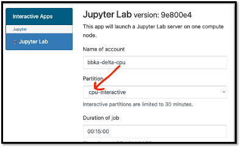

Services
===========

.. _openon:

Open OnDemand
-------------------------

The Delta Open OnDemand portal is available for use. Current supported Interactive apps: Jupyter Lab, VS Code (Code Server).  A terminal is available under **Clusters** -> **Delta Shell Access**.

To connect to the Open OnDemand portal, point a browser to https://openondemand.delta.ncsa.illinois.edu/, and use your NCSA username and password with NCSA Duo on the CILogin page.

Make sure to match the account to charge with the resource partition as shown below. 
The account names end in -cpu and -gpu; the matching partition would start with cpu or gpu (as in gpuA100x4 interactive).

Customizing Open OnDemand
----------------------------

- :ref:`custom_jupyterlab`
- :ref:`r_env`

Debugging Open OnDemand Problems
---------------------------------

For internal staff debugging (also useful for new OOD applications): `debugging jupyterlab, Open OnDemand <https://wiki.ncsa.illinois.edu/display/DELTA/debugging+jupyterlab+%2C+OpenOnDemand>`_.
