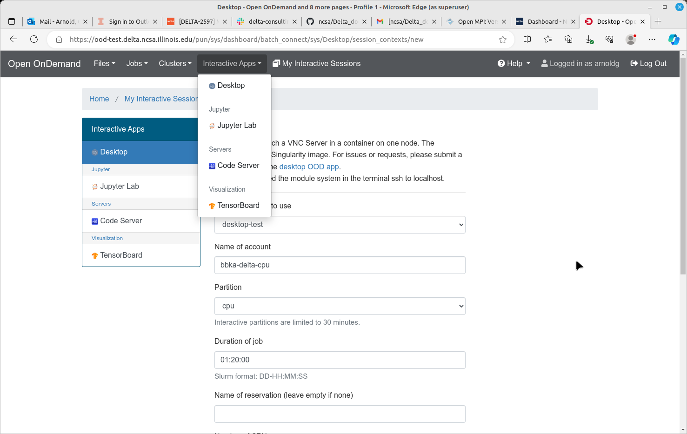
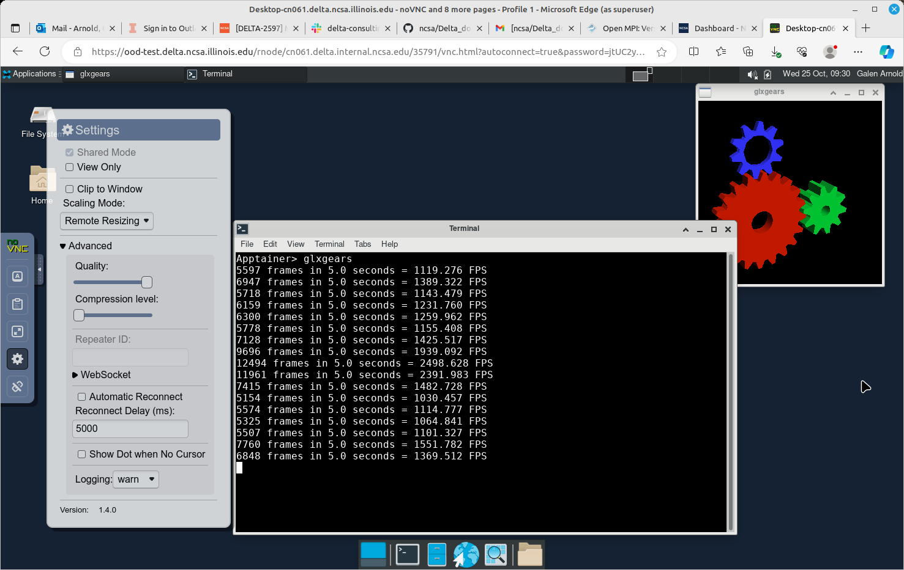
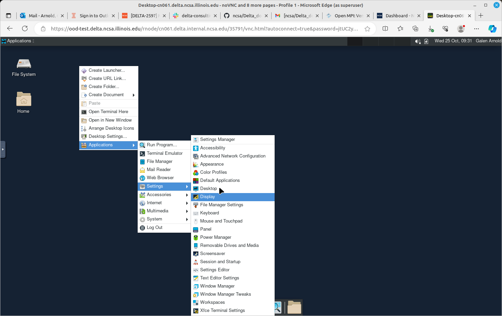
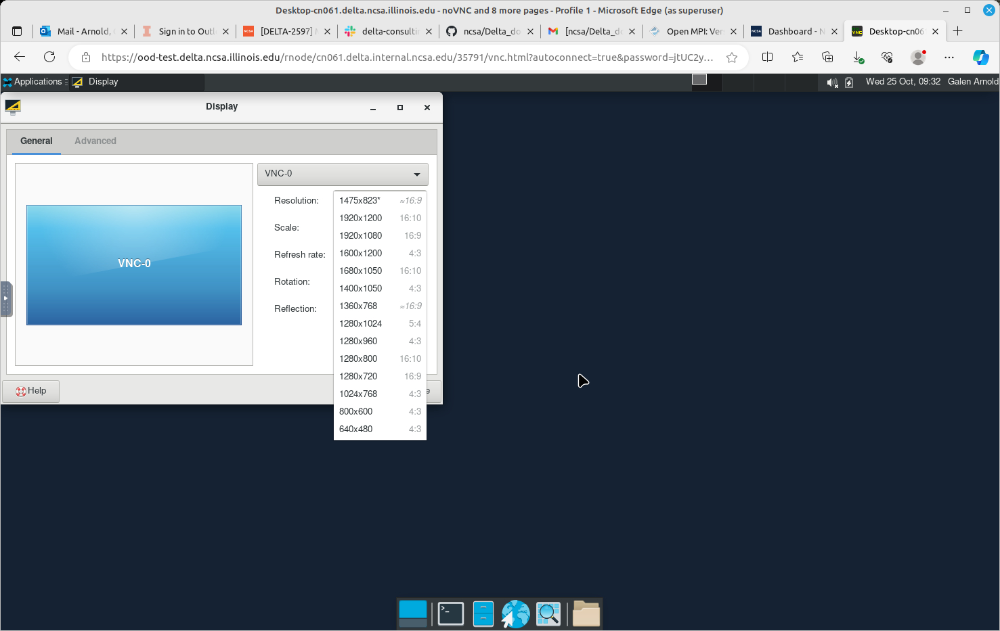
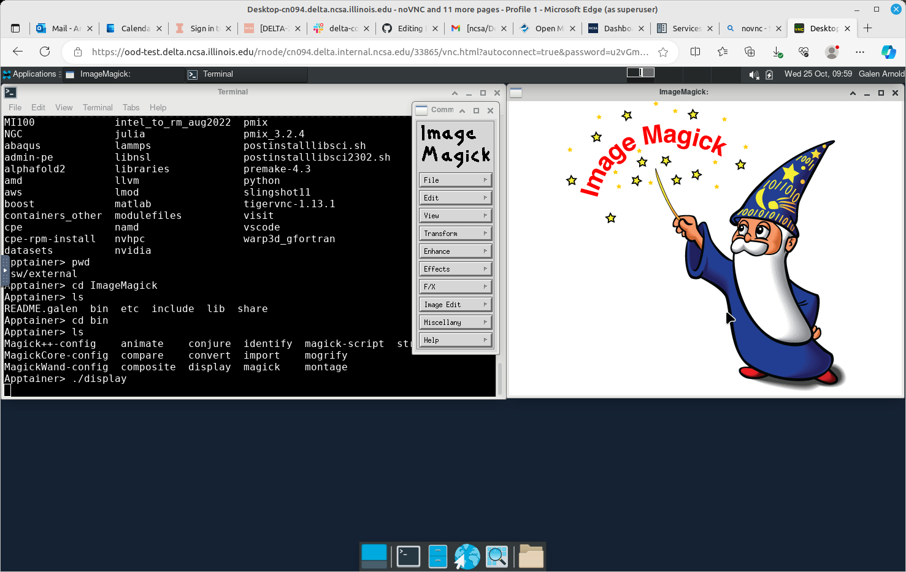

Services
===========

.. _openon:

Open OnDemand
-------------------------

The Delta Open OnDemand portal is available for use. Current supported Interactive apps: Jupyter Lab, VS Code (Code Server).  A terminal is available under **Clusters** -> **Delta Shell Access**.

To connect to the Open OnDemand portal, point your browser to https://openondemand.delta.ncsa.illinois.edu/, and use your NCSA username and password with NCSA Duo on the CILogin page.

Make sure to match the account to charge with the resource partition as shown below. 
The account names end in -cpu and -gpu; the matching partition would start with cpu or gpu (as in gpuA100x4 interactive).

..  image:: images/services/jlab_config_partition.png
    :alt: Jupyter Lab partition configuration
    :width: 500

Open OnDemand Desktop
-------------------------

Open OnDemand provides a VNC service (`noVNC <https://novnc.com>`_) through the "Desktop" Interactive App.  
The desktop runs in a job on a compute node and gives you access to a virtual Linux desktop that can provide a better graphics experience than X11.  
It runs within a container that can see the Delta filesystems ($HOME, scratch, projects, /sw) but the Delta modules are not available from the container. 

Things to keep in mind:

- You may navigate to a directory and manually launch applications that require a GUI.  
- You may need to set PATH and LD_LIBRARY_PATH from some applications.  
- Some applications may fail if the libraries required are not available in the container.  
- Due to space and time constraints, it is not possible to build a container that represents all of the software installed in /sw, so *"some assembly required"* will be the correct approach if you run into issues trying to launch a program.  

See ``module show <foo>`` when logged into Delta via SSH or VS Code to discover the PATHs and environment setting you may need to include in the noVNC Desktop.

The Delta team recommends disabling compression for the best performance.  
Also note that graphics performance will mostly depend on the graphics capabilities of your desktop computer. 
We have seen the best performance when using a gaming-style laptop with a discrete GPU.

Use the Linux Desktop display settings to adjust the display resolution to best fit your browser tab and local display.

Here is an example showing the ImageMagick running from /sw/external/ImageMagick/bin .  

Customizing Open OnDemand
----------------------------

- :ref:`custom_jupyterlab`
- :ref:`r_env`

Debugging Open OnDemand Problems
---------------------------------

For internal staff debugging (also useful for new OOD applications): `debugging jupyterlab, Open OnDemand <https://wiki.ncsa.illinois.edu/display/DELTA/debugging+jupyterlab+%2C+OpenOnDemand>`_.
