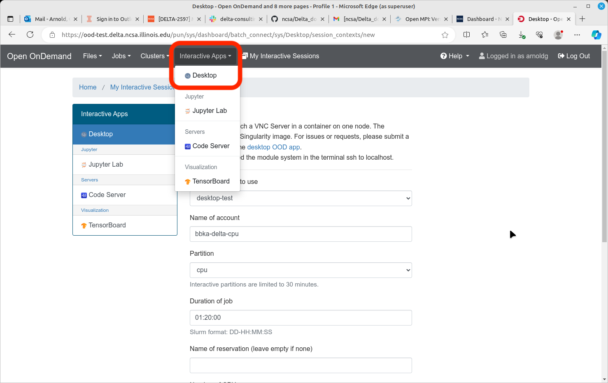

Services
===========

.. _openon:

Open OnDemand
-------------------------

The Delta Open OnDemand portal is available for use. Current supported Interactive apps: Jupyter Lab, VS Code (Code Server).  A terminal is available under **Clusters** -> **Delta Shell Access**.

Connect to the `Open OnDemand portal <https://openondemand.delta.ncsa.illinois.edu/>`_ in a browser. Log in through CILogon with your **NCSA** username and password, and **NCSA** Duo MFA.

Make sure to match the account to charge with the resource partition as shown below. 
The account names end in -cpu and -gpu; the matching partition would start with cpu or gpu (as in gpuA100x4 interactive).

Open OnDemand Desktop
-------------------------

Open OnDemand provides a VNC service (`noVNC <https://novnc.com>`_) through the "Desktop" Interactive App.  
Desktop runs in a job on a compute node and gives you access to a virtual Linux desktop that can provide a better graphics experience than X11. Elements to keep in mind:

- noVNC runs within a container that can see the Delta filesystems (``$HOME``, ``scratch``, ``projects``, ``/sw``), but the Delta modules are not available from the container. 
- You can navigate to a directory and manually launch applications that require a GUI.  
- You may need to set ``PATH`` and ``LD_LIBRARY_PATH`` from some applications.  
- Some applications may fail if the libraries required are not available in the container.  
- Due to space and time constraints, it's not possible to build a container that represents all of the software installed in ``/sw``. Consider a *"some assembly required"* approach if you run into issues trying to launch a program.  
- Use ``module show <foo>`` when logged into Delta via SSH or VS Code to discover the PATHs and environment settings you may need to include in the noVNC desktop.

Recommended noVNC Settings
~~~~~~~~~~~~~~~~~~~~~~~~~~~~

- The Delta team recommends disabling compression for the best performance. Graphics performance will mostly depend on the graphics capabilities of your desktop computer. We have seen the best performance when using a gaming-style laptop with a discrete GPU.

  ..  figure:: images/services/ood-desktop-settings-compression.png
      :alt: noVNC Desktop settings window showing "Compression level" slider set all the way to the left (off).

- Adjust the display resolution to best fit your browser tab and local display in the Linux desktop display settings. Right-click on the desktop background and select **Applications**, then **Settings**, then **Display**.

  ..  figure:: images/services/ood-desktop-settings-display.png
      :alt: In noVNC Desktop, right click the background and choose "Applications", then "Settings", then "Display".

  ..  figure:: images/services/ood-desktop-display-resolution.png
      :alt: Display settings window showing resolution options.

ImageMagick Example
~~~~~~~~~~~~~~~~~~~~

Here is an example showing ImageMagick running from ``/sw/external/ImageMagick/bin``.  

Customizing Open OnDemand
----------------------------

- :ref:`custom_jupyterlab`
- :ref:`r_env`

Debugging Open OnDemand Problems
---------------------------------

For internal staff debugging (also useful for new OOD applications): `debugging jupyterlab, Open OnDemand <https://wiki.ncsa.illinois.edu/display/DELTA/debugging+jupyterlab+%2C+OpenOnDemand>`_.
