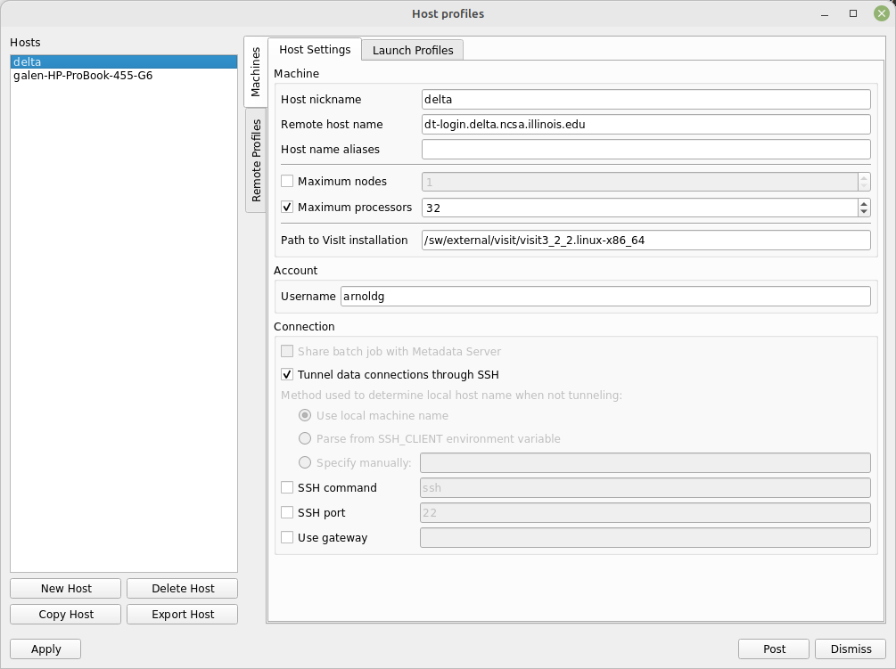
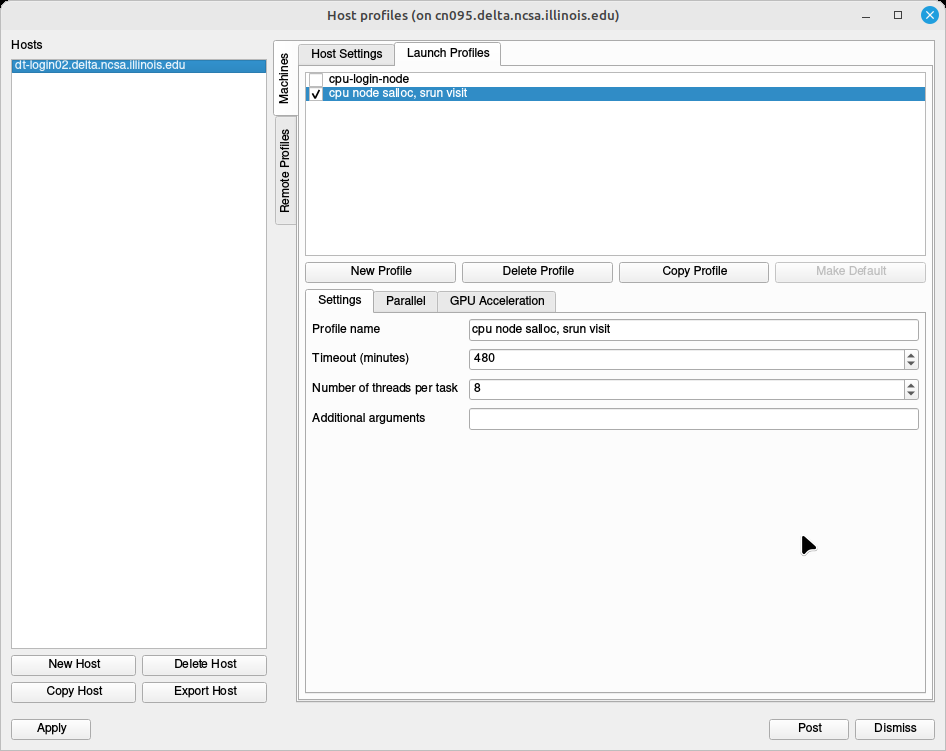
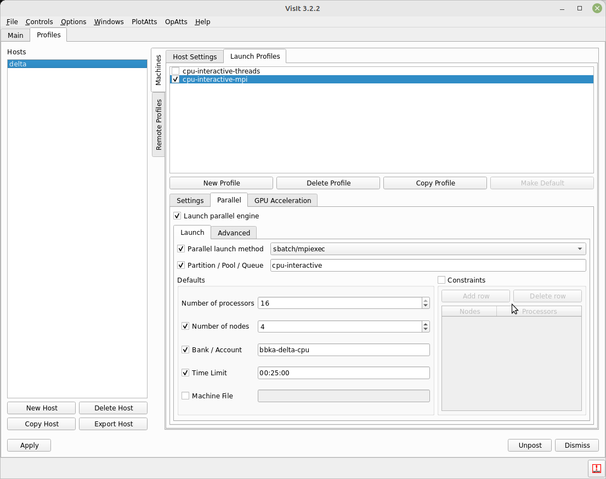
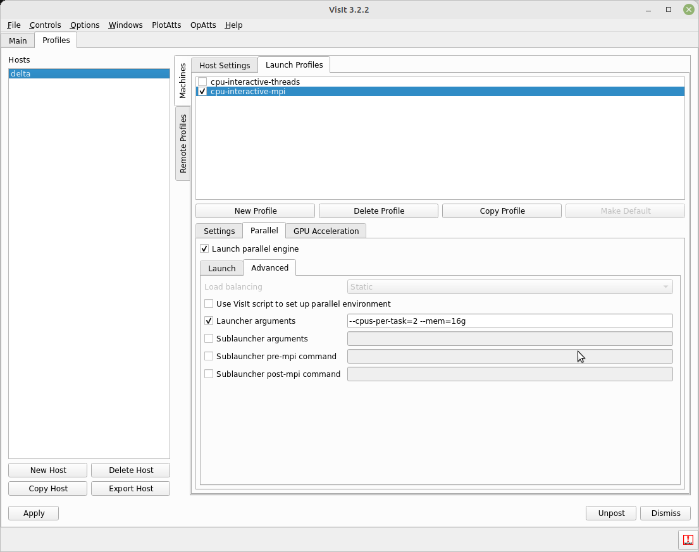
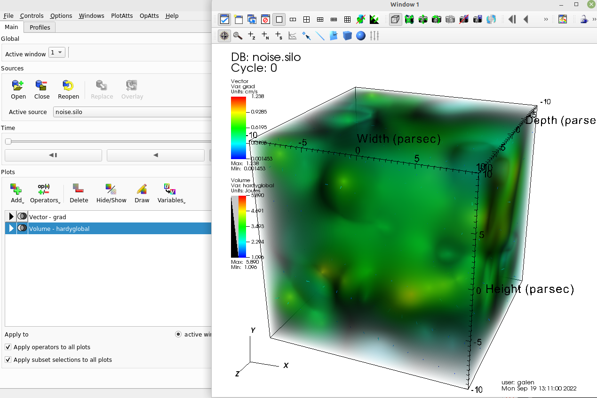

Visualization
=====================

Delta A40 nodes support NVIDIA ray tracing hardware.

ParaView 
----------

Client Server Mode - unsupported
~~~~~~~~~~~~~~~~~~~~~~~~~~~~~~~~

`MIT Engaging cluster ParaView client server mode documentation <https://engaging-web.mit.edu/eofe-wiki/software/paraview_client_server_mode/>`_.

Client server mode appears **broken**. When setting up SSH tunnel, as shown, you get this on the client side:

.. code-block::

   Connection failed during handshake. 
   vtkSocketCommunicator::GetVersion()
    returns different values on the two connecting processes
    (Current value: 100).

At least one site does not support client-server anymore (due to issues like this one from the `RWTH HPC IT Center help page <https://help.itc.rwth-aachen.de/en/service/rhr4fjjutttf/article/b98c687822874a30b740ef09f4330e7b/>`_).

PvPython and PvBatch
~~~~~~~~~~~~~~~~~~~~~

PvPython and PvBatch work and are available. Suggest reviewing the `ParaView PvPython and PvBatch wiki <https://www.paraview.org/Wiki/PvPython_and_PvBatch>`_ and using only the PvBatch part of ParaView:

.. code-block::

   [arnoldg@dt-login02 ~]$ cd paraview_pvbatch/
   [arnoldg@dt-login02 paraview_pvbatch]$ vi greenSphere.py  # sample from URL above for pvpython
   [arnoldg@dt-login02 paraview_pvbatch]$ pvpython greenSphere.py 
   [arnoldg@dt-login02 paraview_pvbatch]$ ls
   greenSphere.py  greenSphereScreenshot.png

greenSphereScreenshot.png:

VisIt Client-Server Mode
-------------------------

Following the `SDSC VisIt getting started guide <https://www.sdsc.edu/education_and_training/tutorials1/visit.html>`_, below are the screenshots for using Delta in a similar way.

.. note::
   **Pick a unique login node, .bashrc on Delta.** Choose either dt-login01 or dt-login02 (not dt-login) to keep SSH tunnel connections working smoothly. Be sure to SSH to that login node **before** you proceed (if you have not logged into it before). VisIt cannot deal with the initial login confirmation of a new host key.

   Add to your $HOME/.bashrc (for the remote VisIt GUI):

   ``module load visit``

Adjust Maximum processors to fit your requirements:

The "-interactive" version of a partition is shown. 
Note, those partitions are for quick tests up to 30 minutes; choose another partition for longer sessions.

Partitions and accounts should match: GPU partitions go with GPU account endings, CPU partitions with CPU account endings.

**Options** → **Save Settings** after filling in the above.

Proceeding with the tutorial, this is the view from the client and noise.silo example (found in the VisIt installation data/):

