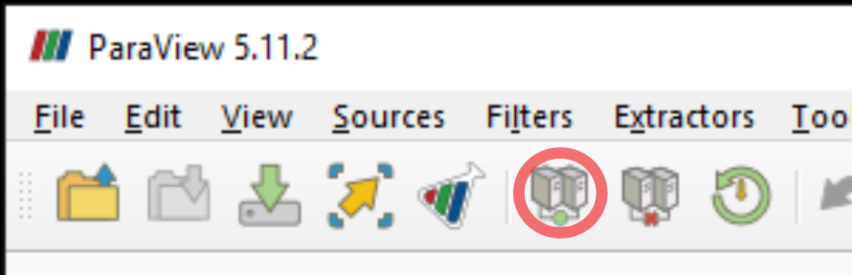
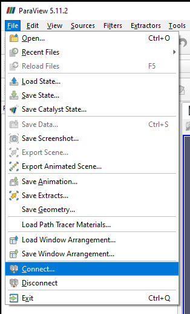
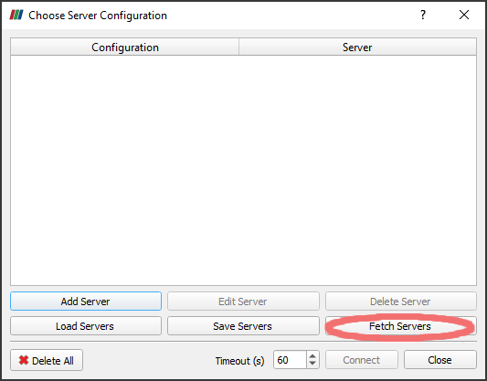
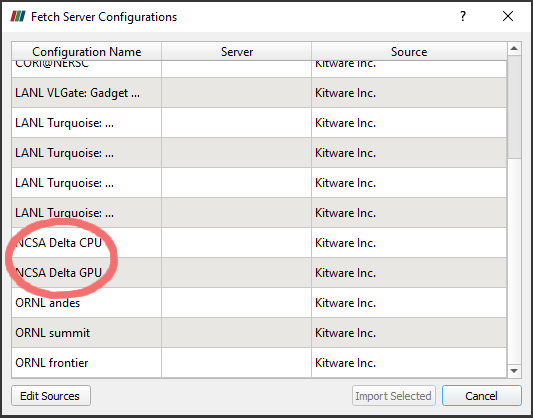
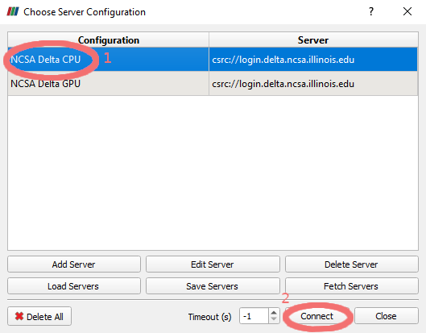
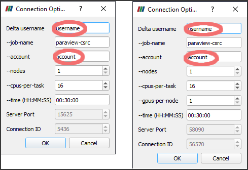
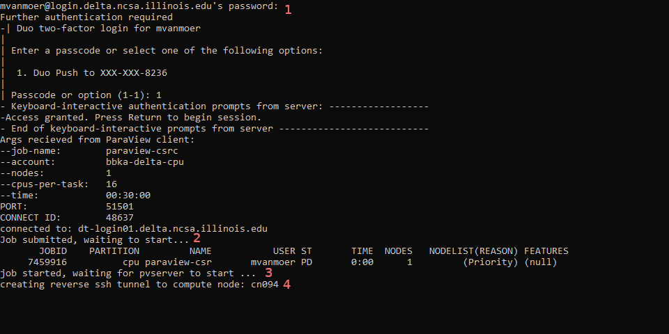

Visualization
=====================

Delta A40 nodes contain NVIDIA ray tracing cores (RT cores) and also support traditional rasterization graphics.

ParaView 
----------

`ParaView <https://www.paraview.org>`_ is an open-source visualization and data analysis tool.

Interactive Use: ParaView in Open OnDemand (OOD)
~~~~~~~~~~~~~~~~~~~~~~~~~~~~~~~~~~~~~~~~~~

The ParaView GUI client works via OOD on both CPU and GPU jobs, but interactivity is significantly improved on the latter.

#. :ref:`Start an OOD Desktop session <ood-start-desktop>`.

#. In the Desktop app, open a **Terminal**.

   .. figure:: images/visualization/ood-desktop-terminal-icon.png
      :alt: OOD Desktop app with the terminal emulator icon at the bottom of the screen highlighted.
      :width: 500

#. Load ParaView, requires using the GUI-enabled ParaView module.
   
   .. code-block::
   
      $ module load paraview/5.10.1.gui

#. Start ParaView.

   .. code-block::
   
      $ paraview

`ParaView User Guide <https://docs.paraview.org/en/latest/>`_

Offline Use: pvbatch
~~~~~~~~~~~~~~~~~~~~~

Batch rendering can be achieved with :code:`pvbatch`. Probably the best way to get started is to use Tools > Start Trace from the main menu in the GUI client to record an interactive session and then edit as needed.

:code:`pvbatch` requires using a "headless" module, either :code:`paraview/5.11.2.egl.cuda` for GPU jobs or :code:`paraview/5.11.2.osmesa.x86_64` for CPU jobs. Inside of a job, use :code:`srun` and it will automatically use all of the allocated processors. E.g.:

.. code-block::

   srun pvbatch <myscript.py>

Additional information at: `ParaView PvPython and PvBatch wiki <https://www.paraview.org/Wiki/PvPython_and_PvBatch>`_

Advanced Interactive Use: ParaView Client-Server Mode 
~~~~~~~~~~~~~~~~~~~~~~~~~~~~~~~~
For ParaView client-server connetions, you must have the exact same version as ParaView installed as on Delta, currently this is `5.11.2 <https://www.paraview.org/download/?version=v5.11>`_. Once this is installed, start the ParaView client application. (Note that if you are on an ARM processor, you may see a warning about not being able to load the OSPRay plugin which requires x86_64, this may be ignored.)

Make a connection by either clicking on the Connect button:

or navigating to File | Connect...

The Choose Server Configuration dialog window will open, click on the Fetch Servers button:

Scroll down and select the appropriate NCSA Delta profile. Note: you must have a GPU allocation for the GPU profile to work.

First, select the appropriate profile and then click the Connect button which will open a Connection Options window. 

The image below shows the CPU and GPU options side-by-side for comparision. Change the options as appropriate, in particular, you must enter your actual username and a chargable account. See below for more suggestions about the other options. Click OK. 

This will open a terminal window which must remain open for the duration of the session. It will prompt for (1) your password and a two-factor authentication method. Once you have authenticated, (2) a job will be submitted based on the supplied options. The job file as well as the SLURM output will be in your home directory. Messages will appear in the teriminal for when (3) the job starts and once (4) the SSH tunnel has been made to pvserver running on the compute node, respectively.

(Note: On Windows, if nothing happens at this stage, or if a window opens and immediately closes, try downloading and installing PuTTY and plink.exe from https://www.putty.org/)

Once the connection is complete, the ParaView client window should change to the default background color, and the pipeline browser should show a csrs:// connection to Delta

.. figure: images/visualization/8_ParaView_successful_connection.png
  :alt: Pipeline browser showing successful connection to Delta.
  :width: 416

Suggestions on Connection Options
~~~~~~~~~~~~~~~~~~~~~~~~~~~~~~~~~
ParaView's server application, pvserver, is a hybrid OpenMP-MPI application. This informs the following advice.

#. Set --nodes to 1, unless your data is spatially decomposed into multiple files per timestep. In which case, try setting --nodes to the number of domains. ParaView will not automatically decompose data except for very specific instances. The D3 (data domain decomposition) filter might be able to decompse your data.

#. --cpus-per-task also sets the default memory allocation of 1GB per cpu. Increase as necessary, but note that requesting more cores may result in longer queue wait times.

#. For GPU jobs, start with --gpus-per-node at 1, it is likely there will be little to no benefit from using more than one. These jobs are run on the gpuA40x4 partition.

VisIt
--------

`VisIt <https://visit-dav.github.io/visit-website/>`_ is an open-source visualization and data analysis tool. 

Interactive Use: VisIt in Open OnDemand (OOD)
~~~~~~~~~~~~~~~~~~~~~~~~~~~~~~~~~~~~~~~~~~

The VisIt GUI client works via OOD on both CPU and GPU jobs, but interactivity is improved on the latter.

#. :ref:`Start an OOD Desktop session <ood-start-desktop>`.

#. In the Desktop app, open a **Terminal**.

   .. figure:: images/visualization/ood-desktop-terminal-icon.png
      :alt: OOD Desktop app with the terminal emulator icon at the bottom of the screen highlighted.
      :width: 500

#. Load VisIt.

   .. code-block::

      $ module load visit

#. Start VisIt.

   .. code-block::

      $ visit

`VisIt User Manual <https://visit-sphinx-github-user-manual.readthedocs.io/en/develop/using_visit/index.html>`_

..
  To load the VisIt example data, ``noise.silo``, follow these steps:

 #. Under **Sources**, click **Open**.

   .. figure:: images/visualization/ood-desktop-visit-open.png
      :alt: VisIt opened in the OOD Desktop app with the Open button highlighted.
      :width: 500

 #. In **Path**, navigate to ``/sw/external/visit/visit3_3_3.linux-x86_64/data`` and select the ``noise.silo`` file.

   .. figure:: images/visualization/ood-desktop-visit-data-path.png
      :alt: VisIt File open window showing the "/sw/external/visit/visit3_3_3.linux-x86_64/data" path with the noise.silo file selected.
      :width: 500

 #. Click **Add** and select **Volume**, then **hardyglobal**.

   .. figure:: images/visualization/ood-desktop-visit-add-volume.png
      :alt: VisIt Add menu showing Volume, and then hardyglobal selected.
      :width: 500

 #. Click **Draw**. The data will render in the adjacent window.

   .. image:: images/visualization/ood-desktop-visit-draw.png
      :alt: The VisIt Draw button.
      :width: 500

Offline Use: visit scripts
~~~~~~~~~~~~~~~~~~~~~~~~~~
VisIt can be used for offline, batch rendering using Python scripts:

  .. code-block::

     module load visit
     srun visit -np <N> -nowin -cli -s <python script>

Note: it might be necessary to explicitly call :code:`sys.exit` at the end of the script to prevent VisIt from dropping into a Python interpreter and consuming the remaining time after finishing rendering.

For more details see the `Python Scripting <https://visit-sphinx-github-user-manual.readthedocs.io/en/develop/python_scripting/index.html>`_ section of the VisIt User Manual.

Advanced Interactive Use: VisIt Client-Server Mode 
~~~~~~~~~~~~~~~~~~~~~~~~~~~~~~~~
This is currently unsupported.

VTK
--------

VTK Python API
~~~~~~~~~~~~~~~

To use the VTK Python API (in order to ``import vtk``), install with pip or conda following the guidance at :ref:`Installed Software - Python <delta-python>`.

VTK C++ API
~~~~~~~~~~~

To build against the VTK C++ API or link to the VTK C++ libs, load the module with: ``module load vtk``. The currently available version is 9.4.0.

.. The below VisIt client-server mode info is commented out because we have trouble getting it to work properly. 

.. VisIt Client-Server Mode
   -------------------------

   Following the `SDSC VisIt getting started guide <https://www.sdsc.edu/education_and_training/tutorials1/visit.html>`_, below are the screenshots and setup for using Delta in a similar way.

   .. note::
      **Pick a unique login node, .bashrc on Delta.** Choose one of dt-login01 through dt-login04 to keep SSH tunnel connections working smoothly. Be sure to SSH to that login node **before** you proceed (if you have not logged into it before). VisIt cannot deal with the initial login confirmation of a new host key.
   
      Add to your $HOME/.bashrc (for the remote VisIt GUI):

      ``module load visit``

   Get a batch allocation on a compute node and run ``visit`` in that allocation with ``srun``.  Enable ``x11`` forwarding.

   .. code-block::

      salloc --mem=32g --nodes=1 --ntasks-per-node=1 --cpus-per-task=16 --partition=cpu,cpu-interactive --account=bbka-delta-cpu --constraint=scratch --x11 --time=00:30:00
      salloc: Pending job allocation 3063018
      salloc: job 3063018 queued and waiting for resources
      salloc: job 3063018 has been allocated resources
      salloc: Granted job allocation 3063018
      salloc: Waiting for resource configuration
      salloc: Nodes cn095 are ready for job
      [arnoldg@dt-login02 c]$ srun visit
      Running: gui3.3.3
      Running: viewer3.3.3 -geometry 1499x1080+421+0 -borders 40,11,11,11 -shift 0,0 -preshift 1,30 -defer -host 127.0.0.1 -port 5600
      Running: mdserver3.3.3 -host 127.0.0.1 -port 5601

   Fill in **Host Settings** and under **Launch Profiles**, adjust **Number of threads per task** to fit your requirements and the ``--cpus-   per-task`` from ``salloc`` above:

   ..  image:: images/visualization/01_visit-host-settings.png
       :alt: delta host profile settings
       :width: 1000px

   ..  image:: images/visualization/02_visit-thread-settings16.png
       :alt: delta host profile settings
       :width: 1000px

   Leave the **Parallel** tab options unchecked; since this example is not using MPI, that tab isn't applicable.

   **Options** → **Save Settings** after filling in the above.

   Proceeding with the tutorial, this is the view from the client and noise.silo example (found in the VisIt installation data/):

   ..  image:: images/visualization/05_visit-mpi-noise-final.png
       :alt: client view of noise example
       :width: 1000px

|
