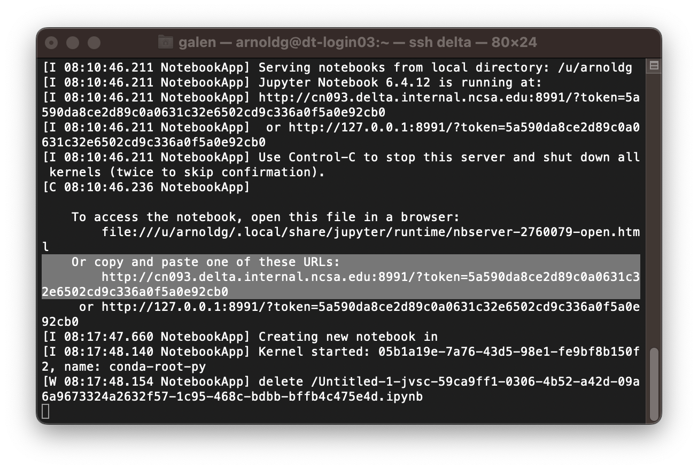

.. _remote-jupyter:

Run Jupyter on a Remote Compute Node Through VS Code
=======================================================

See the `Visual Studio Code working with Juypter Notebooks <https://code.visualstudio.com/docs/datascience/jupyter-notebooks#_connect-to-a-remote-jupyter-server>`_ guide and :ref:`jupyter` (open two new browser tabs).

#. Install the Jupyter extension for Visual Studio, if you have not already done so.

#. Complete the first step from the Delta user guide (second link above) where you srun a jupyter-notebook on a compute node. 

#. Make note of and copy the first URL after the job is running, that is the URI you will provide to Visual Studio's "Connect to a Remote Jupyter Server" after clicking the Kernels button. 

   You may also need to select the remote jupyter kernel under the kernels in VScode.

..  image:: ../images/prog_env/04_jupyter_in_vscode.png
    :alt: accessing Jupyter notebook using visual studio
    :width: 1000px
