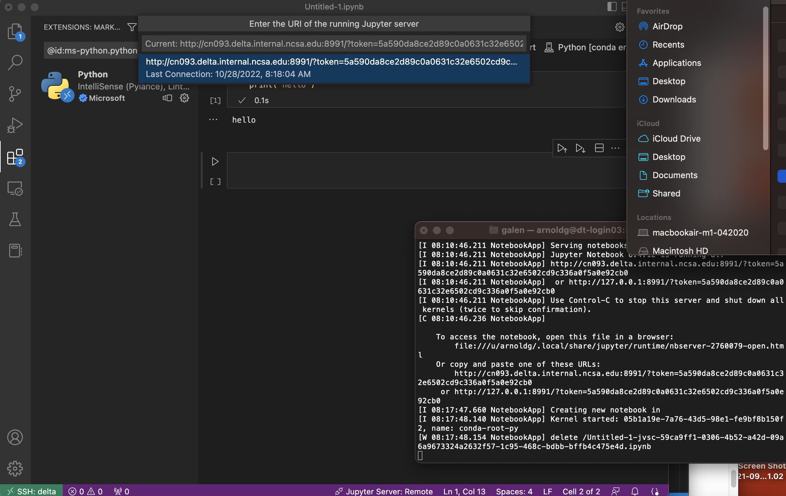

.. _remote-jupyter:

Run Jupyter on a Remote Compute Node Through VS Code
=======================================================

#. Open the following documents in new browser tabs:

   - `VS Code connect to a remote Jupyter server <https://code.visualstudio.com/docs/datascience/jupyter-notebooks#_connect-to-a-remote-jupyter-server>`_    
   - :ref:`Delta - Jupyter Notebooks <jupyter>`

#. Install the **Jupyter** extension in VS Code, if you have not already done so.

#. Complete **steps 1 thru 10** from Delta - Jupyter Notebooks (second link above), where you ``srun`` a Jupyter notebook on a compute node. 

#. Follow the VS Code connect to a remote Jupyter server instructions (first link above). The **first URL** from your ``srun`` output is the URL you will use for the running Jupyter server.

   ..  image:: ../images/prog_env/03_jupyter_url.png
       :alt: terminal with Jupyter workbook URL to use
       :width: 600px

